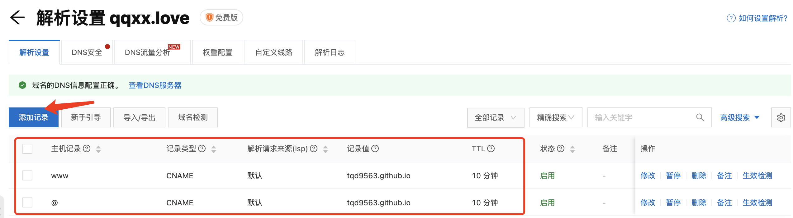
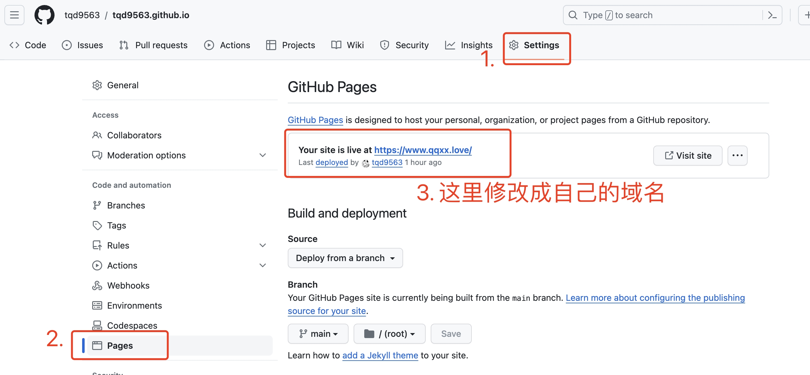

# 情侣小站搭建全过程


<!--more-->

这篇文章主要是记录一下我们的情侣小站的搭建之路。虽然说网上已经有很多的Hugo教程了，但是实际做起来还是浅浅地踩了一些坑的~

> 参考资料：
> [Hugo + GitHub Action，搭建你的博客自动发布系统](https://sspai.com/post/73512)

# 前期准备工作
## 安装Hugo
我用的是公司的macOS笔记本，所以直接使用homebrew安装即可:`brew install hugo`。
安装后使用`hugo version`命令验证安装成功

# 创建网站和调试
## 生成博客站点
打开终端，使用`hugo new`命令创建一个博客站点，例如我的是`hugo new blog`，这样就会在根目录下新建一个`~/blog`目录。这个目录会用来存放你的博客一切相关的资源，包括markdown文件、静态资源如图片/音乐、博客主题等，下文我们就把`~/blog`叫做**站点根目录**。

## 选择主题
Hugo提供了非常丰富的主题，可以在[Hugo Themes](https://themes.gohugo.io/)挑选一个自己满意的，这次我使用的是[LoveIt主题](https://github.com/dillonzq/LoveIt?tab=readme-ov-file)，github星标3.2k，算是最热门的几个主题了。老婆说这个比较好看，而且他支持的功能的确非常丰富，省去了非常多我后续摸索魔改的功夫。

选择好主题后，敲下面的命令即可安装主题：
```
cd /blog
git init
git submodule add git@github.com:dillonzq/LoveIt.git themes/LoveIt
```

如果后续要同步主题仓库的最新更改，运行命令`git submodule update --remote`即可。

## 主题的初始配置
一般下载下来的Hugo主题都会自带一个类似于`examplesite`的目录，参考这个目录结构我们就可以来组织自己的网站了。我们的LoveIt主题官网也提供了[详细的教程](https://hugoloveit.com/zh-cn/)，可以查阅。此处不再赘述。

## 第一篇文章
回到站点根目录，执行命令`hugo new posts/my-first-article.md`，然后我们就可以看到Hugo自动帮我们新建了`/content/posts/my-first-article.md`文件，他遵循的模板则是`/archetypes/default.md`。

## 本地调试
执行命令`hugo server -D`，然后在浏览器地址栏输入`localhost:1313`，就可以用开发者模式看到我们的站点啦。在开发者模式下我们修改了某处的代码后，网页就会实时刷新，非常易于我们调试。当调试完毕后，我们执行命令`hugo`，就会在站点根目录下生成一个`/public`文件夹，里面存放的就是我们的博客部署所需要的全部文件了。之后的发布也是针对这个`/public`目录。

# 网站发布
## 创建Github Pages仓库
[Github Pages](https://docs.github.com/zh/pages/getting-started-with-github-pages/about-github-pages)是一项静态站点托管服务，可以直接从Github上的仓库获取HTML、CSS和JavaScript文件，然后build & deploy。我们需要创建一个特殊命名格式的仓库：`username.github.io`，其中`username`就是我们github账户的名字。

## 域名购买与解析
这一步是可选的。如果不购买域名的话，博客的访问地址就是`https://username.github.io`。如果购买的话，还需要完成域名的解析工作。这里我是在阿里云上买的域名`qqxx.love`，非常有象征意义的一个域名，一年的价格是35RMB，希望我的小站后续能对得起这个价格！

购买完成后，进入阿里云域名控制台-域名列表，找到刚才购买的域名，然后点击右侧的解析。然后我们在这里点击「添加记录」，分别添加下面两项：



解析完成后，还需要进入刚才创建的github仓库，点击settings，在左侧找到Pages，修改右侧的site为我们的域名地址：



发布之前的最后一项准备工作，我们需要修改我们的站点配置文件`config.toml`，修改`baseURL = "https://www.qqxx.love"`。

## 发布
我们进入`/public`目录下，然后将其初始化为一个git仓库，并将其与我们的`username.github.io`远端仓库相连
```
cd ~/blog/public
git init
git remote add origin git@github.com:tqd9563/tqd9563.github.io.git
```

然后就是常规的git add, commit, push流程：
```
git add .
git commit -m "feat: 初始化我的情侣小站"
git push
```

这里`git push`的时候可能会报错，提示你需要拉取最新的远端分支。但是执行`git pull`又会报错：`fatal: refusing to merge unrelated histories`。问了chatgpt之后，说这是因为我尝试合并两个没有共同提交历史的 Git 分支时。而Git 2.9 及更高版本默认不允许合并没有共同祖先的分支，这是一种安全特性，用来避免合并本不应该合并的分支。
如果发生这种情况，只要在pull后面加一个参数就可以绕过了：
```
git pull origin main --allow-unrelated-histories
```

最后处理一下merge问题，就可以push到远端了。push完之后大概等一两分钟，打开浏览器，输入新购买的域名，就可以看到我们的博客小站啦~

有的时候会出现一个问题：当我们的博客内容发生更新，走了一遍git push的流程后，发现网站404了。这个时候检查一下我们的Github Pages的域名解析是否正确，可能的原因是CNAME文件被覆盖掉了。解决的方法是在`/public`目录下新建一个CNAME文件，并且在里面输入你要定向的域名，这样就可以确保不会出现CNAME解析错误的情况了。
