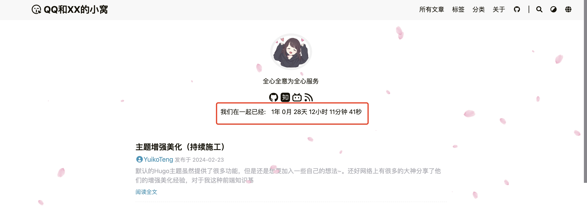

# 主题增强美化（持续施工）


默认的Hugo主题虽然提供了很多功能，但是还是想要加入一些自己的想法~。还好网络上有很多的大神分享了他们的增强美化经验，对于我这种前端知识基本为零的菜狗，基本只需要做一个互联网知识的搬运工就行啦~这篇文章就是记录一下我对我们情侣小站的一些主题美化的过程~

## 自定义CSS样式
因为Hugo读取文件时的优先级是博客根目录 > 主题目录，因此我们如果想要自定义CSS样式覆盖主题自带的CSS样式，就应该创建新文件`~/blog/assets/css/_custom.css`。之后我们都在这里定义自己的CSS样式

## 自定义Javascript
很多的美化工作都离不开javascript，但是LoveIt主题默认并不支持自定义js，因此我们需要手动操作一下：

### 创建`custom.js`文件
在小站的根目录上创建文件：`~/blog/static/js/custom.js`，之后我们的所有自定义js都会放在这个文件里

### 修改模板文件以渲染js
1. 将主题目录下的文件`~/blog/themes/LoveIt/layouts/partials/assets.html`，复制到`~/blog/layouts/partials/assets.html`
2. 点进去，下拉到最后一行找到`{{- partial "plugin/analytics.html" . -}}`，在这行代码之前新添加一行：`<script type="text/javascript" src="/js/custom.js"></script>`

## 添加恋爱天数计数器
直接问的chatgpt，以一个目标时间为起点，用一段javascript代码，动态的输出当前时间距离目标时间已经过去的年月日时分秒，并且以秒为单位刷新。然后找到首页想要放置的位置，我暂且先放在了个人信息下方居中的位置，查阅代码发现对应的模板文件是`~/blog/themes/LoveIt/layouts/partial/home/profile.html`，于是将其复制到`~/blog/layouts/partial/home/profile.html`，并添加以下HTML代码：

```html
<!-- NOTE: 在一起纪念时间 -->
<div class="time-count">
    <!-- 静态文本 -->
    <div class="inline-container">我们在一起已经:</div>
    <!-- 动态文本 -->
    <div id="timer" class="inline-container"></div>
</div>
```

默认会换行显示，于是我们再添加一个自定义CSS样式：

```css
div.inline-container {
    display: inline-block;
    vertical-align: middle; /* 确保对齐也是垂直居中的 */
    margin: 5px; /* 提供一些外边距，以便它们之间有一些空间 */
}
```

最终效果如下：



## 参考资料
> - [Hugo 的 LoveIt 主题修改及增强](https://zhuanlan.zhihu.com/p/646556566)
> - [哈哈哈啊](www.baidu.com)




