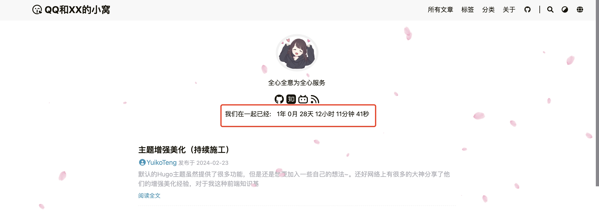
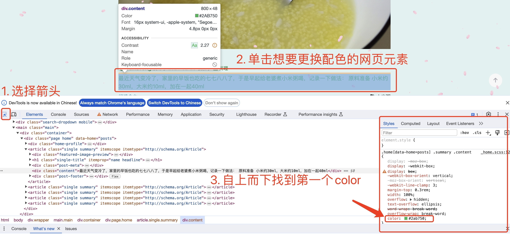
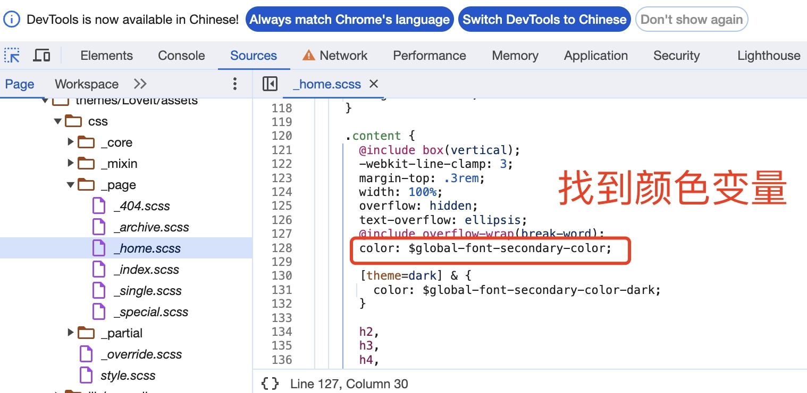
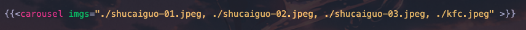

# 小窝装修之路


默认的Hugo主题虽然提供了很多功能，但是还是想要加入一些自己的想法~。还好网络上有很多的大神分享了他们的增强美化经验，对于我这种前端知识基本为零的菜狗，基本只需要做一个互联网知识的搬运工就行啦~这篇文章就是记录一下我对我们情侣小站的一些主题美化的过程~

## 自定义CSS样式
因为Hugo读取文件时的优先级是博客根目录 > 主题目录，因此我们如果想要自定义CSS样式覆盖主题自带的CSS样式，就应该创建新文件`~/blog/assets/css/_custom.css`。之后我们都在这里定义自己的CSS样式

## 自定义Javascript
很多的美化工作都离不开javascript，但是LoveIt主题默认并不支持自定义js，因此我们需要手动操作一下：

### 创建`custom.js`文件
在小站的根目录上创建文件：`~/blog/static/js/custom.js`，之后我们的所有自定义js都会放在这个文件里

### 修改模板文件以渲染js
1. 将主题目录下的文件`~/blog/themes/LoveIt/layouts/partials/assets.html`，复制到`~/blog/layouts/partials/assets.html`
2. 点进去，下拉到最后一行找到`{{- partial "plugin/analytics.html" . -}}`，在这行代码之前新添加一行：`<script type="text/javascript" src="/js/custom.js"></script>`

## 添加恋爱天数计数器
直接问的chatgpt，以一个目标时间为起点，用一段javascript代码，动态的输出当前时间距离目标时间已经过去的年月日时分秒，并且以秒为单位刷新。然后找到首页想要放置的位置，我暂且先放在了个人信息下方居中的位置，查阅代码发现对应的模板文件是`~/blog/themes/LoveIt/layouts/partial/home/profile.html`，于是将其复制到`~/blog/layouts/partial/home/profile.html`，并添加以下HTML代码：

```html
<!-- NOTE: 在一起纪念时间 -->
<div class="time-count">
    <!-- 静态文本 -->
    <div class="inline-container">我们在一起已经:</div>
    <!-- 动态文本 -->
    <div id="timer" class="inline-container"></div>
</div>
```

默认会换行显示，于是我们再添加一个自定义CSS样式：

```css
div.inline-container {
    display: inline-block;
    vertical-align: middle; /* 确保对齐也是垂直居中的 */
    margin: 5px; /* 提供一些外边距，以便它们之间有一些空间 */
}
```

最终效果如下：


## 主题配色
默认的LoveIt主题是白底黑字，虽然这是最经典的，但是白底看久了就显得有点单调，并且些微有些刺眼了。于是就打算折腾一下网页的配色。

最开始的时候老婆说想用红色，在[中国色](http://zhongguose.com/#chunmeihong)这个网站找到了一个叫「春梅红」的颜色（好巧，这个网站我很久以前就收藏过了），换色的过程比较简单，无非就是替换css样式。大概的步骤如下：
1. chrome打开开发者工具，select选中想要更改配色的网页元素，然后在开发者工具的右侧styles栏里会刷新出当前这个元素的css样式，覆盖优先级顺序是自上而下，所以只要从上往下找第一个color出现的位置就行了
2. 按住cmd键 + 鼠标单击这个color，开发者工具会跳转至这个颜色对应的css文件位置。在跳转的文件里，找到color的取值是来自哪个变量
3. 去项目代码里全局搜索这个变量名，然后修改这个变量的取值即可实现更改配色了





LoveIt主题的配色方案基本都通过`_variables.scss`文件来统一管理，这个文件会定义很多的颜色变量，例如网站背景色的变量定义为
`$global-background-color: #fff !default;`。

在修改配色的时候，还遇到了很多的问题，例如红底白字的时候总感觉这个字的颜色太过刺眼，以及这个背景的颜色看着也不太顺眼等等。。但是很多都是凭感觉出来的东西，说不上为什么。于是我上网搜了好多关于网站配色的资料，终于找到了一个神奇的网站[color.review](https://color.review/)。这个网站介绍了一种理论叫做WCAG标准，大概的意思就是通过调整**网页背景颜色和字体颜色之间的相对对比度**，使得每个人包括色盲都有能力顺利地完成阅读。网站上面提供了调色盘，下方还会按照你的调色方案实时渲染一个样例出来。按照他的理论，在选定背景色后，文字的颜色应该落在**左侧三条对比度等高线的至少第二条下方**，这样才能保证Text Contrast达到AA的最低标准。

根据这个网站，我又重新调整了一波配色，把背景色稍微调淡了一些，字体颜色也选择了深一些的紫色，看上去的确是比第一版更好些了。

睡了一觉，第二天起来之后又有了新的idea。。起因是在看别的博主写的Hugo主题装修笔记的时候，看到有博主设置了一张图片作为自己的网页背景，我和老婆说这个主意好像也不错，但是要注意不能用花里胡哨的照片。于是选来选去，最终选择的是纸质纹理的图片，一方面比较简约，一方面也相对亮白色或者是红色，可以有更好的阅读体验吧。现在的背景图片素材[来自这里](https://unsplash.com/photos/white-wall-paint-with-black-shadow-y_2GC4EhOP4)，是一种textured paper。为了适配这个背景图片，还需要修改一系列的配色，最终的方案如下：

```scss
$global-background-color: #cec8b8 !default; // 网页整体背景颜色, 与网页背景相近
$global-font-color: #604B96 !default; // 正文文本颜色, 紫色
$global-font-secondary-color: #76808b !default; // 小字的颜色, 例如主页显示的文章摘要, 灰色
$global-link-color: #6e8ac5 !default; // 超链接文本颜色, 例如主页文章标题链接, 浅蓝色
$global-link-hover-color: #255fdb !default; // 超链接光标悬浮上去时的颜色, 深蓝色
$header-background-color: rgba(0, 0, 0, 0.01) !default; // 导航栏颜色, 透明
$single-link-color: #df8994 !default; // 单一超链接文本颜色, 浅粉红色
$code-background-color: #21241f !default; // 代码区域背景色, 深灰色
```

需要注意的是，同样因为是自定义的css样式，所以需要新建一个文件`~/blog/assets/css/_variables.scss`来覆盖原有主题自带的样式。

## 菜单栏图标
> 参考文档：[Content Management-Menus](https://gohugobrasil.netlify.app/content-management/menus/)

LoveIt主题默认的菜单栏是只有文字没有图标的，但是Hugo提供的强力的菜单功能，允许我们引用一部分HTML代码来嵌入小图标。在Hugo中，一个菜单（menu）是一组带元素命名的数组（named array），并且可以在我们的template模板中通过`.Site.Menus`这个site变量来调用。例如我们在`config.toml`里定义的主菜单就可以通过`.Site.Menus.Main`读取到。一个菜单数组通常会包括许多元素，其中我们重点关注以下几个
- `.URL`：菜单跳转的链接
- `.Name`：即菜单栏的文本名称
- `.Title`：鼠标悬停在此菜单链接上时，将显示标题
- `.Pre`：template.HTML类型，可以在名称前后添加的其他信息，例如图标

我们想要给菜单栏文字前面加上图标，只需要修改`pre`属性即可，我们选择的是使用[fontawesome](https://fontawesome.com/icons)这个非常流行的图标字体库，里面提供了非常非常丰富的网页图标，只需要复制HTML代码，赋给`pre`即可，例如：`pre = "<i class='fa-solid fa-paperclip'></i>"`
最后的实际效果如下：


## 文章内图片轮播
### slick.js插件
市面上有很多现成的轮子可以用，鉴于我也没啥基础，要求也不高，就随便选了一个比较热门的slick.js，这是一款基于jQuery的插件，可以非常方便地构建漂亮的响应式图片轮播。官方网站还提供了一个[入门使用手册](https://kenwheeler.github.io/slick/)，对着抄基本就可以了。

要使用slick.js，首先需要配置加载一些必要的资源如cdn，js等，如下（这里需要注意slick.js需要在jQuery之后加载，且要求jQuery的版本大于1.7）：
```html
<link rel="stylesheet" type="text/css" href="https://cdnjs.cloudflare.com/ajax/libs/slick-carousel/1.9.0/slick.min.css"/>
<link rel="stylesheet" type="text/css" href="https://cdnjs.cloudflare.com/ajax/libs/slick-carousel/1.9.0/slick-theme.min.css"/>
<script type="text/javascript" src="https://cdnjs.cloudflare.com/ajax/libs/jquery/3.3.1/jquery.min.js"></script>
<script type="text/javascript" src="https://cdnjs.cloudflare.com/ajax/libs/slick-carousel/1.9.0/slick.min.js"></script>
```

假设我们有三张图片需要轮播，那么首先定义一个HTML容器用来装这些图片（**这里的图片路径是相对路径，图片应当和内容文件处在同一层级目录下**）：
```html
<div class="img-carousel">
  <div></div>
  <div></div>
  <div></div>
</div>
```

然后添加下面的JS代码就可以实现轮播了（这里`$(document).ready()`的含义是声明了一个函数，当整个DOM完全加载后自动开始执行）
```js
<script type="text/javascript">
    $(document).ready(function(){
        $('.img-carousel').slick({
            autoplay: true, // 是否自动播放
            autoplaySpeed: 2000,  // 播放速度，数字越大速度越慢
        });
    })
</script>
```

### Shortcodes模板
如果每次图片轮播，都需要写上面那么多的HTML+JS代码，就显得过于笨重了，而且还会使得我们的markdown文件不够简洁，我们的markdown内容文件的重心应该放在内容上。幸而Hugo提供了一个特性叫Shortcodes，它可以让我们在内容文件（markdown）里引用一些内置的或是自定义的模板。这样做就可以保证markdown文件足够的整洁，除了一些内置的shortcodes外，还支持开发者自定义shortcodes模板。

因此开工把上述的代码逻辑封装成一个shortcodes模板。首先新建一个目录`~/blog/layouts/shortcodes`，并在这个目录下新建一个html文件`/shortcodes/carousel.html`。在模板文件中，我们先把需要加载的cdn、js、css资源都放在开头。接着就是组织我们的核心代码。考虑到轮播的图片数量是不确定，应当通过一个参数传递给模板。Hugo的shortcodes模板支持参数传递，但是好像不支持数组类型的传递，因此只能将图片路径用一个字符串传递，不同的路径之间用逗号分隔开，例如`imgs="./img1.jpg, ./img2.jpg"`。然后在模板内部解析参数，获取到图片列表后，循环生成对应的div容器即可。完整的模板代码如下：

```html
<link rel="stylesheet" type="text/css" href="https://cdnjs.cloudflare.com/ajax/libs/slick-carousel/1.9.0/slick.min.css"/>
<link rel="stylesheet" type="text/css" href="https://cdnjs.cloudflare.com/ajax/libs/slick-carousel/1.9.0/slick-theme.min.css"/>
<script type="text/javascript" src="https://cdnjs.cloudflare.com/ajax/libs/jquery/3.3.1/jquery.min.js"></script>
<script type="text/javascript" src="https://cdnjs.cloudflare.com/ajax/libs/slick-carousel/1.9.0/slick.min.js"></script>

{{ $imgs := .Get "imgs" }}
{{ $items := split $imgs "," }}
<div class="autoplay">
    {{ range $items }}
        <!-- 去除空白符 -->
        {{ $trimmed_src := trim . " " }}
        <div></div>
    {{ end }}
</div>

<script type="text/javascript">
    $(document).ready(function(){
        $('.autoplay').slick({
            autoplay: true,
            autoplaySpeed: 2000,
        });
    })
</script>
```

之后只要在需要轮播图片的markdown里，引用我们的shortcodes模板即可，引用方式如下：


## 按content type定制食谱文章模板
因为这个小站主要是记录我和XX两个人的生活的，其中会有很多文章是记录料理菜谱的，这些文章的格式比较统一，且和普通文章不太一样，因此希望可以抽象成一个通用的模板。Hugo提供了`Archetypes`这种为新内容文件设置的预制模板的功能，它定义了当用户使用`hugo new`命令创建新内容时，markdown文件的front matter里需要包含哪些内容。不同的content type可以对应不同的模板。

每个content type对应了`content/`下的一个目录，例如默认的`posts`类型，就是对应了`content/posts/`下的所有文件。假如我们要新增一个食谱类型文章的模板，对应的content type叫做"receipes"，那么就需要以下两步操作：
1. 新建食谱类型文章对应的预制模板文件：`/archetypes/receipes.md`
2. 后续新建食谱类型的文章时，需要用命令`hugo new receipes/article_title.md`，而不是`hugo new posts/article_title.md`

这样我们的文章就会按照`/archetypes/receipes.md`定义的模板来创建了。

## 字体美化
主题自带的字体看久了着实有点丑。。于是想着去网上找一个美美的字体替换一下。在[字体天下](https://www.fonts.net.cn/)找了一会，找到了一款叫「也字工厂瑞云浓楷书
」的，效果还不错，就决定是你了皮卡丘！更换字体的步骤找gpt学了一下，也挺简单的，就几个步骤：

1. 新建`/static/fonts`目录，把下载到本地的`.ttf`字体文件放在这个目录下
2. 添加 @font-face 规则到您CSS。在我们的`_variables.scss`文件中，需要修改@font-face规则，指定font-family为我们刚才下载的字体:
```css
@font-face {
    font-family: "YeZiGongChangRuiYunNongKaiShu-2";
    src: url('/fonts/YeZiGongChangRuiYunNongKaiShu-2.ttf') format('truetype');
    font-weight: 300;   // 300会比正常偏细一些
    font-style: normal;
}
```
3. 最后修改`_variables.scss`文件中的`$global-font-family`变量即可生效：`$global-font-family: "YeZiGongChangRuiYunNongKaiShu-2"`


## 参考资料
> - [Hugo 的 LoveIt 主题修改及增强](https://zhuanlan.zhihu.com/p/646556566)
> - [哈哈哈啊](www.baidu.com)




