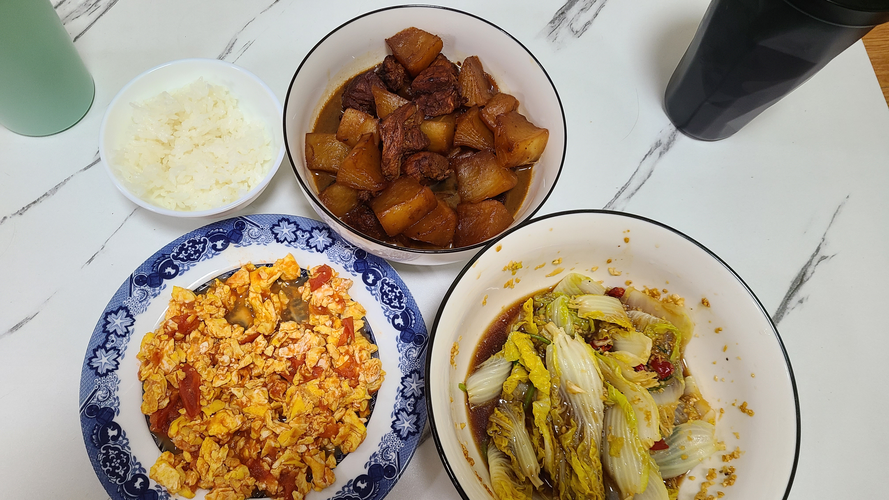

# 做四休三的小长假

上周五正好是三八妇女节，老婆公司下午放半天假，不巧前一天晚上大姨妈来串门了，这次疼的厉害，于是请了上午半天病假凑了个三天的小长假，正好周五应该没什么事，我也顺便请假在家陪陪老婆了。

## 周五
### 家务时间
上午按照惯例八点起床，把昨晚煮了两遍的红豆重新加热两遍，这样老婆起床之后就可以喝到热腾腾的红豆汤了。然后打扫了一下客厅，收拾了一下乱糟糟的桌面，把玄关的抽屉也收拾了一下，省的每次拉开抽屉都关不上。抽屉里面有之前买的好几节电池，密封卡纸装着，很占地方，万能的xhs推荐了一个电池收纳盒，既能收纳电池，还能测电量，果断下了一单。

### 我是雀神
打扫完大概快10点了，老婆还在睡觉，于是我在客厅沙发上躺下来，准备来一局紧张刺激的雀。排了一把段位东风场，今天运气不错，简直是雀神附体，起手东一局坐庄，直接连了四把庄，差点就把上家击飞了，最后东风场怒拿7w点，顺利地升了一段，神清气爽呀

### 别对我动心
今天打算在家里简单吃点，叮咚上买了点蔬菜，下锅一通乱煮，配上之前买的关东煮调料，简单的水煮蔬菜，吃的也是津津有味。荤菜就继续用昨天没吃完的KFC辣翅，加上一些唐扬鸡块，空气炸锅炸了一下，那叫一个油汪汪啊！一边吃饭一边看了个最近优酷新出的偶像剧，叫《别对我动心》，好像是改编自一个晋江的小说来着，剧情挺老套的说实话，但是不知道为什么，我看的时候会全程痴汉笑呢？

### 下午茶摸鱼
看了几集电视剧，老婆说看不下去了，要出去走走，毕竟魔都已经快连续一周的阴雨天气了，今天久违的阳光灿烂，适合出门溜达。我们就骑车去了公司，点了两杯咖啡然后坐着玩手机。第一次在下午3点多的时候来公司的咖啡厅，没想到居然有这么多的人，属实给我震慑到了？大家真的都好会摸鱼呢，我甚至看到有几个桌子的人在那里一聊就是一个小时，好想知道他们到底是哪个部门的，居然可以这么闲。。。在咖啡厅坐了2个小时后，准备沐浴着夕阳回家

## 周六
### 萝卜味的屁
由于昨天中午和晚上吃了太多的白萝卜，到了晚上的时候止不住的想放屁，一股浓浓的萝卜味，pang臭。。。真不知道为什么吃萝卜之后放的屁会这么臭。。早上老婆说我昨晚睡着之后还时不时放屁，被子里全都是一股萝卜味。。(不是。。谁睡着了还能控制住不放屁的呀！臣妾真的做不到啊)

### 洗猫厕所
又到了一个月一度的给梨子洗猫厕所的时候了，这次的猫砂量还要是之前的两倍左右（因为过年前倒了好多好多的猫砂怕脏怕臭臭。。）一个人把猫砂倒进垃圾袋之后，去浴室吭哧吭哧地刷厕所了。当初买这么大的猫厕所真的是买对了，空间大洗起来很顺手

### 户口卡更新
下午和老婆约了一起去公司弄签证申请需要的材料，但是发现自己的个人户口卡过期了，给派出所打了个电话，运气不错的是周六上午是可以办理户籍业务的，不过11点30就关门了，派出所离我们家还挺近的，于是赶紧出门去办了一下。周六的派出所人还是挺多的，取了个号之后等了5个号，让填了几张表格后就光速办理完了，然后就和老婆一起去公司啦。

### 签证准备
上午打扫完猫厕所之后，就和老婆一起骑车来公司准备申请签证要的材料了，这个申请的流程还挺长的，没想到从中午12点直接搞到了下午3点，我们才刚把这个东西大概的填完了，但是还欠缺一些文件材料没有准备，约了下周五递签，留给我们的时间真的不多了啊。。。下周看来下班后加班搞这个了

### 沙丘
弄完签证材料，我和老婆一起去电影房看电影，这次看的是一部太空歌剧类型的科幻电影叫《沙丘》，讲的是男主和他的家族被皇帝派遣到一个沙漠星球上去开采一种叫”香料“的珍贵资源，在途中与这个星球的前任领导家族发生了一些冲突，最后男主一方几近团灭，被迫和妈妈一起流浪星球，最后被当地土著部落接纳的故事。。XX很喜欢这个电影的世界观，在看电影的过程中还时不时地给我进行科普，里面的一些世界观设定。电影一共看了2个半小时，看完之后的休息时间，我顺便狠狠地给老婆安利了Gooboo，这款游戏深度非常深的网页放置游戏，可惜老婆的灵魂没有和他产生共鸣捏，呜呼哀哉!

## 周日
### 练车
本来周六也要去练车的，但是因为周五想起来预约的时候已经傍晚了，驾校办公室都已经下班了，所以只能周日来练车咯。约了早晨10点练车，9点出门后先骑车车去公司咖啡厅准备打两杯咖啡再走，结果没想到咖啡厅居然10点才开门。。只能白跑一趟，把咖啡杯寄存在了一楼前台，准备下午练完车回来的时候再来喝咖啡了。

坐地铁到驾校的时候已经是10点20分了，教练说以后让我们准时一些。。然后上午就继续复习倒车入库。一个星期没练了果然还是有点生疏了，有几把倒的不及格，还被教练看到了，给说了两句。。中午是直接点的外卖，因为教练说中午吃完饭继续练车，就不出去了。点的外卖是一个盒饭，番茄炒蛋+白菜肉+粉丝，外加一盒麻婆豆腐，送来的时候菜菜有点凉了，不过早晨没怎么吃早饭，所以还是萌萌吃了一顿！吃完饭之后继续练倒车，练了半个小时后，换了一个新的教练来带我们练小路，巧的是，这个教练正好就是上午看到我倒车不合格的那个教练=。=

小路今天练的是S弯和侧方停车，记住了点位之后，跑了几圈S弯，感觉不算难，只要进去的时候车身靠右就差不多行了。侧方位停车难度也还行，主要是我人太高了，从反光镜里看不到教练说的直角角落，得把头低下来看才行。。我和老婆轮流开了一圈，一人1次S弯 + 直角转弯 + 3次侧方位停车，然后就下课了。。好像是因为下午2点之后没有自动档的空车了，所以我们就可以回家了。下课这么早，开心！



### 家庭煮夫
从驾校坐地铁回家的路上，我们先去了一趟地铁口的水果店，买了一盒草莓，还砍了一根甘蔗。感觉已经很久没吃过甘蔗了呢，有点想念，查了一下现在也算是甘蔗上市的季节了。。下了地铁我们走路去了公司的咖啡厅，打了两杯咖啡坐着歇了会。最后再慢慢骑共享单车回家。

今晚是家庭煮夫当家做煮的时候了！前天买的萝卜还剩半根，今天准备吃完，所以打算做一个萝卜烧肉，外加一个蒜蓉娃娃菜，一个番茄炒蛋，把家里的蔬菜库存清一下。萝卜烧肉的做法和之前栗子烧肉的步骤一模一样，今天算是第三次做了，感觉已经熟门熟路了，真不容易呢哈哈哈！前面熟门熟路的一波操作，最后把肉放进锅里闷煮之后我就去洗澡了，剩下的翻炒环节，还有几个蔬菜的洗菜环节就交给老婆了，番茄炒蛋也是老婆亲自上马炒的，毕竟是她的拿手好菜，值得期待哈哈（结果你的番茄炒蛋居然是甜口的？？咸党永不为奴！！）蒜蓉娃娃菜好像是大蒜加太多了，吃起来好辣好辣。。。

### 逃避虽可耻但有用

吃完饭后，和老婆坐在沙发上准备找个日剧看看，在推荐列表里发现了一部叫做《逃避虽可耻但有用》的职场日剧，是新垣结衣主演的，我本人是非常喜欢看职场剧的，之前看过的职场剧有《我准点下班》，《半泽直树》等等，每次看职场剧都会深入体会日本职场中的那种人情百态，然后再把自己代入进去（~~下班了还继续上班是吧~~）。

不过今天看的这部似乎和以往的不太一样，不是那种很正统的职场剧，讲述的是女主研究生毕业被裁找不到工作，临近失业时被爸爸介绍去男主家做家政服务代理，但是男主非常满意女主的表现，双方协商后提出了事实结婚的想法，搭伙过日子但是不结婚。据说这部剧的男主就是之后新垣结衣在三次元里结婚的对象，我真的是惊了个呆！不过男主的眼镜还有发型都和我有几分神似，男主工作时候的样子也和我很像，所以我在看剧的时候会有一种莫名强烈的代入感。。。

### 吃甘蔗
下午练完车在地铁口农贸市场买的甘蔗好甜！喜欢吃！可惜一根太多了吃不完，进冰箱了，希望明天口感还不错吧。。

## 后记
愉快的三天小长假结束了，果然做四休三才是真正的王道！！什么时候我也能找到做四休三的工作呀


