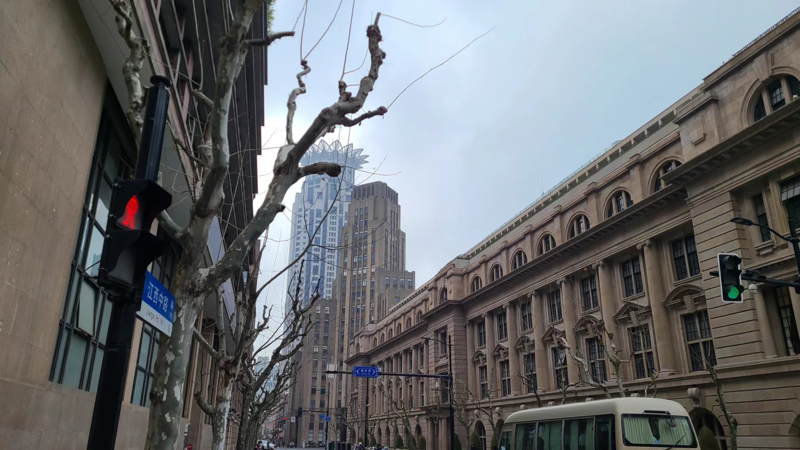

# 黄浦区City Bike & Walk

## 英国签证
今天是星期五，之前约了上午九点半线下申请签证，所以和XX一起请了上午半天的假。周三晚上的时候因为官方网站抽风，在线提交材料的时候卡了好久好久，直到周四下午才搞定，差点还以为去不了英国了。。。如果之后有人问我申请欧洲哪个国家的签证，我必然不会推荐英国🇬🇧，体验太差啦！从我们家坐地铁到领事馆要一个小时左右，听说英签拍照允许化妆，老婆想化个妆再去，所以往前再预留一个小时，让我早晨7点就喊她起床。哼哼哼，某猪猪真是不自量力，最后还不是屈服于睡觉，睡到了7点半才肯起床！（~~然后花了半个小时光速化妆，真厉害~~）

到了人广出地铁口才8点45分，比想象中早不少。原本打算直接骑共享单车去的，现在就打算慢悠悠的散步过去了。这好像还是我们第一次在工作日的早晨City Walk，还是在市中心的黄浦区，真刺激！这个点能在路上闲荡的没几个正常人，来往的路人都是脚步匆匆的，一看就是拖着已经工作了4天的疲惫的身躯和灵魂的卑微打工人。。我们沿着汉口路一路向东，途中经过的南北向的路全部是以省份命名的，像是云南中路、广西北路、浙江中路、福建中路、山西南路、山东中路、江西中路，一直到目的地的四川中路为止。讲道理魔都的这一片区域的道路命名不知道依据的是什么，全是一堆省份根本记不住，也不是按省份的相对地理位置来的，令人捉摸不透。。

到了签证中心附近，这里的建筑就有一种浓浓的租界那样的风格了，这里还能远远地望见远处顶端没入云雾之中的东方明珠，和那个上海黄浦江边的地标莲花建筑物。进去后左拐上楼二楼就是英签的地方，等了不到五分钟就可以进去取号了，原来预约9点半的话，9点15左右就能进去了呀。办签证的手续很简单，只要把护照和Appointment Confirmation交给工作人员就行，然后再等叫号进去按指纹和拍照，全部流程加在一起只花了半个小时不到，非常丝滑！甚至我还能来得及赶回公司上班？但是一是考虑到请的假不能撤回，二是中午还约了和老婆两个人吃西餐，三也是一个难得的可以继续city walk的机会，所以就作废啦！

## City Bike
离开了签证中心后先原路返回，去之前来的时候经过的一家水果店买了一盒草莓🍓，给老婆下午带去公司吃。这里的草莓看上去红红的，质量不错，价格也只有10~11一斤，感觉很实惠，希望不会被打脸哈。途中经过了很多有轨电车，本来还想坐一次电车的，结果都是空空如也的，司机师傅也不在，不知道啥时候才发车。。没办法只好准备骑车慢慢地去中午预定的西餐厅咯，地址是在愚园路那，我们挑了两辆有着新的车轱辘的小黄，就一路慢悠悠地向着终点进发咯！

### 南苏州路
我们的起点是福建中路，骑了一小会后中途导航显示要拐弯去「南苏州路」，但是我们骑到十字路口的时候发现前面有一个大上坡，瞬间我的DNA里有什么东西被触动了，直接二话不说吭哧吭哧地就冲上去了，结果骑到一半发现「南苏州路」原来在桥底下。。幸好旁边有一个向下的楼梯可以走，于是慢慢推车下楼梯。（趁机偷偷在后面拍了一张老婆推车的照片哈哈哈）下楼后正对面就是北京东路小学，好像是上海很有名的一所小学？能在这里上学的孩子，家庭条件一定都很好吧（话说上海的小学好像都感觉很小来着。。是因为上海寸土寸金吗？）

「南苏州路」的路况非常好，好像是沿着黄浦江的样子，很适合骑车和跑步。我们骑车的路上还遇到了旁边两个女生在慢跑。。讲道理周五的早上10点可以在外面慢跑的，到底是自由职业者呢，还是不需要工作的呢？想不明白，悟不出来。



### 新闸路
「南苏州路」的下一站是「新闸路」，在这里我们遇到了另一个跑者，配速还挺快的，超过了我们骑单车的速度，看他那健壮的小腿，感觉像是个马拉松选手呢（忘记拍照了）。刚进入新闸路的时候路况特别糟糕，有一种骑漕宝路坑坑洼洼的老路的感觉。。这种情况一直到了石门二路那附近才好转。刚看到石门二路这个路名的时候就感觉很熟悉，好像是之前有一次和老婆一起来吃波奇饭的地方，掏出大众点评搜了一下，还真就在这附近，可惜中午12点才开门，只能下次有机会再去吃咯~

### 常德路
下一站是「常德路」，这里有静安嘉里中心，感觉之前好像也骑过这条路，是有一次和老婆打算去静安寺的时候来过的，不过是从反方向过来的，那次好像还买了鸡蛋灌饼，还在静安公园这里看到了一群跳街舞的老爷爷老奶奶（我的记性真好）到静安这里明显感觉到繁华了起来，各种商店商场啥的层出不穷，不愧是上海的又一个市中心呢！

### 愚园路
右拐来到了终点站「愚园路」。这条路之前来过很多次了，吃酸汤莔火锅来过一次，万圣节活动也来过一次。我们骑车骑到一个商场就停车了，准备慢慢散步过去。愚园路这里的租金应该挺贵的，路上我们居然看到了不少很小众的咖啡店，很好奇他们是不是自己家的房子，不然的话感觉根本回不了本，30块一杯咖啡感觉回不来，再贵的话谁会喝呢。。

途中经过了一棵白玉兰树，上面的白玉兰花居然开了！超级好看，附近的树都还是光秃秃的，就显得这棵树非常的扎眼，不少走过路过的路人也驻足拍照（我也不例外）



## Koya Bistro
预定的西餐厅名字叫<a href="http://www.dianping.com/shop/G8cwcCe2Vc5KRAAm" target="_blank" rel="noopener noreferrer">Koya Bistro</a>，到了导航的终点后我们进了一个像是产业园的地方，刚进门就闻到了一股非常香的面包味（~~但是好像找不到面包店在哪里。。~~）在园区里面兜兜转转找了半天也找不到餐厅的位置，最后绕了一大圈才发现原来在园区入口再往前走一点点的位置。。。店面的整体装修风格挺好看的，门口有好多可爱的章鱼🐙，还有超多的酒排列成一长排，给人一种视觉震撼。可能是周中中午没什么人吧，我们好像是今天的第一个顾客？服务员带我们来了预约的餐桌，餐桌上还有一个花瓶（是花瓶吧？），上面贴着一张纸，纸上还写了预约人的姓名，两个大大的QX写在上面，很难不令人侧目！（当然我也拍了照记录下来了！）



老婆是在鼎食聚上的餐厅周活动订了一个双人套餐，一个人¥78，套餐的东西还挺多的，一份蔬菜沙拉 + 一份奶油蘑菇汤 + 一份汉堡 + 一份海鲜意大利面 + 一份黑松露薯条，外加一份甜点，这个价位说实话很便宜了，感觉薅到了羊毛！而且味道也很不错呢，牛肉汉堡的肉饼又嫩又多汁，薯条也很脆脆的，就是蘑菇汤有点太鲜了，吃多了实在受不了。。还好我们来之前机智的买了一瓶饮料。。因为这家店的味道的确还很不错，老婆又买了一份烧烤畅吃套餐，下周选一个下班的日子和老婆一起来再吃一次。这家店是宠物友好的，当初本来还期望着能看到很多人带着自己的宠物来吃饭呢，可惜今天没什么人，不知道下周晚上能不能如愿以偿~



## City Walk
这顿午饭吃的属实很撑，于是就打算走路消消食，这次是真正的city walk了！目标就是最近的12号线地铁站，到那里之后我们俩就各自坐地铁分头回公司上班去。导航给出了三条可选路线，选了一条红绿灯比较少一点的开走！这条鹿只需要拐三个弯，一个在乌鲁木齐北路，一个在长乐路

### 乌鲁木齐北路
没有什么特别的地方，就是一条在上海市中心的普普通通但又没那么普通的路？途中经过了一家店，门口有好多人在排队，仔细一看是一家叫<a href="http://www.dianping.com/shop/k9ePQnDXeK0uscpP" target="_blank" rel="noopener noreferrer">云里·云南铜锅米线</a>的店，好像还是必吃榜呢，下次有机会的时候和老婆一起去吃吧，先加入我的大众点评收藏夹去。走着走着突然人变的很多，原来是到了华山医院附近了，这不就是我星期二才来过的地方吗？？死去的回忆开始攻击我.jpg到这里我也不用看导航了，熟门熟路的就可以走到地铁站了。

### 长乐路
华山医院前面左转来到了长乐路，我记得这也是一条网红街来着？路边有很多的那种城区老房子，对面还是一片很大的广场和一栋很高很高的写字楼。

老婆：”如果住在这里，上班的地方就在马路对面的话，肯定很爽吧！“，

我：”如果住在这里，那么可能大概率是不需要上班的吧。。“

老婆：”是我格局小了。“

原定的目的地的陕西南路地铁站，但是因为吃多了，老婆很困想去睡觉，于是我们最终在常熟路地铁站上了地铁，选择了7号线转12号线。一个美好的周五早晨就这么在city bike & walk中度过了，真是惬意~~



