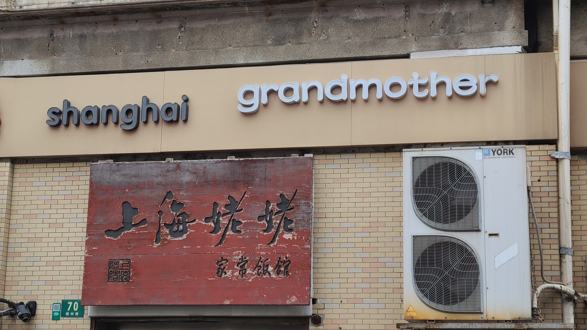
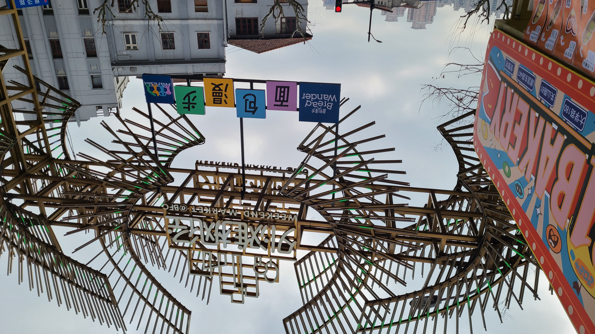

# 一个平凡的周六

一个平凡的星期六，今天和老婆出去玩了一天，主要是吃饭、逛面包节，还有看婚纱。

## 纳鲁孜
由于昨天在鼎食聚上买的餐厅周活动体验很不错，老婆说今天还想再看看有什么好吃的店，于是翻了一下午餐人均在100以下的餐厅周活动，发现满足条件的只有两家店，除了昨天去过的那家Koya Bistro外，就是一家叫<a href="http://www.dianping.com/shop/l3021R3zQCVz4hE8" target="_blank" rel="noopener noreferrer">纳鲁孜</a>的新疆菜馆，地点在南京东路那边，看了下似乎也还算比较实惠，就定了个中午11点半的位置。

最近老婆很辛苦，因此早晨让她睡到了9点半，10点钟左右出发先去公司咖啡厅打了两杯咖啡，然后坐地铁出发去吃午饭。南京东路的人还是挺多的，我们出地铁站后步行了一会就找到了目的地所在的商场，叫悦荟广场。这家商场好像之前从来没来过，里面居然有6层高，主要还是以饭店为主。我们要吃的这家新疆菜就在六楼。到了六楼以后首先经过的是萨莉亚，门口排了老长的队伍，果然不愧是西餐界的沙县小吃，人气就是高啊。在纳鲁孜的旁边还有一家自助餐厅叫东盛，门口的坐满了大概三四长排的座位，起码有几十号人在外面等位，实在是太可怕了。。查了一下发现这家店是吃牛肉自助的，而且价格也不太贵，人气这么高也就可以理解了。。先狠狠加入收藏夹，以后有机会的话早点来吃！

纳鲁孜店里吃饭的人不多，感觉薅餐厅周的羊毛的人也不是很多的样子？（~~也可能别人薅更贵的~~），我们坐下后上菜的速度非常快，我们点的套餐里一共有这么几道菜：
- 凉皮：这个凉皮的味道还不错，属于是我能接受的口味；
- 咸奶茶：这个奶茶没有什么奶味，连我也能喝，真的非常的惊喜。
- 馕炒烤肉：馕炸的金黄酥脆，一口下去嘎嘣脆，还带着烤肉的肉香味，超级好吃，烤肉的味道也非常香！！
- 大盘鸡：大盘鸡绝对是今天的MVP没有之一，土豆煮的非常烂，炖出了很多泥，非常入味；鸡肉蘸着土豆泥吃也是无比的香！
- 羊肉串：一共两串，好像售价是20一串来着，老贵了，但是很香，不愧是新疆的羊肉，一点也没有膻味，喷喷香！！

最终经过一个小时的奋战，我很努力的把大盘鸡吃了个七七八八（土豆全部炫完了！），馕炒烤肉也吃了好多，然后就饱了。。真的非常的顶，还好来之前点了杯饮料，不然可能还吃不了这么多。



## 外滩散步
吃完了之后我们就打算去下一个目的地：面包节，是老婆在xhs🍠上刷到的，地点在外滩枫泾，骑车10分钟左右的路程，但是老婆说吃太饱了想消消食，于是我们就准备步行过去。打开导航看了一下，发现我们吃饭的地方居然就在昨天办签证的地方旁边隔了一条马路xs。在去的途中经过了很多熟悉/神奇的地方：
- 首先是经过了上海姥姥，之前有一天的晚上下班后来找老婆吃饭，就是在这里吃的，他们家的菜泡饭很好吃，人气也很旺
- 又经过了那个上海地标莲花建筑物，在一个十字路口的行人等待区，我给老婆也拍了一张“戴着皇冠”的游客照，真好看！
- 还路过了一家银行，银行门口围了好多好多人，好像是在拍戏还是拍电视来着？我们想停下来看的时候还被站在马路对面的人赶走了，弄的真神秘

走到黄浦江边之后就是沿着外滩边上散步了，大中午的外滩居然也有这么多人，好多都是外地游客，起码遇见了四五个中老年旅游团，统一的帽子和穿着。拐到人民路之后开始会断断续续看到手里提着各式各样面包袋的行人，应该都是刚从面包节回来的吧，抱着期待的心情我们也快马加鞭赶往目的地去。

## 面包节
到了场地后却是只能用一个词来形容————“龟龟”，人真的是太多太多了，放眼望去都是人，几乎每家店门口都排满了人，好多店都已经卖完打烊了。我们挤了几家店，但里面的面包卖的也都挺贵的，有个吐司要卖40一包，附赠一个面包挂件；大部分面包都要10几20几的样子，看到最便宜的大概是19.9任选3个的组合吧。老婆本来还以为这种节日会有什么折扣优惠呢，看来是白欢喜了一场。中间我们还听到走在后面的两个路人彼此交谈：**“他们简直对上海人民的战斗力一无所知”**，“还好没有空着肚子来这里吃，什么也吃不到”，真真可以说是真相了！逛了一圈之后我们俩就出来了，一个面包也没买。看了一眼🍠，瞬间多了好多的避雷贴，都是吐槽这个节日办的很拉胯。。大家的感受还是一样的呢

## 婚纱照
出来后我们就准备进行下一项行程——看婚纱了，预定的婚纱摄影工作室离我们家还挺近的，我们坐地铁回去后，他们还能报销打车的费用。工作室在一个普通的写字楼里，到了之后居然还需要排队（说好的结婚的人已经很少了呢，怎么还有这么多人来看婚纱呀）。排队的时候我们就在店里简单逛了一下，参观了一些陈列出来的婚纱，还有一些样片集。

过了大概15分钟，一个工作人员找到了我们，领我们去到了一台电脑面前，开始向我们介绍工作室的情况，包括拍摄风格、样片、产品和服务、各种套餐等等。老婆很喜欢他们家的川西风，可惜就是要去川西拍，行程上非常不方便。。这家店的拍摄风格、审美啥的都很戳老婆，唯一的缺点就是贵了点，拍3套就要9k，拍4套要10k。因此我们还是回复说要回家再考虑考虑，这个时候可以看的出来的是他们真的是挺急的，听到我们这么一说，立马就开始给我们一些调整和优惠，想要说服我们当场付下定金。还好我还保持着冷静，没有被冲昏头脑，坚守住了最后一道底线。谁曾想这时候有一个看似职级更高的工作人员过来了，看到之前和我们对接的那个人没有搞定我们，把我们悄悄带到了电梯口，又作出了一番忍痛割爱的模样，在之前的基础上给我们砍了1k，还免了夜景的1k服务费，这个价格说实话之前是没有想到的，看得出来现在真的是很买方市场了。我们准备回家之后，明天再找另外两家婚纱店看看价格，再做最后的决定。

## 五里关火锅
晚上就比较简单了，约了教练和Kai哥一起吃火锅，从5点吃到了9点，然后回家休息。


