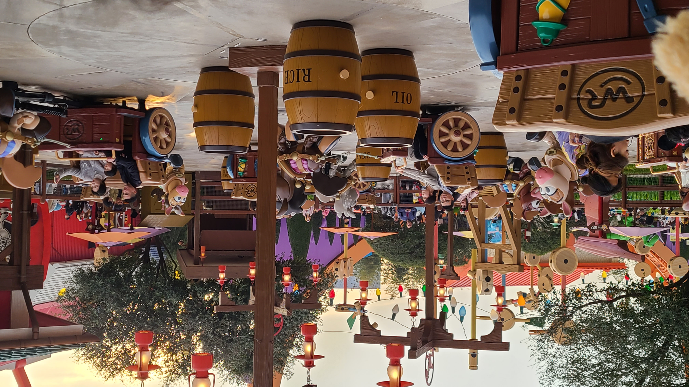
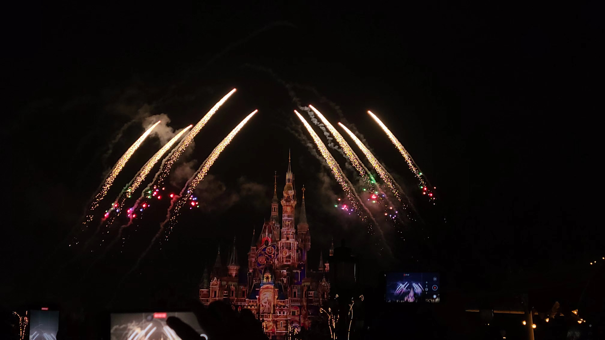

# 迪士尼三进宫

上周六XX部门组织团建去迪士尼玩，去年圣诞节那天就已经团建去过一次了，但是那天迪士尼的疯狂动物城出了事故，于是免费赠送了所有人一次入园机会。有白嫖不去是傻子，不过这还是我第一次在春天来迪士尼玩（之前去的两次都是圣诞节。。）今天的天气预报是中雨，希望不会下很大吧，不然很影响游玩体验呢。。

## 煎饼妹妹
集合时间是上午的10点30分，我们8点起床，9点从家里出发，在地铁站门口买了两个煎饼当早饭吃（前两天的某个晚上老婆回家的路上和我说很想吃这家的煎饼，甚至成为了今天早起的动力源泉）。我停好电瓶车，回头就看到老婆沐浴着阳光，手里提着煎饼笑着朝我跑过来的样子，这一瞬间宛如天女下凡，古有奶茶妹妹，今有煎饼妹妹！给老婆咔咔拍了好几张照片，假如煎饼店老板用它来做海报，销量一定可以暴增！

快到地铁站的时候老婆才发现原来集合时间是10点15而不是10点30，以为要迟到了，下了地铁后一路小跑到了检票口（好久不运动了，真的跑不动一点），到了才发现还有好几个她的同事没到。。又等了10多分钟，我们一起出发去检票。以前都是9点来这里排队的，这次快11点了，人虽然少了一些，但是还是挺多的。。

## 花车，花车！
由于XX的同事们基本都有搭子了，所以我们俩今天就只和大黄一起逛，主要就是看演出，以及玩一些以前没玩过的项目。老婆预定了一场下午两点半的舞台剧《米奇妙游童话书》，然后我们在M大街那边看了一场花车，春天的花车和冬天的到底不一样，音乐和演出都变了，由于前不久刚换了个SD卡，现在我可以肆无忌惮的拍视频了，这场花车我拍了一个长达8min的视频（手举着真的很酸）。花车结束后我们去了附近漫威的一个展馆，里面可以和蜘蛛侠合影，还有一个巨大的钢铁侠，还有一个钢铁侠的游戏，虽然玩的大部分都是小孩子，但是我和大黄两个人还是排队去玩了。游戏规则很简单，抬起自己的双手，用手心瞄准敌人，然后向前推手臂来发射激光（不过最后的结局好像都是被绿巨人给干倒）。

从漫威出来后，发现旁边的大街上又排满了人，原来是下一场花车即将开始了。这次的花车好像很特别，是什么「春日彩色庆典」，一共有三个颜色的队伍：红队蓝队和黄队，每个队伍会有一些不同的迪士尼IP角色加入。和之前冬天的花车一样，也有一些幸运观众会被选中坐在车上一起巡游。最幸运的是，这次的花车居然看到了老婆最喜欢的草莓熊，真是赚翻了！不过老婆说前面的人太多了，遮挡了她的视线，于是我便努力尝试来“举高高”，事实出乎意料，居然勉强做到哈哈哈哈哈。



## 巴斯光年
第二场花车快结束的时候开始下雨了，天公终究还是不作美呀。不过下的也不算大，冲锋衣足够挡雨了。第二场花车结束之后，我们去排了「巴斯光年」，app上说这个适合小孩子玩，而且几乎可以算是整个迪士尼的游玩项目里排队时长最短的了。进去之后发现他是一辆长长的轨道列车，一排两个座位，两把激光枪，玩法就是开枪瞄准打两边各种地形上冒出的「Z」能量源标识。如果是一个人来玩的话，甚至可以体验双枪！还别说，我觉得巴斯光年挺好玩的，性价比拉满！出来的时候还有分数结算，我打了8w分，老婆7w多分，嘎嘎（不过没拍到照片。。）

## 还是花车！
从巴斯光年出来后，是今天的第三场花车。。地点就在第一场附近，这次在花车开始前还有上海迪士尼乐团的一段合奏表演，演奏的很不错的。可惜这一次的花车我们站的位置不太好，花车中途停下来，IP角色们在车上跳舞表演，但是车车不是正对着我们的，没有获得最佳的观看视角。。

## 米气妙游童话书
看完第三场花车之后差不多快两点半了，快到了我们预约的舞台剧表演的时候了。没想到进去之后在里面排队排了好久好久，原来是因为我们进去的早了，前面一场还没有结束。。这个舞团剧的剧场面积很大很大，我们运气不错，还能抢到中间靠前排的两个座位。。演出水平还是很高的，可惜我看到中途突然感觉很困，在和睡意做斗争，有一些表演就错过了。直到一首Let it go把我惊醒，唱的是真好，鸡皮疙瘩都起来了！

从剧院出来我们去了迪士尼小镇简单吃了个饭，地点选了大食代，我点了一盘最便宜的培根炒饭，也要37块钱，不过比起园区内动辄100的饮食，还是划算太多了。。。老婆点了小杨生煎的一份菜饭 + 四个鱼丸，也花了38块钱。然后三个人一人点了一杯喜茶

## MVP项目——甩驴
吃完饭，原本我们打算直接去排疯狂动物城，甚至连FP(尊享卡)都买好了，结果走到园区入口的时候发现，我们买的FP是有使用时间要求的，要晚上8点才可以用，而且不支持退款。这就坑了，如果晚上8点的时候没什么人排队，岂不是白买。。可是也没办法，只能祈祷晚上人还很多，不至于白扔360块钱。。然后我们退而求其次去排了甩驴，全称「胡迪牛仔嘉年华」，听说非常的好玩，排队要大概40min。甩驴甩驴，究竟是我们甩驴，还是驴甩我们呢？其实是一头玩具驴拉着一辆车，车里坐着两个人，然后车会按照场地内固定的圆弧轨道运转，但是会时不时地来一个侧向漂移，那股离心力真的超级刺激，有一种mini过山车的感觉！我和XX在玩甩驴的时候拍了全程视频，视频里的我们俩就一直在哇哇鬼叫，真是笑死个人。我宣布，甩驴就是迪士尼最好的项目，没有之一！不接受反驳！

## 晶彩奇航
玩完甩驴已经快5点半了，我们去排了下一个项目——「晶彩奇航」，这好像是坐在一条船上，沿着围绕迪士尼城堡的河绕一圈的活动，等轮到我们上船的时候，正好天色刚黑，河面上的各种雕塑布景啥的也都亮了灯，非常的好看，特别是途中经过的一个阿拉丁神灯，这个区域我记忆犹新，那里的喷泉喷到空中还会绕圈圈转！还会随着音乐摇摆，是名副其实的音乐喷泉。

## 烟花
在去疯狂动物城之前，我们还是按照惯例，去城堡前欣赏了烟花。虽然每次看烟花都觉得很好看，但是果然还是第一次看的最具有震撼力啊。。在看烟花的过程中，注意到在我们右前方有一个老哥，他居然让他的女朋友/老婆骑坐在肩膀上，然后女生可以居高临下的拍照了，这不就是我想做但是却暂时没能力做到的事情吗，泪目！！这老哥的背影看着就很壮实，有点像元祖的身材了，真好啊~

附：今天在拍照的时候拍到的一张感觉很不错的烟花照片

## 热力追踪
烟花散场之后，我们逆着人流前往了疯狂动物城园区，入园已经不需要排队了，不过项目还需要排队70min，我们的FP也算是起到了作用吧~在这里XX居然遇到了她的姐姐带着她的侄女一起来玩，可惜她们走的是单人通道，和我们错过了。今天下午的时候微博上还有帖子说热力追踪今天设备故障了，下午排队的人被工作人员告知说要原路返回。。。还好我们不是下午去排队的，不然也太惨了= =项目玩法是一个无轨道的车车，在场地里开来开去？有点点类似加勒比，中间有两段加速的路程特别刺激！玩过一遍之后，老婆说这是她最喜欢的项目，看了眼时间离末班地铁还早，就又回头去排了一次队伍，刷了第二遍，老婆真的很喜欢疯狂动物城呢~



## 后记
迪士尼三刷结束，短期内应该不会再去了，用老婆的话说叫“去魅”了，不知道今年的圣诞会不会再去一次，毕竟也算是梦开始的地方？


