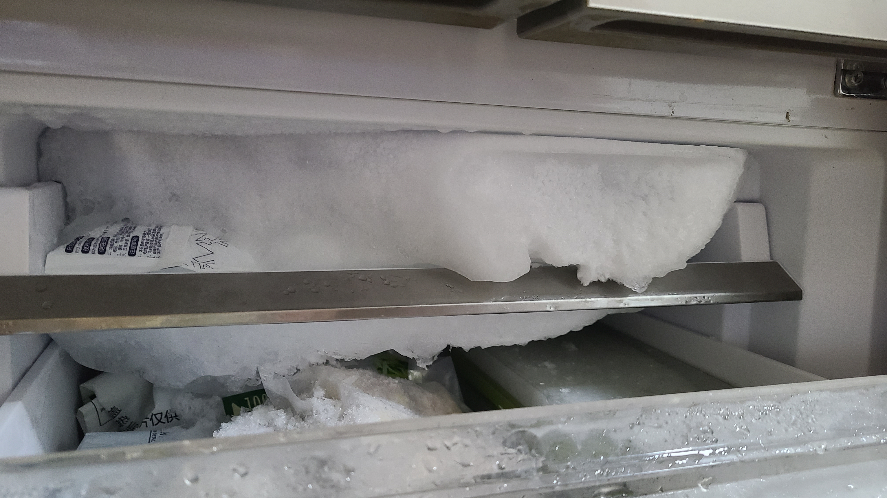
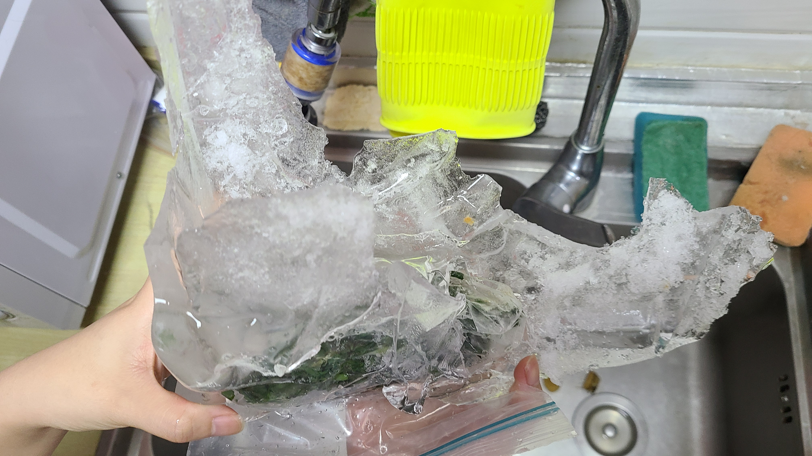

# 十万年玄冰, 寒冰诀大成！

## 玄冰出世！
昨晚回家和XX躺在沙发上，突然想吃旺旺碎碎冰，于是准备打开冰箱炫一根，结果发现乖乖，冰箱冷冻层的第一层冰柜上结的冰已经彻底卡住了，抽屉完全抽不出来。。而且因为冰结的太厚，抽屉外层已经爬满了水珠，冰箱门也关不太上了，这冰怕不得是传说中的十万年玄冰？？情况非常危急，破冰迫在眉睫！

## 小试身手——解压式铲冰
一开始我们想的是直接把冰铲掉，因为以前小时候家里的冰箱也有过这种积冰很严重的情况，当时老爸就是用一把铲子噼里啪啦的把冰给铲碎了。但是我们家现在没有铲子，只能用别的工具代替了，我从厨房拿了一把剪子过来，是那种长得很像老虎钳的剪子，然后对着冰层一阵猛戳，戳了好半天，也只能戳下来一点点小碎冰。。虽然戳的过程超级解压，但是实战效果却令人堪忧

## 大炮打蚊子——戴森出场
打开万能的小红书，搜索冰箱如何除冰，推荐的帖子里提到可以用电吹风开热风对着冰吹，大概5~10分钟就可以开始融化了。这敢情可好，我们家的吹风机可是戴森的，年会刚换来的奖品，马力那是杠杠的，用戴森吹冰箱。。。仿佛有种大炮打蚊子的感觉。说干就干，先把抽屉里的东西搬运到底下两层，把抽屉清空之后，插上插头对着冰就是一顿猛吹，还别说真的有效果，吹了一会就能肉眼可见地看到冰的最下沿开始慢慢地滴水，是要融化的迹象了。但是电吹风也不能一直吹太久，我们只好吹吹停停，吹完歇个5~10min再继续吹。

> 从抽屉里清东西的时候发现，里面的积水都冻成了冰，然后顺着包装袋形成了奇怪的冰雕

## 变招——自然降温法
用电吹风吹了一会，虽然有那么点效果了，但是照这个进度要把这么大块冰给除掉，怕是要吹到后半夜了，看来xhs上的那些人，他们的冰箱里的冰一定没我们那么厚。。这时候老婆提议说，把冰箱的门打开，靠自然降温的方法，看看能不能让冰融化。于是我们就把冰箱门打开着，老婆去打一局lolm，我去看会小说，约好了20min后再来看看情况。

## 终极大招——开水糊脸
20min后，我们无奈的发现：毫无进展。这冰冻三尺，非一日之寒啊。。抱着今天一定要解决的决心，我们又去xhs上寻找攻略，最后采纳了一个撒手锏，就是先把冰箱断电，然后烧开热水，用盆或者碗装满热水后，放在冰柜抽屉里，底下垫一块毛巾吸水，靠开水的热气来让冰快速融化。我们家里没有盆，就用了平时盛汤的大碗，装了一碗开水放进去。

撒手锏果然不愧是撒手锏，效果可谓立竿见影，冰块滴水的速度越来越快，冰层的厚度也在以肉眼可见的速度变薄。为了加速化冰，我们把另一个碗也装了开水，双核驱动，速度超级加倍！放进去的开水，过了10min就已经变成温水了，我们不停的重新烧开水，然后替换，循环了三四次之后，终于下方的积冰全都融化了！我们的抽屉可以顺利的取出来了。。

到这里，万里长征才过去了一半，剩下的还有最顶部的一大块积冰，大小恐怕是刚才化掉的两倍吧？而且问题是他和底部的板子贴的很紧，没法正面受到水汽的烘烤，只能隔着一层板子来烤了。。

## 十万年玄冰，寒冰诀大成
就这么继续烧水 → 换水 → 化冰，持续了几轮之后，顶部的巨大冰层终于可以滑动了，这个时候一个想法同时出现在了我和老婆的脑海中，那就是：把这一整块冰完整的取出，而不是融化成水！如果做得到的话，这该是多么伟大的壮举啊！但是尝试了一下之后发现，碍于冰层的底部有三个冰袋和他冻在了一起，导致底部崎岖不平，会卡住。。于是我拿了一根棍子（厨房里的不知名厨具i，姑且称呼他为棍子吧），对准底部和冰袋结在一起的冰，一阵猛戳，将左侧和中间的冰袋上的冰戳碎，右侧的冰袋则往里戳到底，终于，皇天不负有心人，十万年玄冰几近完好无损的取出来了！！！

对着这块冰，有一种强烈的拍照欲望，感觉这辈子也不会再遇到这么大一块冰了！冰的一面如镜面般光滑，另一面则是崎岖不平的。大小刚好能够塞进厨房的洗水池里。我和老婆先拍了一个合照，然后还给我拍了一张双手高举的照片，最后我还联想到了妖精的尾巴里格雷的造型魔法，非常非常勉强的拍了一张「造型魔法」的招式（因为实在有点冷，还很滑，在手背垫了一张餐巾纸才勉强稳住）有了这块十万年玄冰，本座的寒冰诀终将大成，尔等蝼蚁就匍匐在寒冰之主的威名之下吧，哈哈哈哈哈哈哈！

忙完都凌晨一点了，发个pyq装了一下b之后，就赶紧睡觉了，明天还要搬砖呢。。




