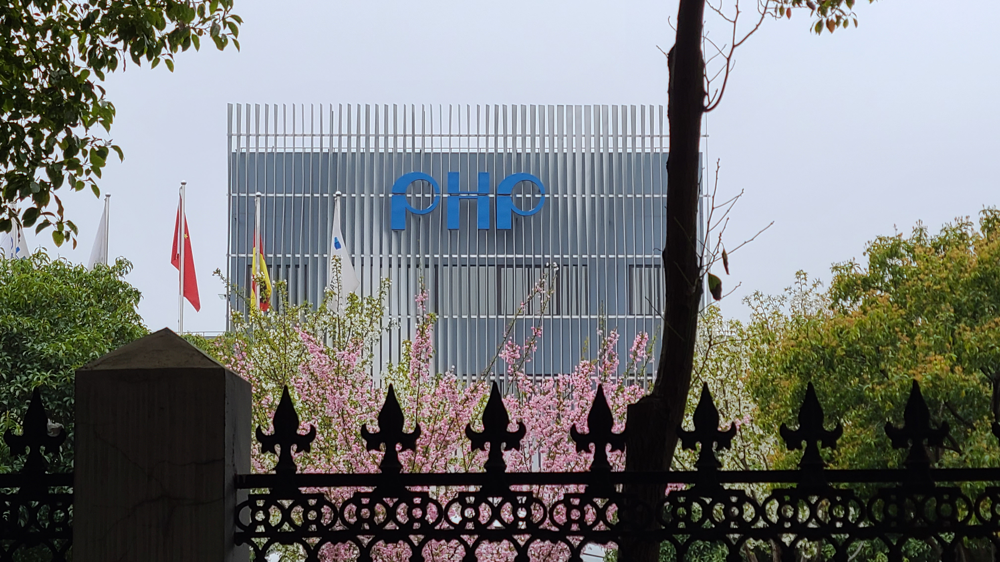
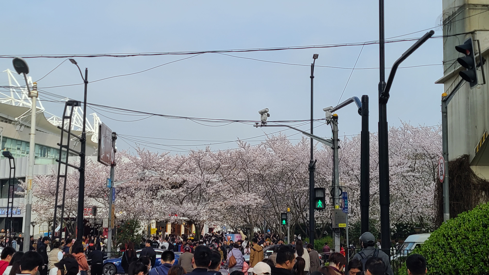

# 赏樱花

## 宝山之行
前些天老婆在咸鱼上给爸爸买了个无人机，约了今天线下面交，不过地点在宝山区，坐地铁要差不多坐到1号线/3号线的终点站了。还从来没有去过那么远的地方，感觉都快不属于上海了。。早晨在家里喝了碗红豆汤之后，12点左右就出门了，准备去上海南站坐3号线。今天因为走的是桂林路，不是以前去南站的方向，差点迷了路，最后把车车停在了一个离地铁站挺远的地方。。旁边有一个奥特莱斯，不过看上去没什么人的亚子，回头的时候可能会逛逛。令人惊喜的是这里居然也有樱花树，好几棵，开的还挺漂亮的呢。

在地铁站买了一个大煎饼当做两个人一起的午饭，然后就踏上了漫漫地铁路。我们选的是三号线，车内的空调开的还是比较冷的，还好因为出门前看天气不算太好，可能会下雨，所以套了件冲锋衣外套，在地铁上才没有觉得很冷。。下车之后咸鱼的卖家说开车来地铁站接我们，我们就在地铁站外面等着。旁边有一个PHP大楼，不知道是什么楼，莫名的想起了一个梗，“PHP是世界上最好的语言”，哈哈哈哈。中途和zxt聊天说起自己正在宝山，发现原来我们现在离木头的上班的地方很近，只有600米的距离，原来她上班的地这么远，怪不得很少来参与我们的饭局了，真的很不方便呢。。

等了大概10分钟，卖家开车来接我们了，这个小哥开车很拽呢，左手单手方向盘，右手还拿着手机（~~不知道xx爸爸年轻的时候是不是也是这么开车的~~）。到了地方我们就开始试飞无人机，操作还是很简单的，我们试了一下大概没啥问题，就交货了，一共花了1900块，内存卡需要自己网上买一个，小哥还送了很多小装备，比如新手防撞护具、停机坪、小夜灯等等。

## 樱花节赏樱
拿到无人机之后我们就准备回家，回家的途中准备拐去虹口足球场看一下樱花，去年看樱花的时候就在xhs上看到帖子推荐说这里的樱花很好看了，今天正好来了宝山一次，3号线回程刚好会经过这一站。下车之后发现这一站的人尤其的多，出站闸机的对面甚至立了一个很大的横幅，写着“樱花节赏樱右转7号口”。。看来今天来赏樱的人会很多捏

出了7号口，瞬间被眼前的人流量震惊了，乌压压的全都是人，挤满了十字路口的这一头和另一头。。好像前两天张杰还在这里办演唱会，演唱会+樱花节，外加昨天的天气非常的好，三重buff下昨天这里怕不是会发生踩踏事故。。。我们顺着人流过了马路，看到了密密麻麻的樱花树，怪不得这里会被xhs大力推荐，不是没道理的，这里的樱花开的真的很密集。

和老婆在这里拍了好多的照片，有风景照，有老婆的单人照，还有我们俩的合照（~~急需一个拍照姿势教学！~~）。拍照途中经过了一些拍照点位，就是xhs🍠上的那些经典机位，有正好可以拍到地铁口路牌🪧的，有正好可以拍到远处的高架路上的车车经过的，有好多人在那里蹲点，还听到一个人说“这得等多久才能拍到车啊”，我们还是很有自知之明的走了哈哈哈哈哈。



## 闲逛奥特莱斯
回程坐到终点站南站下车，在回家之前去了那边的奥特莱斯闲逛了一下，这里的商场几乎都没有人，看不到半个人影，很难想象为什么这里的店怎么还没倒闭？在一家服装店里，老婆看中了一条牛仔短裤，还在犹豫的时候，发生了一些奇怪的对话：

老板娘：“很合适的，打1折，试试吧”
老婆：“多少钱啊”
老板娘：”25“
老婆：”啥？25？25美元吗？“
老板娘：“人民币，我们这里不用美元做单位的哦”
老婆：“真香！！”

原来这家店打1折，原价也不贵才200多，打完折就只剩20多了。。这不给买爆？可惜老婆只看中了一条牛仔短裤和一条背带裤，其他的都看不太上，不过两条裤子也才花了60多块，简直是超值！甚至比之前去广州买衣服还值！这么一看，今天走错路是幸运的，不然就不会来这里的奥特莱斯了哈哈哈哈，看来是冥冥之中自有天意呢~

## 火锅+烤肉
晚上在家里吃火锅+烤肉，约了sld三人组一起来家里吃，吃的是番茄锅底，肉肉是从山姆买的，一份韩式肉，一份西冷牛排，一份猪梅花肉。猪梅花肉的量特别足，才几十块，性价比直接拉满了！我果然还是不适合吃韩式的肉，事先调料的肉还是没有纯粹的肉+干碟好吃啊。。


