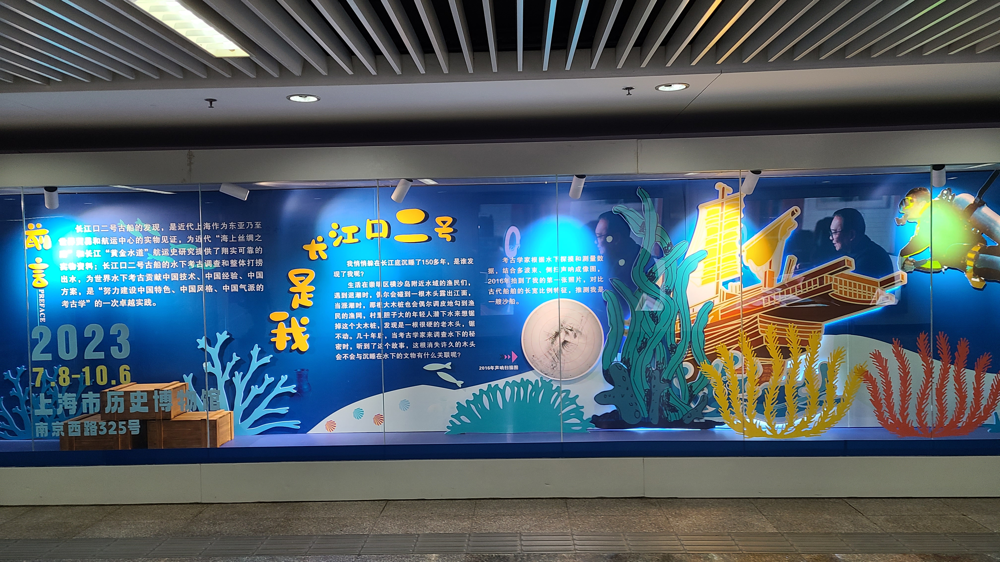

# 有些人走着走着就散了

## 德林酸菜鱼
前两天zxt在群里晒了和mt一起去吃酸菜鱼的照片，他们墙裂推荐这家叫「德林酸菜鱼」的店，据说是上海必吃的酸菜鱼，又酸又菜。但是因为周末人会很多，所以推荐我们工作日晚上去吃。于是我和xx就定了星期四的晚上（突然想起来上次吃蔬菜锅也是星期四，好巧）

地图查了一下，发现要坐地铁到徐家汇站之后，再步行2km左右，折中考虑了一下之后，决定先骑电瓶车到漕河泾，然后坐9号线。9号线不愧是上海的龙脉，这个点开往市中心居然也这么挤，还好我只需要坐3站就到了。下车之后打开大众点评，发现酸菜鱼居然已经开始等位4桌了，明明上车前还不用排队的！！于是火急火燎的先线上取了一个号（~~然后老婆也很心有灵犀的一块取了一个号，我是51号，她是52号~~）地图指示我要从徐家汇的2号口出，下车后首先看到的是满墙的崩坏三广告，看来这段时间徐家汇是被mhy占领了呢~ 之前好像从来没从2号口这个口出过，仿佛经过了一个世纪般的漫长，应该是走遍了整个徐家汇站吧，终于走到了这个出口。。。怪不得显示站内外要步行2km。。快到2号口的时候还看到了一座雕像，好像是一个什么很出名的人物？虽然我不认识。。。旁边的墙壁上还有很多的科普海报，好像是给上海市历史博物馆打广告宣传的。。

出了地铁站，左转沿着马路继续步行，走着走着发现我的号居然就快到了？原来这家店的翻台率居然这么高的吗，被迫的，我只能MODE SWITCH了！从竞走模式change成奔跑模式！跑到一半路经一个十字路口的时候，发现对面有一家姚记铁锅炖，好像是之前谁过生日一起吃饭的那一家。。原来今天是故地重游？

到了7点半，好容易跑到店里，结果还是不幸地过号了。。还好服务员说马上就有空位置了，让我等一会就行。等了大概2-3分钟吧，三楼就有空位了，上去坐下来开始点菜！这家店的环境属于比较嘈杂的那种，快比得上之前在巨鹿路那边吃的那家西餐厅了。。点了一个黑鱼大锅，再加了几份蔬菜，一盘炒饭，就静静地坐着等老婆来吃饭。老婆今天没办法早退，所以得差不多8点才能到店里。还好我也不是很饿，就让锅开着煮着，等老婆来吃第一口鱼肉！

8点钟老婆闪亮登场！不过却是满头大汗的，还只能穿着卫衣吃饭，好可怜啊。。为老婆献上了第一口鱼肉，果然味道还是不错的！不负我这半个小时的深情等待~ 鱼肉里有一些细小的骨头，但是好像都不太扎人，虽然老婆不太会剔鱼刺，但是好像都直接咽下去了？？总体来说，我的评价还是很可以的，至少可以说是秒杀那什么太二酸菜鱼了，太二我是一直吃不惯的，味道太重了，这家店的酸菜鱼还算比较清口的，我们也没有点辣锅，全程都不太需要喝饮料。虽然提供了酸梅汤和柠檬水饮料（柠檬水巨甜！还挺好喝的，有蜜雪冰城的感觉了）最后吃了一个小时实在吃不完了，剩下的打包带走做明天的午饭了。除了味道外价格也算不错，两个人点了个大锅才人均90，换成太二应该得要150吧？



## 有些人，走着走着就散了
吃完饭我们准备骑车车回家，但是下楼之后发现附近没有什么自行车了，正好发现对面有一家蜜雪冰城，老婆想喝柠檬茶，吃冰淇淋，于是决定过去买喝的，然后走回地铁站坐地铁回家。这条马路是天钥桥路，吃的喝的店很多很多，马路对面的二楼有一家什么火锅店，占满了长长的一整排店面，灯火通明的，甚是繁华。

买完蜜雪冰城，便准备走回地铁站了。才刚走了几步路，突然间我的耳畔传来了一阵音乐声，那阵旋律深深地触动了我的心弦，让我不由自主的对老婆喊“停”，然后掏出手机，一边打开网易云听歌识曲，一边慢慢倒退，寻找那音乐的源头。听歌识曲的结果，是庄心妍的那首「走着走着就散了」，而那音乐的源头，则来自停在路边的一辆电瓶车上，正在刷手机休息的美团小哥。黑色的夜幕下，那小小的6英寸屏幕上闪烁着迷人的光晕，扬声器里传出的那可令人断肠的词曲，却令小哥的背影越发的萧瑟起来。这一刻，我有点懂了：有些人，走着走着，可能就散了，而有些人，甚至可能，都没有走散的机会。。

接下来的路程显得无比的漫长，仿佛经历了一个世纪般。我的脑海一片混沌，不知道为什么，小哥的背影充斥着我的整片脑海，一会高大伟岸，一会又佝偻萧瑟。途中我们经过了一个徐家汇市中心的小区，挂牌房价150k/平，这里的户型应该都是100平起的，那就是15M，有点吓人的。虽然钱很多，但是钱却不是万能的，有的人，即使有钱，也没有办法再回到从前了:sob: 快走到地铁站的时候，旁边经过了一个抱着小孩的妈妈，妈妈正在对小孩说：“马上就到家咯~”，我和老婆对视了一眼，不由自主地想到，该不会就是住在刚才那个小区的吧~

走到2号口，发现门口写着徐家汇居然是国家4A级景区，在徐家汇附近住了快4年了，居然还没有好好地逛过这里，除了一个什么徐家汇藏书楼我们之前去过以外。。感觉有点害羞呢，以后找个时间和老婆一起逛一逛叭~

下地铁之后骑电瓶车和老婆一起回家，到家里大概是10点半的样子，洗漱了一下就准备上床休息了。不由自主地又打开了网易云，从头听了一遍《走着走着就散了》，心中却是无限感慨。



