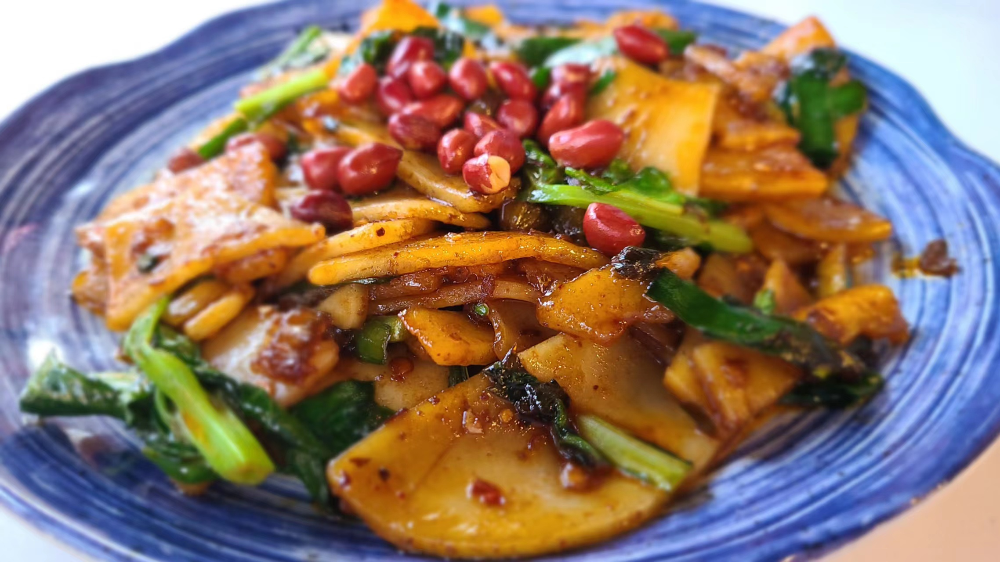

# 云南旅游(1)——昆明

过去的这个五一假期，原本很早就有计划和老婆还有她的闺蜜们一起去英国玩，但因为我的签证被拒，被迫临时更改行程，正好前段时间抖音直播间有特价机票，于是我们便买了去云南的机票，经过了一波紧张刺激的攻略制定后，最终的行程安排是：昆明(1.5d)——大理(3.5d)——巍山(1.5d)——丽江(3.5d)。因为是长达11天10夜的旅行，所以会分四篇游记来记录这段旅行。本文是第一篇——昆明篇。

## DAY1
### 飞机
中午12点20从虹桥机场起飞，历经3个小时20分钟，下午3点40分落地。在飞机上主要是学习相机的使用，老婆给我提前准备了很多教程，包括光圈、快门、ISO、白平衡、曝光补偿等术语，以及相机的各个按键说明等。对着教程倒腾了挺久的，大概算是初步了解了吧，就等着去云南实战了！

飞机在落地前一阵颠簸飞行把我们俩整的挺难受的，差点晕机，但凡这飞机再晚落地5分钟，我估计就要吐出来了:nauseated_face::nauseated_face:下飞机后我们在机场还缓了好一会。机场出口处有很多少数民族服饰打扮的人在接客，有一个小姐姐还很热心的送我们一个手提袋，里面居然装了不少的吃的。。云南民族都是这么好客的吗？

从机场直接坐地铁去市中心的民宿，昆明一共六条地铁线，我们坐的这条始发站是机场，终点站就是我们的民宿，定的位置还是不错的。出站后感觉到一股热浪扑面袭来，昆明下午4点钟的太阳那叫一个毒辣，才4月份，已经有上海6、7月的感觉了，吓得老婆直接全副武装防晒。。我们的民宿在17楼，异域风格的装修，房间实景和图片差不多，不过厕所好像不太行的亚子，洗澡的地方比较小，水流小，也没有提供沐浴露，算是小小的槽点吧。

### 汽锅鸡
简单收拾一下后，我们就骑车去今晚定的饭店，<a href="https://www.dianping.com/shop/laH0oIG7wqyo0i37" target="_blank" rel="noopener noreferrer">福照楼·文明街店</a>，大众点评汽锅鸡排行第三名。出门后发现昆明这边的共享单车很少，大部分都是共享电动车，这倒是一个意外之喜，大大地缩短我们在路上的时间。到了饭店发现很空，不知道是因为还没到饭点还是就是人很少。。点了一个双人餐，包含招牌的汽锅鸡，外加一份菠萝炒饭、一份酸芒果好像是，一份牛肝菌炒肉，外加两杯木瓜水。

汽锅鸡的味道真的很特别，网上查了一下，发现汽锅鸡是不加水的，鸡汤全都是蒸汽液化后的结果，所以虽然看上去油汪汪的，但是全都是鸡自己本身的油，吃起来一点也不油腻，特别好吃！！另外几个菜不做评价，因为吃的比较少，主要就是来吃汽锅鸡的，还得留点肚子晚上吃别的呢！



店的装修风格是西南联大主题的，透着一股浓厚的历史味道，拍照的确很出片

### 昆明老街
吃完饭后我们在旁边的一家店里还点了一份炒饵块，好像是大众点评里的第一名呢。吃之前其实我们并不知道饵块是什么东西，端上来后感觉就和年糕差不多，吃起来口感其实也差不多。。去网上查了一下才知道，饵块是用大米做的，年糕则是用糯米做的，饵块是云南地区的特色美食。不过说实话，这家超饵块的做法，并不是很对我们俩的胃口，浅浅吃了一下就放筷子了

吃完了去逛昆明老街。昆明老街不是一条街，而是指的一片街区。每条街都有各自的主题特色，像文明街是知名的小吃餐饮聚集地，钱王街则是一些文艺的酒吧咖啡厅，景星街主要是古玩珠宝等等。我们也没有什么特别的目标，就随着人流到处逛来逛去。途径那个网红拍照打卡地的酒杯楼，发现真的很像上海的武康楼mini，倒是真的有很多人在那里拍照。。酒杯楼的对面有一个广场，广场上正好在跳广场舞，那个音乐特别带感，跳舞的除了大爷大妈，也有年轻小伙子小姑娘，跳舞手势动作还都挺整齐的，不得不感叹真的是56个民族，有55个都能歌善舞啊。

### 钱王街的酒吧
在钱王街我们路过了一家酒吧，好像是什么中国保护建筑来着，老婆就撺掇我一起进去坐坐。店内的装修和氛围都不错，光线比较昏暗，是那种暗红色的。点了一杯鸡尾酒，在里面坐了半个小时，还用相机给老婆拍了好多照片（然鹅由于是定焦相机，坐的太近了，拍的不太清楚。。）鸡尾酒还挺贵的，一杯70多，就当是为了这个氛围买单啦

### 夜间骑行
在大概把昆明老街逛了一遍之后，我们就准备骑车回民宿。因为这里的路况有些许复杂，实际骑行路线是绕了一些远路的。中途我们经过了南屏步行街，是昆明这里本地人逛街的地方，相当于上海的南京路，晚上人流也挺大的。在步行街路边发现了一辆花车，四周用好多花花满满地装饰了起来，顺手给老婆拍了一张美美的照片！

回家前顺路还吃了个夜宵，在xhs上挺多人推荐的<a href="https://www.dianping.com/shop/H7eN7u9V8wSOzC0M" target="_blank" rel="noopener noreferrer">铁棚小锅米线</a>，就在我们家附近。不过实际吃下来我的评价是一般，那个肉饼的味道是还不错，但是汤底重油重辣，而且米线是细米线，来之前做攻略的时候都说昆明本地是吃粗米线的，细米线是照顾外地人的口味做的。。店里还有几桌坐着的一看也都像是游客的样子，看来都是被xhs带过来的呀，真是罪孽深重的xhs🍠。。

## DAY2
今天是纯纯特种兵的一天，早晨6点多起床，晚上12点睡觉。。

### 翠湖公园
为了赶7点钟去吃早饭。早上6点多就起床了。选的早餐店是<a href="https://www.dianping.com/shop/k5YoGCsO6WqQNSk0" target="_blank" rel="noopener noreferrer">文山荷鲜居</a>，大众点评上排名挺高的，店就开在翠湖旁边。昆明的天气真的挺热的，早晨6点多骑电瓶车，穿短袖+一件薄衬衫一点也不冷。这家店面很小，非常小，比我想象中的要小好多，点了一份饵丝一份卷粉。价格是挺便宜的，但是味道也就一般吧，比较淡，都是鸡汤的底。



吃完后我们就去逛翠湖公园了，早晨的翠湖公园基本没有人，空气也很新鲜，在里面的一个池塘里看到了好多只鸭子和大鹅！还在一棵树上看到了好几只松鼠！这里的生态环境保护的还挺不错的！据说翠湖是本地人饭后闲逛的地方，早晨也就只有一些在湖边打太极的，或者是在公园里晨跑锻炼的老年人了。



### 逛农贸市场
离开翠湖公园，我们准备去逛菜市场了。做攻略的时候有看到一个说法，说比起一些网红打卡景点，本地菜市场更能发掘出当地的风土人情特色。昆明比较出名的菜市场有两个，我们去的是叫「东华」的菜市场，距离翠湖公园地铁2站路，还是挺近的。途中经过了一条叫黄公东街的路，有一个路牌是网红打卡点，没想到才早晨8点半就有挺多人在那里围着拍照了。本着「来都来了」的想法，我们也加入了拍照大军。。。



10分钟后，我们离开黄公东街，正式前往菜市场！坐地铁的时候有个地方要吐槽一下，换乘的时候居然不用上楼梯，同一个空间里一面是5号线另一面就是4号线，下了5号线直接去对面换乘就行了。我们上了楼之后的4号线反而是反方向。。。东华菜市场的装修好像是一个火车的样子，我们到的时候已经是熙熙攘攘的，到处都是人了。外面一圈是一些卖吃的的摊位，主要是一些卤菜店和小吃店，我们看的可以说是眼花缭乱了，最后买了柠檬手撕鸡、炸土豆片、炸茨菇片、芋泥砖、粑粑、还有好多好多好吃的东西，都没有手拎了！

走进内部就是卖菜的摊位了。有些摊位上摆满了我们从来没有见过的菜，真就一个都叫不出名字，实在是新奇。。当然也有那种常规菜像是萝卜土豆青菜啥的就是了。。


### 斗南花市
在菜市场呆了大概有一个小时吧，超出了之前的预期，主要是实在太好玩了，还有好多店因为种种原因最后没有吃或者没有逛的。。临走之前在卖水果的地方买了半斤樱桃和小半斤蓝莓。菜场的蓝莓卖65一斤，比我们刚才在翠湖外面买的88一斤要便宜不少。事后吃完评价，路边摊88一斤的蓝莓很甜，但是菜场65一斤的蓝莓则是盲盒，酸甜参半。。看来还是一分价钱一分货的呀~至于樱桃，只能说没有达到预期，吃下去还有点淡淡的苦味，20块钱算是打了水漂了

从菜市场离开，我们前往下一个目的地——斗南花市。斗南花市是亚洲最大的花卉市场，里面整个会场都是卖花的，分为早场晚场，白天的早场主要是卖给散客和游客的，晚上晚场则是批发商进场采购。因为行程安排，我们就定在了早上过去。买花的目的主要是为了给大理之行拍照的时候用作装饰。花市的摊位一眼望不到头，花的价格也是低到吓人，平均10块钱左右一把花，折算下来就是一块钱一束花，在上海的话根本不敢想。。像是玫瑰什么的价格差就更多了。在花市里面还有不少的流动小贩卖花环的，价钱在3~5块钱一个左右，我们俩人一人买了一个，由于手里拿不下东西了，就戴在头上开始逛花市。经过一番扫荡收割，总共花了大概100块钱，买了6,7把花，外加花泥，和打包的箱子，差不多可以满足去大理的拍照需求啦~



### 云南大学 & 文化巷city walk
从花市回到家已经1点多了，把打包好的花花放在民宿之后，直接去老街吃个午饭。原本打算是今天中午吃野生菌火锅的，但是没想到早晨0点的时候预定的订单居然失败了？？无奈之下只好中午随便吃吃了，在老街找了一家过桥米线，来云南怎么能不爽吃米线呢？据说米线在云南有108种吃法呢，有名的就有过桥米线、小锅米线、豆花米线、罐罐米线、砂锅米线、凉米线、卤米线等等。这次吃的过桥米线，讲实话，和在上海吃的差不多。。。而且过桥米线的价格比其他的米线要贵不少，我也不知道为什么会贵这么多，说配菜多吧，其实每样也才几片。贵的过桥米线甚至要将近100块呢！我们点了一份30多的套餐，主要是尝个味~

吃完米线，原本打算去江边看蓝花楹然后拍照的，但是老婆说现在下午太阳既晒，又因为光线太强拍不出好的照片，提议先把后面的行程提前，于是我们就准备朝云南大学进发，去学校附近city walk。云大的附近有一条文林街和文化巷，是昆明文艺气息最浓的一条街，有好多的咖啡厅、古着店，还有各种小资文艺的小店。在去的途中我们经过了翠湖门口，去那边喝了一杯昆明当地特色的奶茶，叫「上山饮茶」，味道挺惊艳的，老婆很喜欢~ 下午的翠湖和上午简直不是一个地方，用人山人海来形容也不为过，外面的道路口停满了车，公园里面的桥上似乎都挤满了人。。难道才4.27号就已经有这么多游客了吗，表示震惊:scream::scream:在奶茶店旁边是上午没有吃成的破酥包！店员说只要收藏打卡就可以白嫖两个包子，居然有这么好的事！我们吃了一个胡麻味的，一个花生糖腿味的，胡麻真的是太好吃了，破酥包的皮真的很不一样，有千层的那种感觉，特别好吃！

骑车到文化巷下车，这条路的确文艺气息非常浓，xhs上说这条路可能汇聚了昆明最多的美女。这里的很多店面都是租在小区的楼栋里的，租金会比外面的铺面便宜不少吧，开在大学旁边的店果然很挣钱，一件普通的白T都标价大几十。老婆想逛的古着店叫<a href="https://www.dianping.com/shop/G9WfLbQHYki000O5" target="_blank" rel="noopener noreferrer">NANA</a>，也是租在小区楼里的，内部空间不大，上下两层楼，里面的人还不少，看着很像是云大的学生呢。古着店的装修很有感觉，但是标价也是真的狠，基本没有小于300的，老婆一眼相中一件深蓝色的裙裙，还选了一件红色的可爱风的裙裙，两件加起来一共花了888大洋。看来以后给老婆买衣服还是要多出去旅游，在上海的时候一边嘴上说着“我没有衣服穿了！”，一边逛商场的时候说“没有看的上的”。。。:unamused::unamused:

在文化巷这里还发现了一个很好玩的地方是，这里的配电箱外面都会用油漆刷一些特别的图案上去，非常的可可爱爱



### 蓝花楹
从文化巷离开，我们骑车去了盘龙江畔看蓝花楹。昆明看蓝花楹最著名的地方是在教场中路，但是那边的人太多了，那个双层的观光巴士也很难排得上队，所以索性就没去。在xhs🍠上看盘龙江畔的蓝花楹开的也非常的美，但是实际到地方了，发现已经掉的差不多了！！！大部分的树上剩下的都是绿油油的叶子🍃了。。沿着江畔走了好久，好容易才找到几棵开的还比较茂密的蓝花楹树，用相机狠狠拍照了！这个时候拍照才发现，用相机比用手机拍出来的效果要好不少呢（不过下面的图是用手机拍的就是了）



### 野生菌火锅
晚饭吃的是心心念念的野生菌火锅，又回到了昆明老街上，由于我们来的时候还没有到昆明的雨季，因此吃到的菌子其实还是冷冻的菌子，不是新鲜现采的菌子TAT。味道还是不错的~等锅烧开 + 菌子熟了一共需要快20分钟的时间，甚至足够我去自取两杯奶茶。老婆很喜欢下午喝的「上山喝茶」，于是又点了一杯，我自己则是点了一杯「麒麟大口茶」，这家店居然只有一个产品，就叫麒麟大口茶，也是蛮特别的。。。

### 窨井盖文化
昆明之行最大的惊喜是发现这里的窨井盖非常的特别，很多窨井盖上面会刻画附近的地名，比起那种普通的一个「污」字，或者是一个「水」字要生动鲜明的多。可惜的是没有能够收集齐9个不同的窨井盖，召唤神龙:sob::sob:


