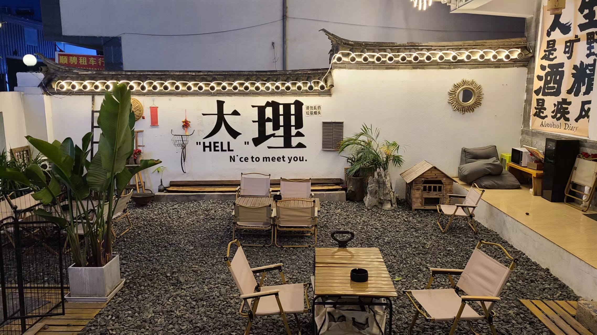

# 云南旅游(2)——大理

在大理的旅行持续的时间最久，从4.28日一直到5.1日，一共4天的时间。

## DAY1——04.28
### 最后一碗米线，再见昆明
今天是在昆明的最后一天，准确的说是最后一个早晨，因为8点我们就会坐高铁离开并前往大理了。最后一个早晨的安排是吃一顿一锅米线，这是在xhs上找了好久，当地人推荐的一家店，名名字叫
。为了赶这顿早饭，早晨6点钟就要起床，收拾行李之后，6点半打车出发。昆明的早晨还算比较空旷，司机师傅在市中心的马路上甚至能飙到80km以上的时速！下车之后找了一小会才发现这家店，店面不大，甚至很不起眼，典型的属于藏在小巷子里的「苍蝇馆子」。我们是今天的第一对顾客，点了一份臭豆腐米线，外加一份老板娘推荐的卤面。点米线的时候老板娘甚至会问我要的是粗米线还是细米线，真是太悉心了！！！

稍等片刻后，我终于吃到了心心念念的粗米线，第一口嗦下去，那叫一个好吃！口味和第一天晚上吃的铁棚完全不一样，可以说无论是汤底，还是米线都秒杀铁棚。也许只有吃到了粗米线的那一刻，才能真正体会到云南米线的精髓吧~


### 想你的风，吹到了大理
昆明到大理需要坐2个小时的动车。到大理已经是上午10点多了，下车后打车前往我们定的民宿。大理的四个晚上，由于行程安排的调整，最终我们定了四个不同的民宿，突出的就是一个盲盒体验。第一家民宿的位置在大理古城的北门附近，我们在定位附近找了好久也没找到，和老板打了视频电话后才找到。这家民宿是我在美团上一眼就相中的，看底下的评论都是清一色的好评，类似于“这个民宿是住过的最像民宿的民宿”的评价比比皆是。由于上一个房客还没退房，我们只能把行李放在客厅之后离开。

从大理古城的北门进来后，发现人很少，路上的行人只有稀稀拉拉两三个，看来错峰出行是非常明智的选择！走在路上，连续遇到好多个人拉力推销租电瓶车的，前一个人刚给你推销完，后一个人就凑上来说“你不要租那个人的，他们家的电瓶车怎么怎么不行”。原来大理古城的电瓶车租赁服务已经卷到这个程度了吗！

中午的吃饭比较随意，先来一杯雪王的柠檬水（这几天每天都炫柠檬水，真的炫饱了），然后在路边随便找了一家小店，点了一份蛋炒饭和一碗冰粉，味道还算不错。吃饱之后我们就准备去生态廊道了。

### 洱海生态廊道
来之前查的攻略基本都说，生态廊道是大理最值得一玩的地方。那么在预期值拉高的情况下，究竟生态廊道还能不能带给我们惊喜呢？答案是肯定的。我们在城外扫了青桔共享电瓶车后，就骑车到了生态廊道离我们最近的起点——才村码头。外面的车是不能进生态廊道的，只能进去之后再扫车。里面的哈啰电单车起步价是¥15/h，贵是真的贵，但是总比骑自行车强吧。。

生态廊道的骑行体验很棒，路面很宽分为三个道，分别是双向的骑行道和单向的步行道（虽然很多车都直接在步行道上骑）。
我们开始骑车的时候已经是下午1点半了，本来打算直接骑车到终点也就是海舌公园，然后手机开导航记录一下这段骑行的，结果手机用的快没电了，一边用充电宝充电，一边继续导航，最后手机变的巨烫无比，电也才充了一点点，吓得我赶紧把电源拔了。。。:cold_sweat::cold_sweat:

骑行的途中，我们还会时不时的下来拍照，还有就是为明天的秋千拍摄选址，需要找到符合老婆拍摄需求地理位置合适的树。找了好多棵树，最后还是选在了廊桥的孤独的树（事后我们才知道，孤独的树在这棵树的旁边，我们选的这棵并不是歪脖子树:joy::joy:）

生态廊道最著名的两个景点，一个就是网红S弯，另一个就是廊桥了。前面我们骑行的时候还纳闷，怎么路上人不多的样子，等我们骑到S弯的时候才发现，这里挤满了人，路边的咖啡厅也都是人。好多人都下车去岛洱海边拍照。也正如xhs说的，只要骑过S弯，到廊桥之前的那段距离，人特别特别少，但是也有很多不亚于S弯的风景。真不知道为什么大家都喜欢挤在S弯拍照。由于老婆没有做好充分的防晒准备，本次骑行在骑到廊桥之后就告一段落了，最后总计骑行了3个小时，花了45块大洋。在廊桥旁边
我们顺手找好了租衣服+化妆的店，名字叫什么时光机来着，一共花了100块钱。老板娘还答应我们明天6点半就开门营业，顺便告诉我们打车的方法，直接沿着大丽线打车到这里就可以了。

### 三月街赶集
打车回家的路上，发现这个路线还是比较复杂的，从廊桥要绕很绕一段路才能开到大丽线上。这样一想，原本我们打算第二天骑电瓶车沿大丽线直接冲到廊桥的想法，现在看来还是太naive了。快到家的时候，司机说我们正好可以赶上三月街的集市，问我们要不要下车，虽然当时攻略没有做这个（好像老婆有写过？），但是肯定要去！

刚走到三月街集市门口，我们就被那响彻云霄的声音惊到了，入口处的几家烤羊肉串店都外放着非常新疆风的歌，烧烤小哥还赤着膊随着音乐摇摆，真是大开眼界！还特意录了段视频（网易云听歌识曲好像不太准，识别出来的歌不像是原曲的样子。。）



整个三月街集市好像是建在一个上坡道的上面，我们从集市门口一路向上攀爬，经过了的最多的店就是卖各色糖果/蜜饯的店，可以说是三步一家，绝对重样。糖果就是我们小时候经常看到的那种彩色的软糖，还有冬瓜糖、丁果糖等等。老婆也在摊位上买了一些小吃，像是糯米饭、羊肉串、冰淇淋等等。中间还遇到了一个cos奥特曼的，站在大马路中间，特别显眼，好多人都围着拍照哈哈哈哈（我也不例外）

中间有一个小插曲，在晚上6点钟准备抢第二天海舌公园门票的时候，老婆抢到了但我没有抢到，害的老婆不能进去拍照照了，老婆还说我手速太慢了，情急之下我就又哭哭了。。。以后一定要改掉这个一直动不动就哭哭的坏习惯！

回去的路上还在路边摊买了一件衣服，原价99，老婆直接砍价到59，双方都收获了喜悦，真好（后来再在店里逛衣服就再也没有见到过这个价位的衣服了。。）

### 夜游大理古城
从三月街回古城的时候已经是晚上快7点钟了，这个时间的大理天空依然是亮亮的，不禁感叹低纬度高海拔的魅力。我们从苍山门进的古城，进去后发现人流比我们上午要多不少，看来大家都是选择晚上出来逛古城呢。我们大概沿着一个逆时针的方向，从西走到南，再走到东，最后走回北的路线，把大理古城逛了个七七八八。古城的商业化还是比较重的，很多店都是走几步就能看到一家一样的，连带店里墙上贴的海报都一模一样，（没错说的就是你，炭烤榴莲）

古城的主干道人流比较大，但是一些小路小巷子却没有什么人，比起同质化严重的主干道，钻黑灯瞎火的小巷子会更好玩更有感觉。在一些小巷子里，还发现了一些神奇的店铺，比如有一家叫的饭店，好像是古城的一个什么排行榜的第一名，里面还有好多人在吃饭，但是我们去晚了，已经打烊了；还发现了一家面包店，好像是手作的面包，还可以快递发往全国，老婆买了一个红豆的面包（然而并不好吃就是了xs）。小路里有的时候还会钻出来一辆马车，马车的车厢外面是流动的荧光，在黑夜下显得十分炫酷！

今天的晚饭也是随便吃吃，在小巷子里找了一家粥店，叫，点了一碗青菜瘦肉粥，还给老婆点了一份乳扇甜品，这家粥店的粥还真挺好喝，大众点评居然才3.5分，寥寥几个评论。看来还是不能太依赖点评榜单。

### 最像民宿的民宿
吃完饭回民宿，推开房门的一刹那，真的有被惊艳到。房间的实景和在美团上看到的网友评论贴图基本一致，装修风格是那种复古风，非常的有特色，即使在房间里都可以拍出非常好的片子。可惜我们没机会在有自然光的环境下拍照咯！晚上11点就准备睡觉了，第二天还要5点起床去拍照呢。



## DAY2——04.29

### 洱海边的精灵
今天是本次10天旅行最重要的一天，目标是去洱海边拍秋千照，老婆在xhs🍠上看到别人拍的，很喜欢，于是也打算拍一个。拍摄的道具是秋千和花花，秋千网上买的50块钱，昨天已经在菜鸟驿站拿到手了；花花是前天在昆明的斗南花市买的，包括主花、辅花和绿叶，还买了花泥和剪刀胶带。摄影师是在xhs上约的，要价是399/小时，不算便宜，但是也不算贵了。。

5点钟起床，5点半打车去廊桥的时候，路边还是黑不溜秋的，再次感叹幸好我们选择了打车，如果这个环境下骑小电驴，真的很不方便。。到了廊桥天还没有亮，老婆在店门口等老板娘过来化妆，我就背着相机去洱海边蹲一下日出。早晨的大理风挺大的，气温也不高，我只穿了一件短袖 + 一件薄薄的衬衫，还是挺冷的。可能是天公不作美吧，一直待到了7点，也没有见到很壮观的日出，顶多就是天边泛起一抹红色罢了。。

快8点的时候，老婆化完妆，我们带着花花和秋千去布置场地，留给我们的时间只有一个小时了。到了实地后发现树的高度比想象的要矮，甚至不用我爬树就可以把秋千甩上去。接着就是装饰秋千的绳子，还有在绳子上插花了。最开始是打算把花插在花泥上，然后花泥固定在秋千的座椅上，但是这样做发现花泥的重心很不稳，一下子就翻倒了，无奈之下只能在绳子上插花，然后用绳子缠紧固定住。开始的时候我们俩插花的手法还略显生疏，但是插到最后，老婆已经俨然是一个专业的插画带师了！（下岗再就业又多了一条出路）

插花+装饰大概弄了1个小时多点，大概从9点半开始正式拍照。拍照的过程中周围陆陆续续会有很多路人两眼放光地来围观，感觉是那种我们一旦停止拍摄，就会一窝蜂涌上来抢秋千拍照。无奈之下我们只能说这个是自己搭的，拍完之后会拆掉，这样说了他们才散开。。老婆穿的白裙子，戴的金色的精灵假发，配上装满花花的秋千，和阳光下波光粼粼的水面，活脱脱的就是仙女下凡！不光摄影师在猛猛拍照，我也用手机咔咔咔的拍了一百多张！中途摄影师还让老婆站在秋千上拍照，也别有一番风味呢。

可惜的是，在拍摄快结束的时候，摄影师让老婆爬树上拍照，结果可能是因为袜子的摩擦力不够，老婆爬到一半的时候jio一滑从树上摔了下来。。。屁股和大腿都有好多擦伤，心疼死我了呜呜呜:sob::sob:，爬树的时候我应该在树下面接着的，但是那个时候我正好在开小差。。。老婆的受伤有我很大一份责任，难受:sob::sob:

### 喜洲古镇——风吹麦浪
拍照总共花了1个小时，10点半的时候，我们把垃圾清理了一下，就继续骑车把剩下的生态廊道走完，大概花了一个小时，骑到了终点的海舌公园。可惜因为昨天没有预约到，今天没办法进去拍照了（听说海舌公园还是很漂亮的呢）。下一站准备去喜洲古镇，这里有很多的电三轮可以搭乘，一个人只要5块钱。到了喜洲古镇，因为今天的天气还是有点凉的，于是老婆给我们俩一人买了一件披肩，就是那种典型的游客披肩——穿这个披肩的一定是游客。没想到矜持到了现在的我们最终还是妥协了哈哈哈哈哈。戴上这个披肩之后，瞬间暖和了起来！15块钱一条也不算贵。

喜洲古镇不大，开发程度也没有大理古城那么高，说实话没什么可玩的，浅浅逛了一下没啥特色，唯一可以说的上特色的可能就是这里有一大片的麦田吧。来之前看小红书说已经过了看麦田的季节了，没想到来了却有惊喜，这里的麦田还是金黄色的呢，好多游客都下去拍照了，我们当然也不能免俗哈哈哈。中午在古城里随便找了一家白族餐厅吃饭，叫，看大众点评的推荐点了top3的套餐——薄荷炸排骨、清炒水性杨花，还有一份木瓜酸辣鱼。水性杨花比我们之前在上海吃的火锅里的和水煮的味道要好不少，酸辣鱼的酸味是出自云南当地的特色木瓜，很新鲜，但是鱼刺太多了，吃不了一点。。。这顿饭也不贵，两人才花了100多。



吃完之后我们就把喜洲古镇剩下的地方逛了一圈，临走前发现有好多人在排队坐小火车，这个小火车是可以绕麦田一周的，好像刚好是51前的试运营，可以免费乘坐（五一之后就要收费35/人了，真幸运）。我们到的时候刚好是新的一波车次准备出发，都没有等几分钟就排上了，运气真好！坐在火车上看麦田的景色，真的很壮观，非常好看！！！火车还有名字，叫“有风号”，感觉是和《去有风的地方》这部电视剧有点关系的，之前欣怡还一直推荐我们去看这个电视剧，等回家了找个时间看看。



### 周城——扎染体验
下午2点半我们离开喜洲，前往下一站——周城。周城也没啥可玩的，只有扎染体验，下车之后你会发现马路两边90%的店面都是扎染体验馆。我们选的第一家好像还是一个什么示范基地，里面还在拍摄扎染相关的纪录片。后来在路边随机逛了几家店，包括老婆在xhs上被推荐的店以后，最后选了一家能够扎染中式男士衬衫，并且价格相对便宜的店，一件衬衫¥90，一件吊带裙也是¥90。

扎染的图案是自己选的，但是很多的扎染图案老板都说做不了，不是要缝，就是要蜡染。最后我们选择的是普通的渐变色加上两个小花花。原本以为扎染可以我们一步步动手亲自尝试，但是事实上这个所谓的“扎染体验”的体验感并不强，甚至可以说微乎其微，我们只是在衣服浸泡染料的时候，稍微动了一下手，其他的工序全程都是老板亲自操作，包括扎线、冲洗、晾干等。。晾干这一步就等了有一个多小时的时间，又因为周城这没别的什么可玩的，我们就坐在那边玩手机打发时间。。

### 性价比最高的民宿
从周城回大理古城是直接在路边拦中巴车。我们收好衣服出来后，运气非常好直接就遇上了一辆中巴车！回到古城后，我们回民宿拿了行李，然后准备前往今晚的民宿——半野民宿，这家民宿是这次旅行的10晚住的最便宜的，只要¥110/晚。到了民宿地点后，不禁感叹这家的性价比真的很无敌，设施一应俱全，地理位置和房间环境也不错，房东还养了一只大金毛，特别的可爱。简单收拾一下之后，我们就继续出门逛古城了。因为明天准备要开始环洱海了，会住宿在海东小普陀那，因此需要把行李先寄存在古城河边。问了民宿老板能不能寄存行李，老板很爽快的答应了，真的是很棒的老板呢！

走出民宿，准备看看租电瓶车的店，正好就遇到路边一个叔叔在拉客，很热情的把我们拉进去介绍租车服务，这家店除了租电瓶车以外，还可以租各种的敞篷跑车呢。简单问了一下价格，环海260km里程的电瓶车1个人租是¥50/天，租两天的话是¥80，和xhs上比了一下价格还算挺便宜的，看着叔叔阿姨也很热情的样子，就直接敲定下来付了钱，希望不会被坑吧。

晚饭吃的是昨天没吃到的，虽然我们到的时候已经超过8点半不接客了，但是在我们（主要是老婆）的盛情恳请下，老板还是退让了，给我们入了座。点的菜不多，柠檬鸡、老奶洋芋、黑三剁，还有酸角汁。柠檬鸡是这一家的招牌菜，可能是因为柠檬在云南有大型种植基地吧（后来在巍山了解到的），真的是顿顿菜都不离柠檬。口感和我们在昆明吃到的柠檬手撕鸡又不一样了，但是很好吃。老奶洋芋就是普通的土豆泥做法，黑三剁是个很神奇下饭菜，老婆吃的赞不绝口。酸角汁和我在上海喝到的完全不一样，非常清凉非常好喝！！！我一口气怒炫两杯！！



### 神秘的摆摊一条街
吃完饭出来，我们便朝西走打算把古城剩下的区域给逛完，途中经过了一条和古城其他地方风格完全不一样的街，这条街的两边没有千篇一律的店面，只有一些年轻人三三两两的蹲坐在路边，摆着个小摊，卖着一些奇奇怪怪的小物件；有的摆了个棋盘写着“五子棋挑战”；还有的玩起了占卜，整条街的氛围出奇的好，看地图上显示的是地方好像是「广武路」，属实是宝藏小街了！
大理古城的风真的非常的大，我们在小街尽头的路边摊买提拉米苏的时候，一阵狂风吹过，台子上堆着的打包盒直接被吹飞了= =这个提拉米苏才20块一个，按老婆的说法，同样的口感，在上海起码翻一倍。可惜我们回民宿的时候没有冰箱，冰淇淋已经化了不少了，还是应该乘早吃的

## DAY3——04.30


