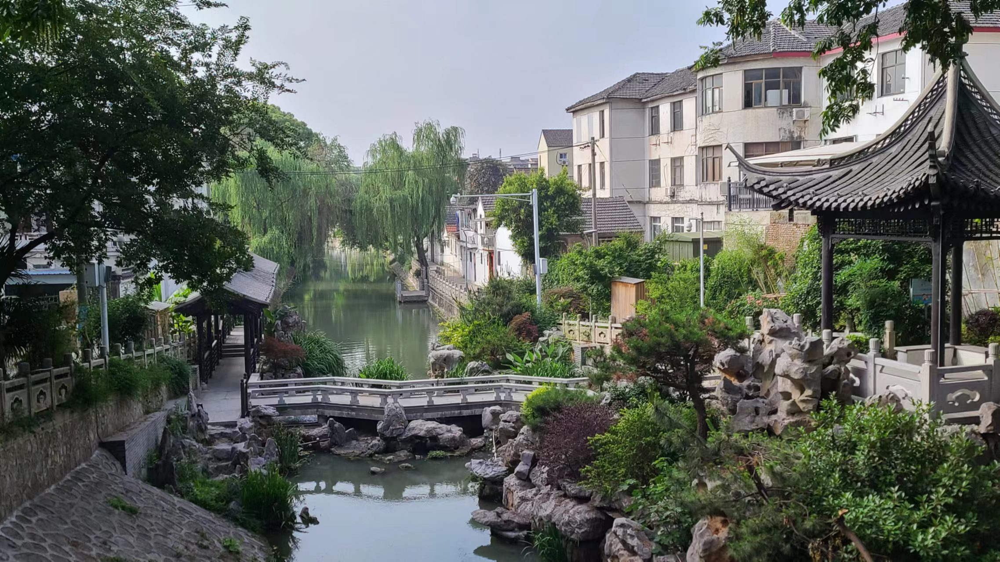

# 烟花五月下扬州

这周末约了双方父母会师，自从今年过年上门之后，已经拖了有3个月了，终于要等到这一天了，还是挺紧张的。。。由于丈母娘只有周六晚上和周日才有空，因此我们约了星期六晚上的晚饭，然后老婆提议周五请假一天，带我爸妈先去扬州玩一圈，虽然说没有赶上「烟花三月下扬州」，但是烟花五月下扬州也不错呢。

## DAY1——05.24
### 荟品仓薅羊毛
买的火车票是下午2点半出发的，正好今天我们家附近新开业了一家仓储超市，叫荟品仓，里面会卖很多打折的大牌服装鞋包（一般都是过季商品），就正好打算过去玩一玩。没想到的是周五早晨的人排队超级多，很多都是住在附近的爷爷奶奶们，门口还有1元换购拉杆箱的活动，哇塞直接排起了一条长龙。。

店面还算不小，一共地下1层和地下2层两层，进门扑面迎来的就是一大片阿迪达斯的鞋柜，基本上打4折左右，原价七八百的鞋子打完折两三百。阿迪的鞋子其实款式都还不错，即使过季了也没那么不堪（没错说的就是你Nike，真是没有对比就没有伤害，耐克的鞋真的就是一个字：丑。看完阿迪再看耐克的鞋子就完全不会有购买欲望了。。）这里的柜子上的鞋子都是单只陈列的，另一只鞋需要去专门设置的提货区领。给老婆挑了一双斯凯奇的小白运动鞋，才250块，配老婆的小裙裙还挺好看的~~（虽然最后因为忘记去提货区领鞋子没买成功:sweat::sweat:）

里面有很多著名的户外运动品牌，像Columbia，Jack Wolfskin，Jeep等等，不过基本都挺贵的，原价1k左右，打完折也要400。。在一层我们淘到了一件Teenie Weenie的短袖，这个牌子是专卖她的熊熊IP的，给老婆选了一套baby蓝的短袖 + 短裤，穿上去真是清纯可爱！！还买了一件粉粉的防晒衣！（后来再去逛的时候发现同款的T恤短裤全被一扫而空了，真的超级抢手，还好我们开门第一天就来了:joy::joy:）

其他专柜就没怎么买了，第一天的人真的很多很多，我们不知不觉逛到了12点多才离开，在楼下的麦当劳简单吃了个午饭，就直奔火车站🚄去了。

### 下扬州
和老爸老妈买的是同一辆车的不同车厢，上车后到苏州站，两人直接提了好多东西找到我们，有在万福兴买的炒肉馅团子，还有一袋枇杷，让我们在火车上吃吃。老婆还挺喜欢吃这个团子的，应该也算是她说的“糯叽叽”吧？高铁到扬州需要2个多小时，到站之后发现扬州站居然和高邮站一样，出站之后是在地面上的，外面的太阳就很晒很晒（后来才知道这一天扬州气温33度呢）。扬州因为没有通地铁，交通出行一般是小电驴🛵 / 公交车🚌 / 打车🚖。打车费用很便宜，我们从扬州东站打车到市区的酒店也只要10几块钱，这放上海起码30多吧。。

因为是带爸妈出行，我们就不折腾民宿啥的了，直接酒店，定了个扬州市中心附近的锦江之星，地理位置靠近我们等会要去玩的东关街和皮市街。放下行李简单休息片刻后，我们就出门逛街去了~

### 彩衣街 & 东关街
扬州行的第一站是东关街，算是扬州最热闹的旅游街区了？酒店出发步行10min就能到达，还挺近的。到东关街之前会经过一条叫彩衣街的路，从这里开始已经能看到一些旅游气息了，路边的各种吃吃喝喝的店都很多。扬大酸奶算是扬州这边很出名的网红酸奶了，到处都能看到卖这个的，在这里我们买了三杯尝尝鲜（因为我不吃酸奶xs，我就买了根冷饮）

东关街就是很典型的那种每个旅游城市都会有的旅游古街，下午的时候游客数量还不多，我们就沿着东关街一路从一头走到另一头，中途看到有好吃的会停下来买来吃。整条街也不是很长，走个20分钟差不多就到头了。中途我妈还会停下来让我老爸给她拍照，我也想给老婆拍照（但是她不喜欢拍游客照xs）



### 三春两园——冶春
走到东关街的尽头大概傍晚5点左右，这个点如果直接在东关街吃晚饭稍微有点早，于是我们就接着向着今晚的晚饭目的地前行。扬州的早茶文化非常出名，而在众多的早茶店中，又属「三春两园」最为出名。三春指的是“富春”、“冶春”和“共和春”，两园指的是“趣园”和“怡园”。我们今晚吃饭去的就是三春里面的。虽然说吃的不是早茶而是晚饭，但是冶春的菜也是非常正宗的扬州本地淮扬菜了~沿着扬州的马路慢慢的走，一边走一边聊天。大概走了有半个小时不到，我们来到了一个叫御马头的地方。据说这里是当年乾隆皇帝下江南时停泊御舟的地方，现在是“乾隆水上游览线”的起点。冶春就在这个御马头的前方不远处。

冶春的布局非常特别，像那种中式后花园的风格，亭台楼阁，小桥流水，还看到好几个女生穿着汉服在河边拍照呢。可能是因为这家店吃早茶更出名吧，晚上来吃饭的人不是很多，直接空桌入座。点的菜都是扬州的招牌菜，一份狮子头、一份扬州炒饭、一份烫干丝，一份文思豆腐、外加一些蔬菜和甜品给老妈吃的。整体的评价还是不错滴，老婆说算是比较正宗的扬州味道了。狮子头是清蒸的，肉入口即化，但是稍微有点腻味；扬州炒饭挺好吃，但是里面的虾仁没有味，感觉是水煮之后直接加进去，没有过油。。烫干丝：好吃无疑，扬州的干丝基本没有不好吃的（事实证明这几天吃的干丝都很好吃！:smile::smile:）文思豆腐配麻馓，蘸着羹吃特别香！



吃完饭天已经黑了，黑夜的冶春和傍晚的冶春又是完全不一样的风景呢。园子里有一座红桥，在夜色下显得格外的妖艳漂亮。离开冶春我们沿着马路散步消消食，原定计划是去皮市街那边逛逛的，中间经过东关街的时候，发现相比下午我们来的时候，人流量多了好多好多，大家都是晚上出来轧马路呢~ 去皮市街快走到一半的时候，我妈突然说脚疼走不动路了，还说已经8点半了不早了，让我们走回酒店早点休息。。无奈之下我们只能放弃皮市街的计划，改到第二天再来了。回酒店之后冲了个澡，吃了点枇杷，然后就早早躺下睡觉了，因为第二天要6点半出门去吃！早！茶！

## DAY2——05.25
### 三春两园——怡园早茶
今天要一起早起去吃扬州的早茶，定了6点的闹钟，6点半就准时出发，目的地是三春两园中的，距离我们的酒店也非常近，步行5min就能到。走的时候我们先把行李寄存在了酒店前台，准备下午回来的时候再取。寄存的时候出现了一些小岔子，先是退完房之后我妈发现手机落在房间里了，然后是都已经走下楼快到怡园了，我妈又想起来防晒外套落在房间里没拿，真是无语住了。。只好让老婆先去怡园取号，我陪着回去翻译普通话。。

虽然已经去的足够早了，但没想到还是差点排不上号，老婆取到的是最后一张四人桌号。这家怡园和广州我们没吃上的那家早茶店很像，都是先坐电梯上二楼，然后有一个非常大的像是宴会厅一样的大厅，里面摆满了圆桌，2人桌，4人桌，甚至更大的大桌都有。我们来的时候已经坐满了差不多一半的座位了，还空着的估计是提前预约了座位还没到的吧。我们点了一份烫干丝、两碗阳春面、几个松子烧麦，还有两块油糕。烫干丝不愧是扬州招牌菜，哪里的都很好吃！阳春面比我上次在高邮吃的要好吃不少，不过老婆说这是因为照顾外地人的口味做的改良版，胡椒粉放的太少了= =。油糕其实就是我们苏州的米风糕换了一个名字，松子烧麦很香（也很大只）。本来还想点这家店招牌的蒸饺的，但是已经售空了。。。（在隔壁桌上看到了，很大很大的蒸饺，从来没见过呢）



吃完早茶，去隔壁的咖啡店买了两杯咖啡，我的是超大杯的气泡美式，扬州的天气很热，这杯冰饮过会就可以救我的狗命了。

扬州人很喜欢慢生活，打工人会很早起床去吃早茶，点一堆精致的花里胡哨的东西，边吃边聊一个多小时，然后再去上班。中午可能就随便吃点盒饭啥的对付一下了。除了早茶外，还有那种专门喝茶的茶馆在扬州也很多，泡一杯茶，坐一个下午，嗑嗑瓜子和朋友拉拉家常，或者一个人看看外面的车来车往，非常惬意，真的很适合养老呢。

今天上午接下来会去玩。不过博物馆要早晨9点才开门，现在太早了，就先在附近散会步，走着走着不知不觉又走到了昨天去过的冶春。早晨的冶春可热闹了，人头攒动都是来吃早茶的，早上冶春还会特别安排唱戏班子的表演，应该是扬剧吧。既有在台下吹拉弹唱的，也有在台上表演的，可好玩了！

### 大运河博物馆
快8点半我们就准备打车前往大运河博物馆。司机师傅是扬州本地人，在路上还和我们闲聊，说扬州最好玩的地方就是这个大运河博物馆了，他都去玩过4次了。老婆虽然也是扬州人，但是还从来没有去过，还被人家狠狠地嘲笑了一番:sweat_smile::sweat_smile:，是不是真的扬州人啦！

博物馆非常宏大壮观，整个博物馆的外形设计成了一艘船的形状，要离它走的远远的才能看得出来。到了门口发现已经排了一条很长的队伍了，后面还一直持续有游客前来。据说去过的没有差评的，清一色的好评，能在里面玩好几个小时呢。而且是免费入馆，只是需要线上抢票预约，每天限流。。还好我们提前了一个多星期就开始预约了，成功约上！

入馆之后，花了20块钱/人租了个电子讲解器，它会在你靠近展区时自动感应然后讲解介绍相应的内容。整个博物馆占地分三层，有12个场馆。前面三个馆是最大的，也是逛下来印象比较深刻的馆。

- 第一个馆叫「大运河——中国的世界文化遗产」，是最大的一个展馆，讲述的是大运河的历史变迁、科技成就、社会作用、经济文化等内容，在里面狠狠地补习了一波历史（虽然可能很快就忘记了233）。
- 第二个馆叫「运河上的舟楫」，这是一个专题展览，里面展出的全部是大运河上的船只模型，各个朝代的，官用/民用/商用的都有，非常的厉害！
- 第三个馆叫「因运而生——大运河街肆印象」，这是我逛下来印象最深的一个馆，他通过现代科技来还原当时历史的街道城镇风貌，里面有各种各样的商铺，还有码头、酒楼等等建筑，展现了大运河沿岸城镇的繁荣昌盛。在里面还可以买一些纪念品，也算是除了租借讲解器以外的另一种商业模式了。。里面有个还原古代人们坐船的场景，特别的真实，抬头还能看到外面在下雪呢，真的很不戳。



四号馆开始的展馆都属于专题展览了，面积也都不大，像是介绍世界上欧美地区的一些运河和运河城市、运河的湿地生态、隋炀帝和大运河的故事等等。全部的展馆加起来逛了3个多小时，在快1点的时候离开，准备去吃午饭。

### 壶园美食
午饭去的地方叫，地理位置比较偏僻，在一个小弄堂里，店面也不算大，不知道算不算的上是苍蝇馆子？去之前还担心会不会打烊了，在大众点评上显示1点半就歇业了，还好最后还是赶上了趟！按照国际惯例先点一份扬州炒饭，这顿主要吃一些之前没吃过的菜，砂锅百叶、宫廷蚕豆、盐水鹅（扬州招牌！）、还有两个蔬菜。这家的蚕豆是我没见过的做法，端上来的时候还在滋滋冒油，吃起来也也是满嘴的油xs。盐水鹅的味道好像挺正宗的，就是肉质稍微有点硬了。其他几个菜不做过多评价了，就是正常水平吧，也没有特别惊艳的。



### 皮市街
吃完饭我们就步行前往溜达，一遂昨晚的未尽之约。到了皮市街发现这里的游客超级多，可以说是摩肩接踵了呢。在这儿见的最多的店是在路边摆着的漆扇摊位，漆扇这个东西好像是最近才变的网红起来的，是因为之前大运河博物馆有一场漆扇制作体验活动把这个带火的。漆扇的精髓是“无法预计的快乐”，你能做出什么样的作品，全凭运气，每个人做出来的图案都独一无二，这一点倒是有点像我们在云南体验的扎染，不过漆扇的随机性好像更胜一筹呢。虽然但是，我们也没凑热闹上去玩一玩。。皮市街很短，走路10分钟就逛完了，这里的奶茶店还有甜品店人气都异常火爆，门口都有好多人排队，令我们望而却步了。。。

今天扬州也超级热，走几步路就开始嘎嘎冒汗，从皮市街出来之后就和我妈吵架了。本来我们还想再在附近逛逛的，但是我妈偏要来给我和老婆撑伞，让我们俩走在前面。我的脾气这么好，偏偏就是会被我妈的这股子语气给惹毛，真的很烦。。。最后还是我亲爱的老婆出来打了个圆场，说想去路边的一家甜品店坐下来喝点什么，这才作罢。。（真是对不起我的老婆了捏）这家甜品店的名字叫，是专卖藕相关产品的。我们点了top2的两份甜品，再给我爸妈来了一壶热的荷花茶。吃了一下藕粉发现我吃不习惯，于是只能喝里面的糖水，剩下的藕粉只能给我妈吃了，红豆挑出来给我老婆吃吃！在店里歇了半个小时，凉快了之后我们就准备出发回酒店了

回酒店的路上，导航了一条非常奇怪的路线，这条路线穿过了很多的小巷子，里面没有什么建筑遮挡阳光，下午3,4点的阳光真的很很晒。。而且杳无人烟，途中甚至还经过了一栋危楼:fearful::fearful:。最后老婆受不了了，直接说绕到大路走吧，别走前面的小路了= =结果发现这条大路的出口正好就是我们前一晚回酒店时横穿马路的那个路口，真的很巧合呢~

### 二访高邮
在打车去扬州火车站的路上发生了一件小插曲。。。我和我妈坐在后排用方言讲了一些话，中间不知道聊到了什么内容，我妈来了一句：“妹妹(指我老婆)又听不懂”，我回了一句“她听得懂的呀”，然后后面继续又聊了一些什么话题，我回了我妈一句“别吵她，她在睡觉呢”。下了车之后发现老婆的心情不太好，再三追问之下，她问我在车上和我妈聊了什么话题，为什么会提到“她听不懂”，为什么在中途又突然沉默不说话了，为什么不和她讲明白之类的。。当时那叫一个懵啊，又想不起来在车上到底说了哪些话了，只能保证绝对不是什么不能让她知道的事情，但是老婆明显兴致还是很低落，急的我现场爆哭，一时场面十分尴尬。。考虑到晚上等会双方父母还要一起见面吃饭，万一被看到眼睛红红的又是一桩麻烦事，只能先暂时压在心里，优先解决眼下的事情。（事后想了一下，感觉老婆为了这趟见面还是很辛苦操劳的，订酒店、安排行程、协调双方关系等等付出了很多，相比之下我的付出非常少，老婆肯定是又紧张，又累，又委屈，积重已久才最终一股子爆发出来的。。真的很对不起老婆，以后我一定对老婆加倍的好！！！）

晚上和叔叔阿姨一起在家附近的一家叫的饭店吃晚饭，这家的招牌菜是鹅肉。我们点了接近10个菜，叔叔还拿出了一瓶他珍藏好久的白酒，和我爸不停的碰杯。饭桌上主要就是我爸和老丈人互相说话，我们俩双方母亲负责陪着吃。总感觉我爸应该是个e人，第一次发现他居然这么能说！感觉还算聊的比较顺利吧，老丈人和丈母娘也没有抛出什么尖锐问题。。。总算是算安稳的度过了这道难关。。晚上我爸妈住在小区附近的酒店，我就住在老婆家里的小客房，和叔叔阿姨一起看了会庆余年，还挺好看的哈哈哈。

## DAY3——05.26

### 盂城驿 & 南门大街
星期天的安排是早晨叔叔阿姨带我们玩一下高邮，然后中午在家里吃顿饭，下午就离开高邮回上海了。上午我们先去吃了个高邮的早茶，这家店好像是新开业的，并不卖阳春面，不过吃到了在扬州没有吃到的大蒸饺！真的超级大，是我们平时吃的饺子🥟的两倍大小吧。里面的汤汁很多，有点像吃生煎包的感觉~ 老婆在啃蒸饺的时候咬的太快了，汤汁直接溅到了那件baby蓝的T恤上面，吓得当场直接用洗洁精狠狠清洗了！真是笨笨的老婆呢

吃完早茶，先去和逛了一圈，虽然过年上门拜访的时候我就来过一次了，但是今天还要陪我爸妈再来一遍。早晨的南门大街完全没有人，就是一条古街，冷冷清清的，盂城驿居然还要收费，一个人要30块钱，过年期间倒是免费对外开放的。考虑到里面也没多少东西，就没有买这个门票= =。在南门大街又遇到了那面写满了高邮话的墙（这墙我们苏州居然都没有！），这次终于学会了两句高邮话，「细啊头」就是”小姑娘“的意思，「泡子崽」就是”小伙子“的意思~

在南门大街绕了一圈之后，往回走下一站就是非遗博物馆，早上9点才开门。叔叔直接让阿姨带我们过去，他自己不去了（估计是他之前带其他人已经去过太多太多次了吧哈哈哈哈哈）。非遗博物馆给我印象最深的就是里面有那个答题游戏，里面有一道甄嬛传的题目，老婆这个10级的甄学家居然都答错了哈哈哈（~~正确答案选C~~）

### 高邮湖 & 镇国寺
离开博物馆之后，叔叔带我们去了高邮湖和。不查不知道，一查吓一跳，高邮湖的面积居然是洱海的三倍！不过高邮湖的开发的确很一般，没有什么可以游玩的，湖边就一个几公里的步道吧，十分钟就逛完了。。。镇国寺倒是很厉害，它居然是直接拦腰建在大运河上面的！地位感觉和我们这边的寒山寺差不多吧，本地人迎财神、或者是求高考啥的都会来这里祭拜，我们去参观的时候，也碰到了几个穿着打扮像是高中生的女生，在那里拜文殊菩萨:joy::joy:。镇国寺的整体建筑风格和我们在丽江参观的木府很像，主色调是那种红蓝绿色。

中午回家后叔叔阿姨在家里自己做饭，做了满满一桌子的菜，还从舅舅的饭店叫了几个热菜送过来。阿姨做的青椒包肉是拿手好菜，下饭特别特别的好吃（忘记拍照片了。。）吃完我们简单休息了一下就去火车站坐火车回家了。这趟扬州之行也就算是圆满告一段落了吧~不知道下次来扬州玩是什么时候呢


