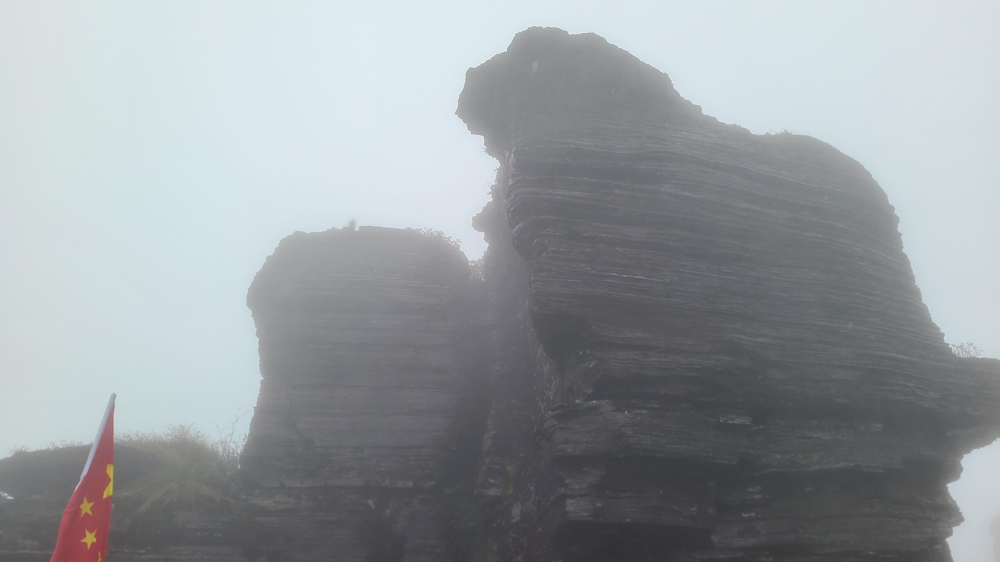
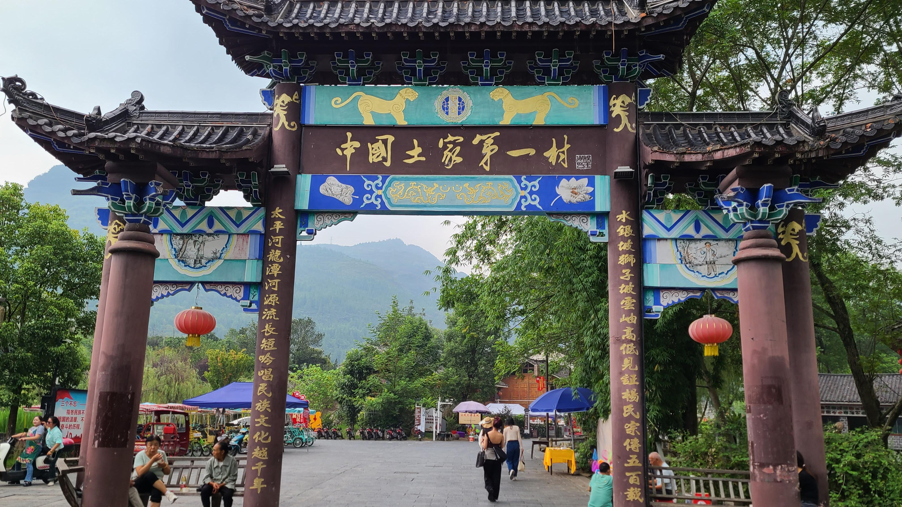
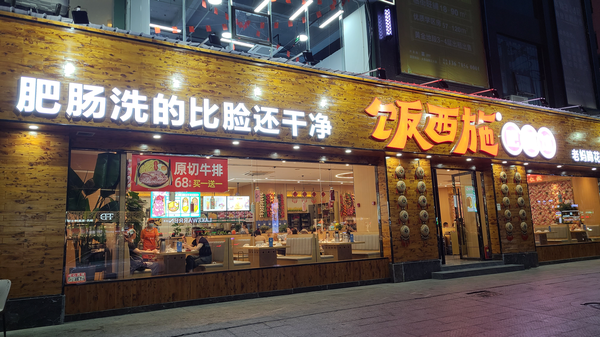
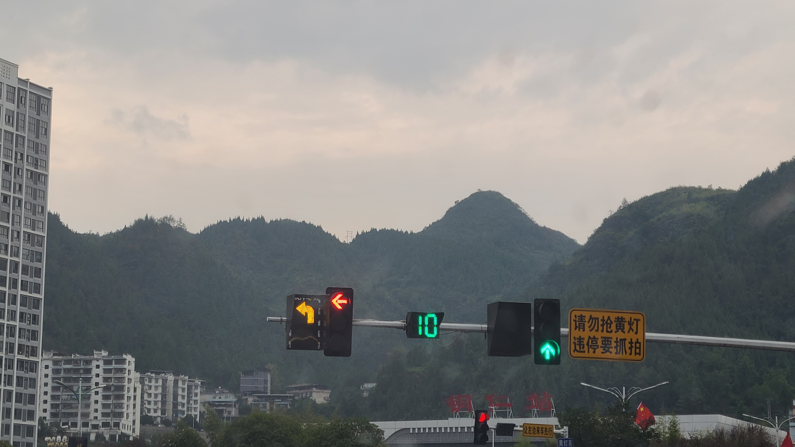
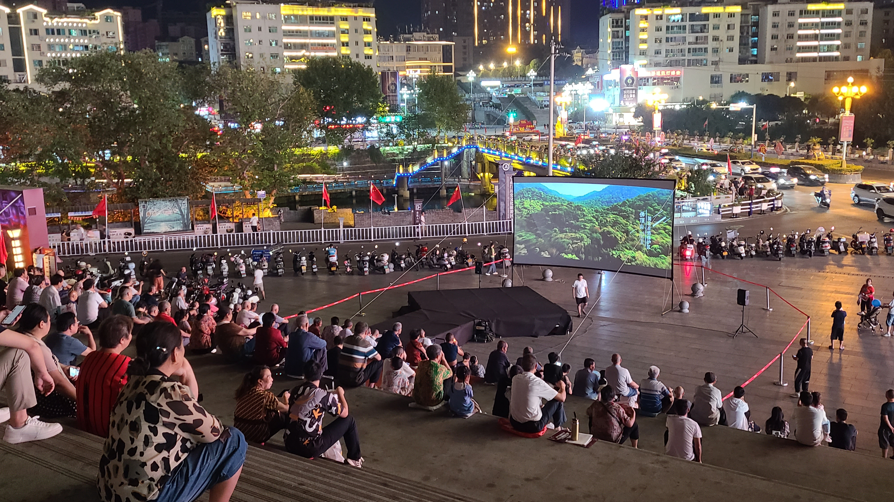
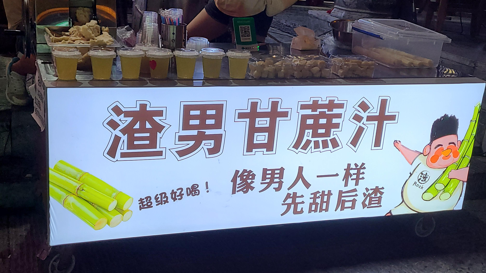

# 贵州旅游(1)——铜仁

今年的十一国庆长假，和老婆还有她的两个好闺蜜君君欣怡4人一块去贵州旅行。起因是君君提出想要玩遍贵州，想要去看大瀑布，于是接收到要求的我和老婆两人就开始吭哧吭哧做攻略，经过漫漫长达两个星期的时间，十几次版本的更迭，最终给出了一份10天11夜，横跨8个不同城市的巨型攻略，即便放眼我们的整个旅游史，也堪称巨匠之作！而我们的故事，将从第一个城市，贵州铜仁开始。

## Day0——09.28
### 雨夜狂飙
按我们的攻略，整个旅途的第一站是5A级景区——梵净山，位于贵州省铜仁市江口县。由于担心爬山时人流过多，因此第一晚的酒店直接订在了梵净山的脚下，并预约了接机服务。飞机18:15起飞，并在21:00左右落地铜仁凤凰机场。这个机场倒是很小，才10分钟不到我们就出了机场，坐上了预约好的车。没想到的是铜仁今天天气不太好，上车后不久就开始下雨。漆黑不见五指的夜晚，倾盆狂暴的雨水，远处黑压压的群山，高速公路两边呼啸而过的峭壁。至今回想起来，这可能都是整段旅途中最凶险的一段路程了。要是换成我们自己自驾，真就会落的个“出师未捷身先死”呢。

好在总算是平安到达了酒店，因为有两个人没吃晚饭，我们就就近在楼下的一个饭馆吃个便饭。不过不愧是开在景区旁边的饭店，味道一般，食材不太行，价格还很贵，稍微点个荤菜就是168起步= =最后就吃了一个黄牛肉，一份鱼，和一碗番茄蛋汤。草草吃完赶紧上床睡觉，为了备战明天的梵净山！可怜的君君还被call了，被迫在酒店开始加班赶工作，最后赶到了凌晨2点才睡:sweat_smile:

## Day1——09.29
### 梵天净土——梵净山
今天早上准时起床，出门后发现天空阴沉沉的，还飘着零星小雨，真是一个不幸的消息，这代表着等会爬山的时候，周围会是雾蒙蒙的一片啥也看不见。我们在酒店旁找了一家早餐店吃个热乎的早饭，老板和我们说因为今天下雨，好多游客都临时退票取消了行程，这似乎又是不幸中的万幸，看来不会人山人海，我们应该能比较快速的下山吧:pray:酒店距离景区售票入口大概需要步行10分钟，一路上看到了很多奇形怪状的面具/图案，似乎是傩戏的文化符号，看上去有一种神秘而庄重的感觉。梵净山的景区入口真是夸张的大，很对得起他的5A级名头。



检票后，我们先坐观光车上山，要前往索道乘坐处。观光车沿盘山公路一路弯弯绕绕地往上开，中间有很多个连续急弯，甚至还有U型发卡弯！在转弯的时候整个人都差点被甩飞出去的这种感觉，让这个观光车票狠狠值回了票价！索道一趟可以上6~8个人的样子，可惜由于天气原因，索道往上升到一定高度后，放眼望出去四周全是白茫茫的一片，仿佛人掉进了云团里，除了白色还是白色，啥也看不到。缆车每过一段距离会突然晃荡一下，坐我们对面的阿姨直接问我们借了一个塑料袋就开始yue了，看的老婆也差点yue了出来:nauseated_face::nauseated_face:

下索道后，发现外面开始下雨了，还越下越大，幸好老婆给我们每个人提前准备好了一次性雨衣，在出门前也穿了长袖外套（虽然差点就决定不带了，真是保住了一条狗命呢）这样总算是可以继续爬山了。今天来梵净山的游客，大部分都是中老年人，还有那种老年旅游团的，真是不明白为什么他们也要赶在国庆来玩，不能在平时错峰出行吗，你好我好大家好才是真的好。在爬山的途中，时不时还能看到抬着滑竿健步如飞下山的挑夫。这好像是梵净山特有的一种服务，就是你花钱坐在轿子上，然后挑夫抬着你上山，是个苦力气活，下雨天的时候真的还挺危险的。

大概爬了1个小时多点，我们就来到了第一个景点——蘑菇石，这里应该是半山腰的位置，从这里继续再往上爬就可以去到梵净山的两个著名山顶——老金顶和红云金顶。可惜的是到了这里的时候风雨突然又变的很大，吹的我眼睛都睁不开，眼镜上布满了细密的雨珠，啥也看不清。。最后我们决定就爬到这里拍个照打卡结束，也算是狠狠体验了一波，否则即便登顶，这个天气下也看不到什么风景，都是一片白茫茫罢了。在蘑菇石的广场上我们还遇到了一个非常非常有元气的大叔，他不知道是在直播还是在打视频，一路举着一个手机，一边拍一边用富含饱满的情感的声音大声地说：“这里是梵净山的xxx，我来了！”，“我现在非常非常的激动，祖国万岁！！”真的好正能量，好有感染力呀~（大概就是这些话吧，时间过太久了有点不记得了，反正就是非常非常的正能量）

下山的时候雨越下越大，把我裤子打湿了，被迫卷起裤腿走路，还好没有因此而感冒，不然真的又是出师未捷身先死。。下山的索道我们是和两男一女一起同乘。他们似乎是刚从山顶上下来的，可能是一路冲锋上去的吧。我们问他们山顶的风景是怎么样的，和蘑菇石的景色是不是一样，其中的那个女生愣了一下，然后立马说“啊当然不一样啦blahblah”，说着说着大家都不约而同的笑了起来hhh，由此看来我们的决定真的很明智。索道结束后坐观光车下山，司机师傅还给我们介绍了路上的一些景点，甚至会偷偷停车让我们拍照，照理说是不允许临时停车的。师傅人真不错。其中路过了一个小的瀑布，还有一座天生桥，是两块石头对向生长连接在一起行成了一座桥，不禁感叹大自然的鬼斧神工啊~



### 中国土家第一村——云舍村
拜今天天气所赐，离开梵净山的时候才上午11点多。考虑到下午可能还会下雨，我们先回了一趟酒店，换了一身干净衣服，稍作休整后前往下一站：云舍村。它距离梵净山只有10几公里，号称「中国土家第一村」，照理说算是来梵净山旅游的游客在回程的时候会顺路打卡的景点，但是当我们到达的时候，却发现整个村子里几乎没几个游客，可能是还没到国庆外加下雨吧，真是走运！

云舍村的传统土家族村落文化气息保留的非常完整，商业化程度不高，只有进门左手边的一些农家饭店罢了，旅拍店更是几乎没几家。午饭我们去的是xhs上推荐的一家店，名叫。店里没有客人，我们四人直接一个大包起飞。点了top1~3的土鸡汤、糟辣鱼和洋葱牛肉干锅，还有一个蔬菜红薯叶和一份主食玉米粑。从点菜到上菜等了大概得有半小时的样子，看的出来这家一定不是预制菜，说不定甚至是从杀鸡宰牛开始做起呢。菜品的味道不错，比昨晚梵净山脚下的饭店强太多了，土鸡汤是Top1推荐菜，做法也很特别，好像是先将鸡肉炒熟后再炖汤，味道特别浓香。糟辣鱼也是贵州这边的特色菜，这家的鱼有很多的小刺，吃起来不是太方便。。在讨论起吃鱼怎么吐刺的时候，顺带还聊起了舌头的灵活性对吃鱼的帮助程度。结果令人震惊的是，老婆居然不会卷舌，更令人震惊的是，欣怡居然能将舌头反转180°！！（你还是人吗？？）



吃过饭，君君又被call了，被迫找了个村子里的咖啡店继续加班:sweat_smile:，我们仨就开始散步看风景。村子的风景非常美丽，河流清澈见底，河面上有很多的小鸭子戏水。沿着河流往上走一小会就到了村子里著名的景点——神龙潭，水面是碧绿色的，像一整块的帝王绿，整个潭面光滑如镜，没有一丝丝的波澜，和旁边几步之隔水流形成的小型瀑布形成了鲜明的动静对比。神龙潭的对面则是一条叫龙塘河的小河，似乎还是世界上最短的河流之一（不保真）。神龙潭和龙塘河的中间地带，是当地居民洗菜、泡西瓜，还有小孩子玩水枪、嬉戏打闹的地方。




云舍村的两大特色是古法造纸和桶子屋群。其中造纸术保留了土法制作工艺，号称“云舍造纸，蔡伦为师”。可惜我们来的时间不凑巧，游客数量太少，古法造纸的体验馆是关闭的。桶子屋则是云舍村的特色土家族古建筑，村子里随处可见。这里的家家户户门口都会有一条小沟渠，里面会有流动的水，好像是为了方便每家每户有水可用而建造的，现在可能只有在那种老村落或者乡下才见得到了。本来还想去一个叫观景台的地方看看的，不知道是不是能俯瞰整个云舍的美丽风光，结果走着走着迷路了，走到了村子的西北边边，遇到的路过的当地居民和我们说观景台其实就在刚刚神龙潭再往上走的地方。。最后由于时间原因只好被迫放弃了:sob:回程的时候又下起了小雨，赶忙一路小跑回村子门口的咖啡店，和君君汇合，点了两杯咖啡，然后等司机师傅过来送我们去下一站——铜仁。

### 铜仁古城——中南门街
今晚的住宿定在了铜仁火车站附近，因为明天早上要赶高铁去贵州行的第二站——凯里市。由于君君下午工作没忙完，晚上还要继续加班，于是就我们仨简单收拾了一下屋子后，准备打车前往晚上的目的地——铜仁中南门古城，也叫铜仁古城。打车定位的地点选在了民宿门口的马路边的一家理发店，隔壁有一家肥肠店叫，打的广告语特别的令人印象深刻：“肥肠洗的比脸还干净！”

由于是晚上5点半左右，正好是下班高峰期，路上很堵，我们打车等了10多分钟才上车。。路上发现了一个神奇的现象，铜仁的红绿灯上，会有不断闪烁的黄灯，并且是带着箭头符号的，比如一个不断闪烁的右转箭头黄灯。问了下司机师傅，这个代表着可以右转，但是要注意路况安全的意思，似乎是贵州这里的特色（在之后的凯里、都匀等城市也都有这样的黄灯）

途中经过了一个路段，路边有许多的摊位，卖蔬菜水果的和卖其他小吃的，看着特别的热闹。问了一下司机才知道是因为这里白天不允许摆摊，所以这些人会在傍晚的时候来这里摆摊卖菜，一直要卖到第二天早上才走，真令人震惊:scream::scream:这位司机师傅开车也是真的狂野，跨实线变道，变道不打灯，这一路严格一些都够扣满他12分了:sweat_smile:而且这边的出租车甚至可以在大马路中央随叫随停。师傅刚把我们送到临近铜仁古城的十字路口，就有一个路人招手示意上车，于是司机就直接把在这里把我们放下来了。下车的地带好像是铜仁的闹市区，各种运动服装店、黄金店、小吃店等等扎堆在这里。朝前走穿过一条马路来到了一个巨大的街头广场，叫做“铜仁团结广场”。这里正准备播放露天电影，广场的台阶上坐满了观众，以老爷爷老奶奶为主，不过也能看得到一些年轻人就是了，场面气氛十分热闹，不由得想起之前去西安的时候也有这种类似的露天大广场，很多人坐在台阶上乘凉、看表演等等。

广场再往前就到了铜仁古城步行街了。刚进步行街，映入眼帘的是一个大大的舞台，正在举办一个像是歌唱比赛海选的活动，似乎只要报名就能上台，年度特等奖是价值30w的汽车一辆，怪诱人的，可惜老婆不上台表演，不然什么牛鬼蛇神都得给我靠边稍稍！舞台对面是一个书院，可以报班学习书法画画，还可以租赁汉服。这里的景色确实挺适合拍汉服的，有一种书香的气息。整体来说铜仁古城步行街和全国其他地方的古城步行街也差不太多，该有的要素也都齐全。中途路过一家卖抹茶的店，里面还可以体验抹茶制作，毕竟铜仁号称是「抹茶之乡」，抹茶很有名，不过体验费要100多一个人，只能退而求其次买了几包抹茶回来给老婆泡茶喝；在路边还买了冰糖葫芦和糖炒栗子🌰，冰糖葫芦比在上海吃过的要更甜更好吃，糖炒栗子事后才发现是贵州行的这10天里最好吃的一顿栗子！！！！后悔没多买一些:sob::sob:；还有路边一家卖甘蔗汁的摊位，叫渣男甘蔗汁，打的标语真的是绝了：“像男人一样，先甜后渣。”看得我们仨都快笑成神经病了。

晚饭本来打算回民宿附近吃火锅，但是君君在民宿自己点外卖吃了，正好这边又开始下雨了，我们就在路边找了一家火锅店吃。说起来铜仁古城步行街像这种火锅店的吃正餐的店数量确实很少，这家火锅叫，吃的人很多很多，我们来的时候需要等位4桌，结果没想到前面轮空了2桌，第三桌去了室内的空位，轮到我们直接光速给安排在了室外的空位上。坐在路边吃火锅真的别有一番风味，可太有烟火气息了，淅淅沥沥的小雨中热气腾腾的火锅，配上隔壁店铺为了庆贺开张表演的舞龙，真是一幅绝赞的画面。他们家的特色渣渣牛肉指的是放在锅底里煮好了一起端上来的碎成渣渣的牛肉，你还别说，用勺子在里面捞渣渣牛肉真的很爽，感觉怎么吃也吃不完的样子。还有点评上1块钱团购的一碗冰豆花，让老婆和欣怡都赞不绝口，直呼好吃，算下来人均居然才小几十块钱，这顿饭真的真的太值了！



吃完火锅我们就打车回民宿了，洗洗睡觉，准备明天早上赶高铁咯。

## Day2——09.30
### 小十字中心市场
今天早上从铜仁去凯里的火车是8:44，早晨我和老婆选择了6点多起床，赶早去一次铜仁的小十字中心市场吃早饭，xhs推荐那里有不少的好吃的早餐店，应该就是类似昆明的东华农贸市场的类型吧，还是蛮期待的。一路上最大的感受是：铜仁的学生真tmd多，从我们坐电梯离开民宿开始，电梯里大清早的就进来了3个学生，看个头应该是小学生，然后打车的时候，车窗外到处都能看到路边有穿着不同校服的学生在赶着走路上学，甚至还遇到了一辆公交车，上面坐满了学生，都可以说是校车也不为过了。这种情况甚至持续到了我们后来7点半返程的时候，令人震惊。感觉自己已经很久很久没有在路上见过这么多鲜活的学生了:sweat_smile:



到了小十字，发现这里的店很多都还没开门:sob::sob:，菜市场的布局确实和昆明的东华差不多，外围是一些卖吃的的小店。我们买了一份社饭（铜仁的特色美食），一份米豆腐，一份卷粉，还有玉米粑。社饭的味道很一般，可以说不太好吃了，不知道为什么本地人这么爱吃社饭，也可能是我们买的这一家不行吧；米豆腐凑合，凉凉的，原料就是大米做出来的，口感有点像扎实的凉粉吧，也不太合我的口味；卷粉味道尚可，但是因为买的太急，忘记让老板不加折耳根了，结果老婆三个人完全吃不了一点，没想到我尝了一口居然感觉还可以？？难道我才是那个天选之人吗哈哈哈哈。



吃完早饭就拖着行李箱去铜仁站，准备坐高铁前往下一站——凯里！


