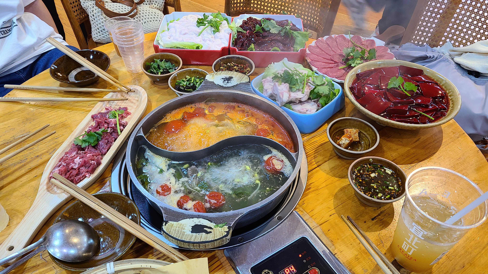
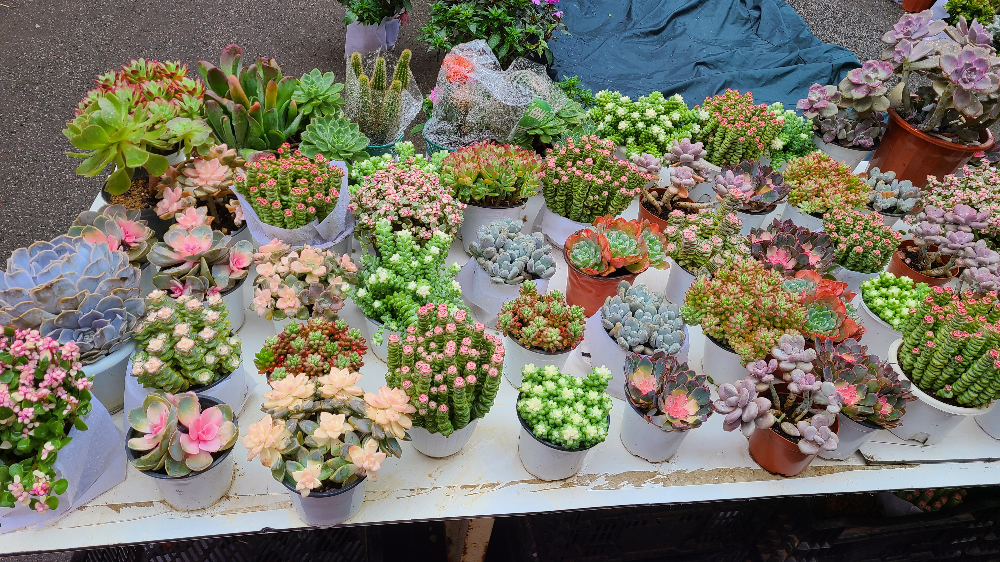
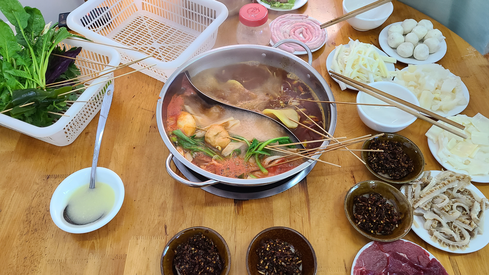
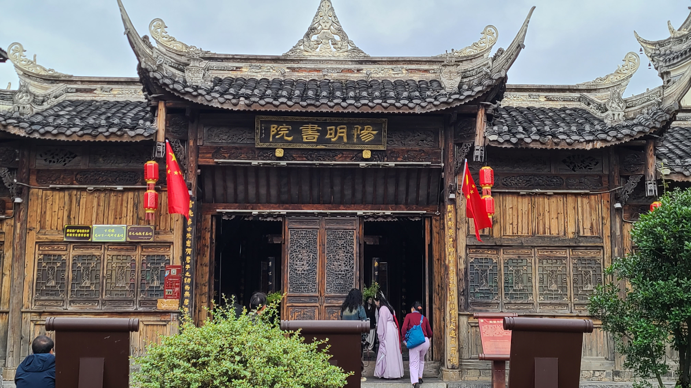
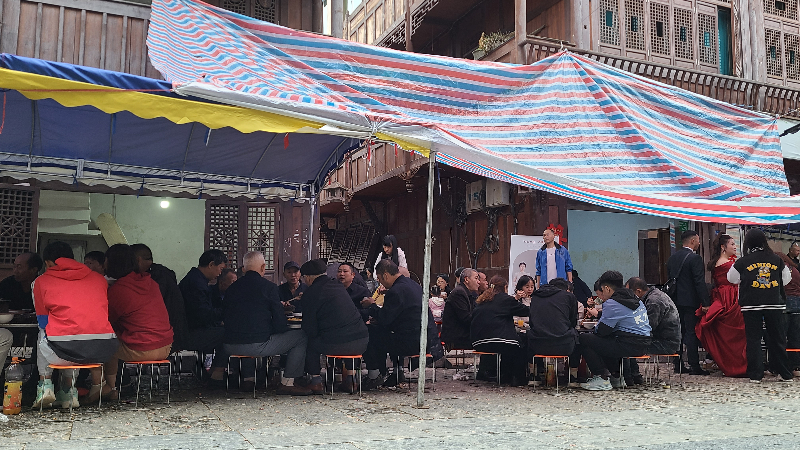
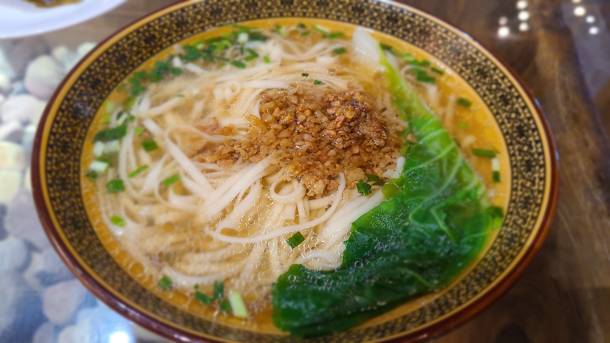

# 贵州旅游(2)——凯里

## Day2——09.30
### 32层高的民宿
上午9:56分，我们的高铁到达了凯里南站，下车后先直接打车去民宿放行李。路上司机师傅非常热情的和我们聊天，向我们介绍凯里这边好吃的东西和好玩的地方，得知我们下午要去千户苗寨后，说我们可以继续找他接送，可以给我们算便宜一些，我们也答应了。凯里的这家民宿是这次旅途中唯二由我来定的房间，当时在去哪儿上看到它的第一眼就惊为天人，100平米的大面积，装修风格是那种偏泰式风格的，环境优美精致，价格更是居然只有人均¥65/晚，简直令人不敢相信！！当我们进门的时候，民宿老板还刚打扫完卫生，她和我们说她也是住在这里的，一共有三层，我们定的是最底下的一层，她住在上面的两层，有什么事情都可以随时找她。听完我只能说乖乖，这岂不是总面积300平的大别野？而且实物确实不错，和照片的样子基本吻合，床品也不是那种酒店/民宿用的被子，是带着蕾丝边的那种，像是老板自用的棉被，质量还不错。能订到这家民宿真的是赚到啦~



### 三天不吃酸，走路打蹿蹿
放完行李，君君又要开始处理工作了，我们仨就先铺一下床单被套，然后躺在沙发上玩会手机。大概11点半的时候，打车出发前往距离2km不到的午饭地点——。来凯里当然就要吃酸汤，毕竟凯里可是酸汤的发源地，当地人甚至有“三天不吃酸，走路打蹿蹿”的说法，不猛猛吃几顿怎么对得起这个名号？途中经过的凯里体育馆造型非常的别致，最外面靠近马路的一圈造的像是亭台楼阁一样，很有民族风情（这里忘记拍照了dbq），我们的酸汤火锅店就在这个体育馆的旁边。贵州这边的酸汤分为红酸和白酸，白酸主要是用米浆发酵，口味清淡，味道醇正；红酸也分很多种，主要的是毛辣角酸，是用一种类似西红柿的毛辣果做的，酸味比较醇厚。不过我尝下来无论是白酸还是红酸，都和在上海吃到的酸汤味道差别很大，甚至反而是上海吃到的更酸，原来这才是正宗的酸汤火锅吗？

入座后，发现这里的火锅菜特别喜欢吃牛，除了常规的牛肉、牛杂、牛舌外，还有牛血、牛脊髓、牛脑花等等。我们点了个鸳鸯的红酸拼白酸锅，然后基本每样菜都来了点。牛血的口感是硬硬的，我吃不习惯，还是更喜欢嫩嫩的鸭血；牛脊髓味道还行，和猪脊髓差不多都是嫩嫩的，毕竟之前啃骨头也吸过猪的脊髓。脑花不必多说肯定不是我的菜。吃火锅的时候还顺便点了当地的特色奶茶——宜北町，喝了他们的气泡饮，配送的时候居然是果汁和气泡水分开的，这样可以想加多少气泡水加多少气泡水，非常自由，好评！（味道也很棒）

### 西江千户苗寨
吃完火锅，我们就打车前往下一个景点——西江千户苗寨了。贵州这里是十几个少数民族的聚居地，其中黔东南这一块分布的主要是苗族、侗族和瑶族。这一次由于时间紧迫，加上各个少数民族村寨分布的是也是七零八落的，只能选择了离凯里市相对比较近，也是知名度最高的千户苗寨。到达苗寨的时候是下午3点钟，老婆她们三个人提前在这里约了一套苗族拍摄，所以就直奔摄影店化妆去了，我在她们化妆的这段时间就去附近一个人闲逛闲逛。



今天是国庆前的最后一天，白天的游客数量还不算很多，错峰出行的攻略真是做对了。来之前看xhs说千户苗寨的商业化非常发达且同质化，遍地都是旅拍、民宿和烤串三巨头，实际体验下来其实确实如此，只不过它在商业化之余，还是保留了不少苗寨本身的特色的，比如在苗寨里能看到很多的吊脚楼，这是一种干栏式建筑，是苗族传统民居；再比如风雨桥，是苗族人民建来用来遮风挡雨，纳凉歇息的地方，千户苗寨一共有5座风雨桥，分别叫1号/2号/.../5号风雨桥，都是拍照打卡的胜地。



离开摄影店后，我随机朝着一个方向往前走。后来看了地图才知道我来到的就是1号风雨桥附近的地带。这里非常开阔，远处还可以看见绿油油的梯田，以及密密麻麻的苗族吊脚楼，鳞次栉比。在附近转悠了一圈后，大概下午4点左右往回走回1号风雨桥，然后在岔路口选择了最左面的一条路。没想到的是我随便选的这条路，竟然是一条超长的上坡路，一路爬坡，花了我半个小时，最后到达的是整个千户苗寨的最高点——观景台，在这里可以俯瞰到整个苗寨的风景，“千户苗寨”名不虚传。

这个时候老婆她们化妆也快结束了，我也准备下山回去了，本来想沿着导航提供的路从另一边下山，结果没想到这边的路特别弯弯绕，全是店面之间的小路，走了好几条路都找不到头，不是死胡同就是绕了一圈回到原地。。无奈之下只能坐观光车下山，这个观光车走的路还好巧不巧刚好是我刚才爬上来走过的路:sweat_smile::sweat_smile:下山之后赶紧一路小跑回摄影店和老婆汇合，然后跟着摄影师一起拍了三套照片。老婆这次选的是紫色的苗族服饰，化妆师水平很在线，服饰比上次在丽江拍摄的红色要好看多了，有“梦中情毒”的感觉了！不过取景地感除了一套标准的屋顶外，另外两个外景感觉都一般般。拍完照之后，我们去找欣怡和君君汇合，然后三个人一起找了个地儿拍了一组合照。这个时候已经是晚上了，又开始飘起了小雨，我穿着短裤 + 短袖，感觉冷飕飕的，有点扛不住冻了。

TODO: 梦中情毒

全部拍摄结束大概是晚上7点多，先回店里换了衣服，解了头发，然后准备去1号风雨桥坐观光车上观景台。晚上的1号风雨桥已经有很多人了，而且还源源不断的有游客拖着行李箱到这里，她们应该是把苗寨作为国庆旅游的第一站吧，我们选择了错峰出行真的是太明智了！晚上的观景台人也很多，比下午来的时候多了太多，下午我还能轻松找到空的拍摄机位，而现在已经差不多是里三层外三层的程度了。。不过有一说一，晚上的苗寨也非常好看，亮灯后从观景台高空俯瞰，如繁星点点，和白天是两种完全不同的风情。



从观景台下来坐车返回风雨桥后，今天的苗寨之行就基本宣告结束了。三个女生的时间大部分都用在了化妆和摄影上，就晚上看了一下观景台，而我则算幸运的还能浅浅欣赏到一些白天的风景，也算是不虚此行吧。晚上回程的山路则是这次贵州之行第二刺激的路程，这位司机大哥将灯光运用到了极致，不论是过弯前急速的远近光交替，还是两车会车前及时的关闭远光灯，都堪称教科书般的操作，彻底刷新了我对科目一和科目三的认知。甚至途中我侧过脸观察司机开车时，乍一看他只用右手单手操作方向盘，吓得我天灵盖都冲起来了，仔细一看才发现他的左手稳稳扶在靠近转向灯操作杆的旁边，随时准备切换灯光。。如果以后有夜路考试，我觉得就应该将灯光加入实战考核范畴，而不是像现在的科目三一样，局限于死记硬背般的考核方式。。按照原定的计划，今晚会去永乐路夜市吃夜宵，但是因为我傍晚在苗寨受凉，冻了好久，浑身冷飕飕的，老婆担心我会感冒，于是选择直接回民宿点外卖吃。

## Day3——10.01
### 绣里淘非遗集市
今天是国庆长假的第一天，但是天公并不作美，天气预报显示会下整整一天的雨。早晨起床的时候，窗外的雨声噼里啪啦的，气温也凉飕飕的。难以想象约了今天去苗寨拍照的游客该有多惨，人又多，还因为下雨得等着排队，要么就是淋着雨硬上，怎么看都讨不了好:sweat_smile::sweat_smile:愈发感叹我们的攻略安排的真是太妥当了！早晨君君终于不用加班了，她选择在民宿睡个懒觉到自然醒，于是今天早晨就是我们仨出去溜达，本来打算去凯里民族博物馆，但是不巧正好赶上维护闭馆了，于是选择了去。这个集市主要以苗绣为主，卖一些手工艺饰品、绣片、绣布、还有一些包包、冰箱贴啥的。我们去的时候因为刚好下雨，摆摊的摊主还比较少。整个集市面积不算很大，但是摊位+店面还是有不少的。普遍的价格大概是戒指¥15~25，首饰¥30+，包包¥200~300+，冰箱贴¥30~50。因为顾客不多，很多店还没开张，所以砍价比较好砍，可以直接打个对折凑个开张吉利。老婆买了两个首饰，还刚好可以凑成情侣款耶！最后兜兜转转又回到了最开始逛的第一家摊位，这个摊位的首饰、冰箱贴还有戒指的款式都不错，经过一通杀价，老婆以145块的总价将看中的东西全部收入囊中！可喜可贺~~



今天的早晨真的很冷，出门的时候穿的短裤，上身是短袖+外套，还是感觉很冷，所以打算等会先回民宿换一身衣服再去吃午饭。正好也没吃早饭，所以就在集市附近随便找了家不知名面店坐下来，点了一碗牛肉粉，一碗小馄饨暖暖身子。这家店门口摆了好多好多的多肉植物，养的都非常的好，绝了。

### 第三家麻辣烫
浅浅吃了点早饭，身子暖起来了之后打车回了民宿，换了一身长袖长裤，以防连续两天冻着真的感冒。。正好君君也起床了，收拾好行李我们就离开民宿准备去今天的午饭地点：。这家虽然叫麻辣烫，但是其实就是凯里本地的酸汤串串，中博美食街这边到处都是好吃的，xhs强力推荐的中博麻辣烫，在这里有好多家，名字也非常好玩，有叫“第一家”的，有叫“第三家”的，还有叫“第四家”的，但是没有叫“第二家”的？我们吃的是第三家，店里主要以蔬菜串串为主，肉类不多，而且都是盘装的。这家最赞的菜非黄喉莫属，超级无敌脆，是至今吃过的最嫩最爽脆的黄喉！这家店价格也非常实惠，四个人一共才吃了160块，凯里的物价真的好诱人！！

### 下司古镇
吃完麻辣烫，我们打车前往下午的目的地——。这个古镇是国家4A级景区，位于清水江的上游，凯里市西南片区，因明清两代属平定长官司的分司治所，因地处平定下游，得名下司，还有着“人文下司，天造山水”，“贵州小上海”等美誉。到达古镇的时间是下午2点半左右，我们先把行李寄存在了镇子门口的一家桌球店里，老板很热心，都不用收我们钱（顺便店里的小哥们打球都贼厉害，远台一个赛一个准），然后就进古镇逛了。按照预定计划，只安排了一个下午的时间在这里，到晚上6点多就要离开前往都匀秦汉影视城了。

进了古镇后首先来到的是一条空无人烟的街道，叫做“面条街”，这条街的两边全都是卖面条的，而且都是以姓氏为名，比如“吴氏面条”，“徐氏面条”等等。很多店面都关门了，只有零星几家是开着的，卖的是那种生的面条。其中有一家修脚按摩店门口竖了个招牌，但是写字顺序无比混乱，我们四个人读了好几遍才读懂:sweat_smile::sweat_smile:



穿过面条街后来到了一个广场岔路口，叫芦笙广场，这里开始逐渐出现了游客人流，但是比起今天国庆第一天来说还是太少了。我们在有着“下司”黑字的白墙前拍照打了卡，然后顺着古街一路向前走。走到了一个乘船码头。这里毗邻清水江，能租船在江上漂流，甚至可以自己开船漂过去。我们四个人租了一艘船，花了大概40多分钟的时间进行了一个往返。江面上风挺大的，还下着一点点小毛毛雨，风雨飘摇中欣赏着江上的风景，真是非常的惬意~~



去程是逆流而上，回程则是顺流而下。不过顺流的时候能明显感觉到冷风扑面而来，等我们靠岸后都冻得有点哆嗦了，赶紧上岸找了一家咖啡店取暖。身子暖和起来后，就出去开始漫步古镇了！下司古镇和我们之前去过的巍山古镇不太一样，它的面积更小，商业化程度相对更低一些，但是风景更胜一筹，保留了很多的原始自然/人文风光，像是禹王宫、莲心桥、鼓楼等等。在这里散步感觉整个人都能放松下来。古镇里还有一个阳明书院，是为了纪念王阳明先生的“阳明心学”而专门建造的。

逛累了就在路边买了一些小吃，有卖洋芋粑粑的，有卖八月瓜的，有卖黑猪肉烤串的，还有到处都有的蓝莓冰粉（但是这次没有尝试）。洋芋粑粑是软糯的口感，黑猪肉烤串特别的好吃，比我昨天在苗寨里买的好吃多了，而且只要一块钱一串！八月瓜是路边一个阿姨推销的，好像也只要两三块钱一个，酸酸甜甜的口感，欣怡和君君吃的不亦乐乎。朝台阶往上走会来到之前做攻略时的主要目标——瑞门入胜。得知这里有瑞门，老婆作为瑞门的虔诚信徒，必须要来朝拜一下圣地的啦~瑞门的后面好像是一个大广场，有小孩在里面玩碰碰车，还放着魔性的音乐（后来搜了下，歌名叫《这条街最靓的仔》，简直是洗脑神曲，就作为这篇文章的背景音乐吧^_^）

边吃边逛来到了鼓楼附近，这里的风景我觉得是整个下司古镇最漂亮的，鼓楼的对面是一座惜字塔，地面上插着许多路牌，每个路牌上都有一句富含文艺气息的句子，像是「且将新火试新茶。诗酒趁年华」，「向星辰许愿，在下司相见」等等。惜字塔背后则是一座良心桥。鼓楼、惜字塔、良心桥构成了一个三角形的布局。鼓楼的面前还有一个“祈福长廊”，上面挂满了红色和白色的灯笼，还有数不尽的红色祈福带，微风吹过，带起祈福带左右晃荡，堪称绝美。这一块地带的绿植密度也非常的高，一些房屋的面前全都种满了花草和绿树，所有的一切构成了一个恬美、素雅的世界，在这里生活，真的会有一种“采菊东篱下，悠然见南山”的旷然之情。



离开这片世外桃源后，我们来到了一条长街，名叫“工坊街”。这里正在举办婚宴，新郎官甚至还是一个军人。沿着街边摆满了桌子，有点“长街宴”的意思，街坊邻里热热闹闹的坐在一起吃饭聊天，气氛好不热闹！我们也算是狠狠沾了一波喜气~离开工坊街又绕回了最初的芦笙广场。没想到这里正好有人在现场唱歌，但是底下稀稀拉拉只有三两个游客在听，于是我和老婆二话不说充当起了合格的气氛组，随歌摇摆疯狂打call！

时间不早了，要准备离开下司了，其实蛮后悔只给这里安排了几个小时的时间（马后炮看，今晚秦汉影视城的夜游并没有什么意思，不如在下司多玩一会）。走之前，在刚才买洋芋粑粑的店里吃了个晚饭，点了一碗招牌的“下司面”，还有一些小吃。下司面没什么特别的，感觉就是面汤比较鲜的阳春面吧，面不宽也不细，像那种拉面的宽度。

吃完饭拿完行李，就和下司古镇say byebye了。如果下次有机会再来贵州玩，还想再来一次下司~

Next station——都匀！


