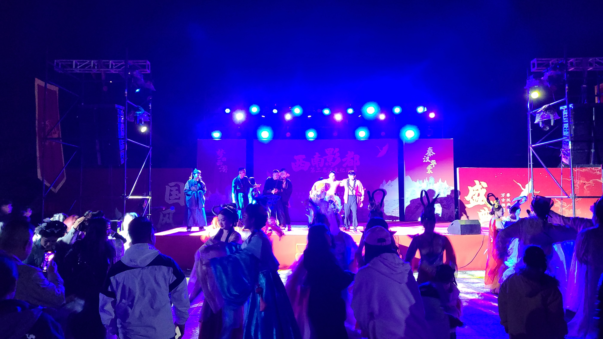
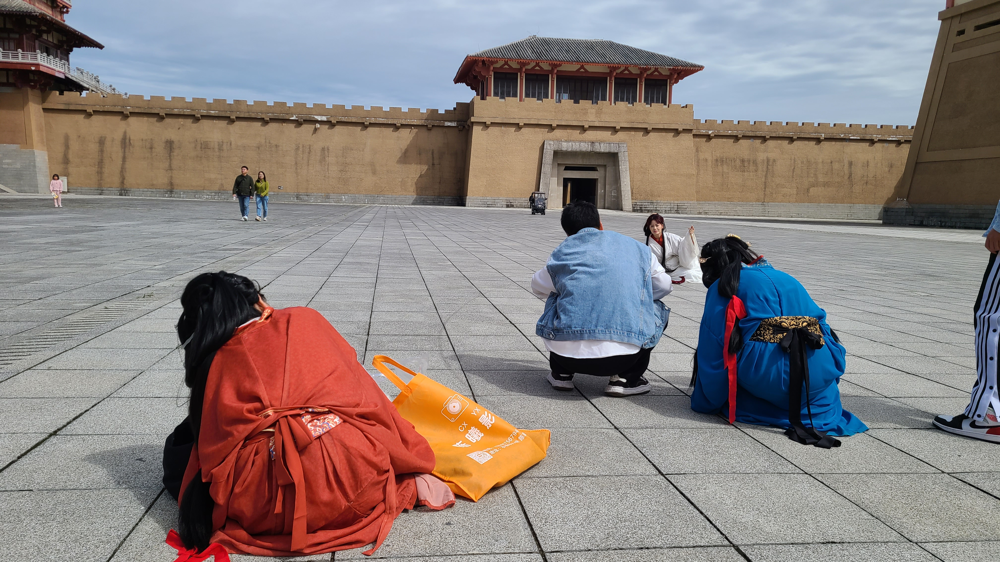

# 贵州旅游(3)——都匀

## Day3——10.01
### 秦汉影视城夜游
都匀作为我们在凯里和荔波之间的中转站，计划安排了一天一夜的时间。都匀出名的几个景点有、西山大桥，还有。影视城是西南最大的影视基地，曾经拍过很多知名影视剧如《陈情令》、《庆余年》、《星汉灿烂》等等。除了白天的定期表演外，还会不定期的开放夜游活动，有NPC互动，像真人RPG一样，今年4月和7月举办过两次了，没想到国庆也有夜游活动，晚上6点半开始，于是我们就打算在10.1号的晚上来这里玩玩看。

从下司古镇出发到影视城距离45km，打车花了近50min。由于下司古镇实在太好逛了，因此我们出发耽搁了一些时间，到影视城的时候已经是晚上7点钟了。进去之后里面非常的空旷，完全没有想象中人山人海的景象，可能是因为大家国庆的第一站通常都会选择贵阳之类的大城市，而不是都匀吧。国庆的夜游活动整体来说是低于我的预期的，就是一个普通的西游表演活动，蹭了点黑神话悟空的热度。NPC有唐僧师徒四人，外加一些像是仙子仙女的人物。整个夜游一共有5场表演，我们进来的时候已经是第三场真假美猴王的尾声了，只看到了接下来的女儿国和猪八戒娶媳妇。（p.s. 唐僧的演员长得很帅哦）

全部的表演结束之后，几个演员带着我们到了最里面的城墙下的大广场，然后开始....聚众蹦迪？？真没想到这个夜游最后居然会发展成这样。老婆还特别喜欢蹦，第一个上台，搞得我最后也不得不一起上去大家一起蹦，真是开了眼了。不过蹦一蹦也有好处，今天晚上气温很低，蹦个迪还能稍微暖和暖和身子。除了蹦迪以外，现场还有一些小的表演，比如请了一位非遗老师，表演打火刀和打铁花。可惜天气太冷，火刀只擦出了点火星子，铁花也没有之前在xhs上看到的九月表演的那么惊艳。

### 西山大桥夜市
大概8点半左右夜游就散场了，我们打车去了都匀市区预定好的民宿，放下行李休息片刻后，就前往下一个景点——西山大桥。在去民宿的路上我们就经过了西山大桥，这里的夜景真的很好看，还是著名的电影《无名之辈》的取景地，可以说是车水马龙，金碧辉煌~西山大桥旁边是一条叫做“剑江”的河，是都匀的母亲河，河两岸竖立着的栋栋高楼，配上五彩的霓虹灯，也是很繁华呢！在过了大桥之后，左手边是一个露天夜市，好像叫白子桥夜市。里面有很多的小吃摊围成了一圈，圈子中间则三三两两摆放着桌子和椅子。我们四个人在这里点了满满一桌子吃的，吹着夜风，听着旁边的路边演唱，吃着烧烤，满满的烟火气，生活就应该如此！

 

 

吃完烧烤，我们去了马路对面，那边算是这边夜市的延伸部分，主要是一些正规餐馆，外加一些奶茶/购物的店，也是一个商圈吧。我们在这里买了一袋糖炒栗子，虽然是现炒的，但是剥起来不如铜仁买的方便，给差评！；还在剑江边欣赏了漂在江上的巨型大黄鸭！剑江的夜景真的很好看呢~最后还在零食很忙里买了明后天准备吃的零食。这个店似乎是贵州的连锁品牌，之前在铜仁、凯里都有看到，在都匀这里也有。在这里发生了一些小小的不愉快，我拿了太多的饼干被老婆凶了，但是她的姐妹们却可以随便拿零食，结果我没忍住委屈当场就哭了出来:sob::sob:姐妹们看到了就让我老婆回家写检讨，跪搓衣板哈哈哈（但是我又怎么忍心让老婆滑跪呢）

 

简单逛完一圈后，就回民宿收拾收拾洗洗睡啦，准备第二天早上逛石板街去~

## Day4——10.02
### 石板街
今天白天的计划是三个女生去秦汉影视城拍一套战国袍，然后下午坐火车离开都匀去荔波。约好的到店化妆时间是上午10点，地点就在都匀石板街内。我和老婆8点多就先把行李带到店里寄存，然后开始逛石板街！石板街是都匀的步行街景区，主干道没什么特别好逛的，全是各种旅拍店扎堆，来这里旅拍的基本不是拍石板街，就是拍影视城。去影视城拍的十个又有九个是拍战国袍，那里的布景很适合拍这种。

 

我们在店老板的介绍下，去了旁边的小吃街吃小吃！首先尝了一个糯米饭，居然是甜咸口味的，吃起来很不习惯，和当初在大理三月三赶集里吃到的糯米饭没什么太大的差别，失望。。。问了摊主老板哪里有卖冲冲糕，这是我们这次来都匀的主要目标，结果老板说
卖冲冲糕的摊位得到早晨11点才会出来，因为早晨会有城管巡逻禁止摆摊。。看来只能等会我自己来找了。除此以外，我们还又在小吃街买了一袋糖炒栗子，是一个老爷爷真正“现炒”的，这还是我第一次现场看栗子是怎么被炒出来的（虽然是现炒的，但是质量属实一般。。）

 

到10点钟后老婆就回店里化妆，我继续去外面逛逛，顺便继续觅食！先吃了一碗辣鸡粉。所谓辣鸡粉就是米粉配上辣子鸡丁的浇头，不过这个鸡肉特别的嫩，一碗粉也只要10块，当作了我的午饭；然后去买了冲冲糕！据说吃了能长高呢~ 做法就是挖一勺糕放进模具里，然后在一个蒸汽笼子上蒸，蒸完后丢到糖粉里裹住，又甜又糯，非常好吃！嘎嘎炫！来之前做过攻略，都匀这里有中国十大名茶之一的都匀毛尖，然后还有本地的特色奶茶品牌叫一茶亦悦乎。给老婆和君君各点了一杯，也给我自己来了一杯毛尖茶，虽然不太懂品茶，但是还挺好喝的呢。最后回去之前还吃了一份洋芋饭！说实话味道比较寡淡。。。本来还打算在都匀这里吃一下特色的虾酸牛肉的，但是苦于没有时间，只能作废了55555，留给下次再来叭

 

### 战国风姿
化完妆12点多，我们打车带着摄影师和助理，一同开启了秦汉影视城的二进宫。今天的客流量显著比昨天晚上多了很多，才刚到大门口就能看到络绎不绝的人流。照例在超市寄存行李后，我们现场买了白天的票入场。老婆穿的是一套蓝色的战国袍，君君和欣怡穿的是白色的和红色的，三个活灵活现的战国美女，啧啧啧。

第一套景好像是拍的“坑”，虽然我不懂，但是好像她们都懂了？第二套景是去内广场拍的，也就是昨晚我们蹦迪的地方。昨晚天太黑了没看清，今天过来才发现原来这个广场这么这么大，昨天我们蹦迪的地儿只占了一小部分。。趁她们拍照的功夫，我去影视城里逛了两圈。白天的影视城就很有那种古装电视剧里的城市面貌了：来来往往络绎不绝的行人，街道两边的商铺，河流前的石狮子，城门前还竖着两排鼓，有什么事业鼓、健康鼓、姻缘鼓等等，每一面鼓前面都有人在排队等着敲鼓。内广场尽头有向上的三排阶梯，爬到最顶上可以俯瞰整个影视城内广场，我还遇到了两个像是初中生的小朋友，让我帮她们拍合照xs。广场内还有一些娱乐活动场所，有一个射箭场，一个射击场，还有一个大型的赛车场，好像正在举办小朋友的什么车车比赛来着，还挺正规的。

 

最后一套拍摄的地点在一个小院子里，有池塘、树木，还有曲曲折折的走廊。拍完之后我们就准备撤离了，可惜老婆她们又没有时间逛影视城了，拍完就得赶回去换衣服。走之前最后还找了个地儿拍了个三人合照，就算圆满结束，准备和都匀说告别~

Next Station——荔波！

在打车去都匀东高铁站的路上，经过了一片很美的山峰和水流，司机师傅说那里叫清水江龙头河，适合去徒步旅游、在河边吃烧烤。这个景点感觉挺小众的，之前做攻略的时候也没在小红书上有看到推荐，特此记录一下，以后有机会的时候可以再去玩~


