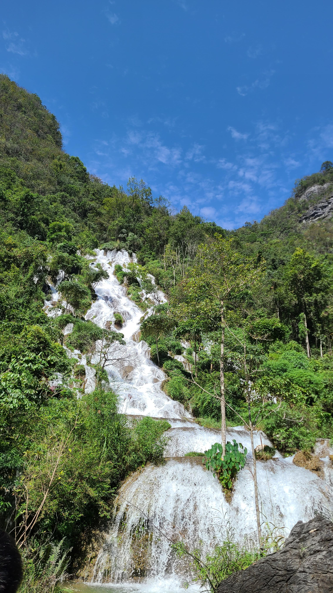

# 贵州旅游(4)——荔波

## Day4——10.02
### 陀螺之乡——瑶山古寨
下午5点半，我们的高铁到达了荔波县。晚上的民宿定在了荔波小七孔附近的瑶山古寨，荔波县不大，这也是唯二我们会游玩的地方。瑶山古寨是少数民族——瑶族的聚居地，被誉为”中国陀螺之乡“，还有着”东方印第安“，”最后一个火枪部落“等称号。其实来之前并没有对这里有过高的期待，只是为了方便第二天能赶早去荔波小七孔，属于顺便玩一下的程度。但是就是这个顺便，却彻底地惊艳到了我。

下车后，民宿老板带着我们去了前台登记入住，一路上扑面而来的便是浓烈的少数民族村寨的气息：地上趴着不动的大黑狗，咯咯哒乱叫乱跑的大公鸡，石头做成的跷跷板，遍地的花花草草和小溪，还有一些瑶族的特色工坊，像是瑶浴泡脚房（后来才知道，瑶族瑶浴和芬兰桑拿浴、土耳其蒸汽浴并称为世界三大洗浴文化呢）。寨子的商业化程度不算特别发达，或者说并没有破坏本身的传统气息。这一点和之前逛过的下司古镇有一些相似，我非常的喜欢这种古镇和古寨。



民宿是简单的木制房，上下两层的Loft式。因为定的比较晚了，只剩下一张大床和一张单人床，晚上需要两个人挤一挤了。放下行李后，我们便在村寨里散步欣赏风景。尿急的我跟着指示牌去寻找公厕，但是找了半天也没找到，还急的老婆团团转，找不到我的人，对我说话的语气也凶了一些，委屈的我又哭哭了，这两天真的很容易哭哭呢。但是老婆脾气不好我也是知道的，都怪我自己不争气哎~一点小事就哭哭啼啼的。。

晚饭是在民宿老板推荐的一家店里吃的，叫，似乎还被CCTV采访过呢。一共就点了两个菜，走地鸡干锅和空心菜。寨子里的鸡都是走地鸡，顾名思义就是经常在地上走来走去的鸡，也就是散养的鸡。不同于那些被圈养在鸡笼里的鸡，走地鸡的肉更嫩更好吃！！吃晚饭的时候正好日落了，夕阳的余晖将天空映照成金红色，空中点缀着如丝絮般的云朵，煞是好看！



### 篝火晚会
今晚的重头戏是篝火晚会，这也是我们赶在傍晚就来瑶山古寨的原因。寨子里每晚都会举办两场篝火晚会，我们看的是第二场8点场，但是7点半我们就迫不及待地进场抢占了第一排的绝佳位置。



篝火晚会的表演内容非常的丰富，旁白会介绍瑶山古寨瑶族的一些历史文化，表演的内容有火枪舞、猴鼓舞等等，都是瑶族的传统文化的艺术结晶！其中火枪舞是瑶族男子每人扛着一把火枪进行的舞蹈表演，甚至真的有开枪仪式，猝不及防之下震的我的小心肝颤颤的；猴鼓舞更是流行于瑶山白裤瑶的传统舞蹈，是瑶族用来祭祀先祖跳的。中间敲鼓的那个男人技术真的特别高超，甚至能站在鼓上面，一边跳舞一边击鼓，身体柔韧性和平衡性绝佳！！不禁令人感叹，真是“55个民族能歌善舞，剩下汉族在旁边鼓掌”呢



表演全部结束后，现场就开始点燃篝火，然后由一个当地的女子作为领导人，打节拍引导我们一起蹦迪，没错，又是蹦迪！但是这次的蹦迪感觉和影视城的完全不一样，现场氛围特别热烈，而且放的歌也更有感染力，甚至还有一首凤凰传奇的《最炫民族风》！蹦的我那叫一个全身发热！

因为明天上午7点就要到小七孔景区，所以5点半就得起床，看完篝火表演后，就直接滚回民宿休息，为第二天养精蓄锐。经过一番谦让，最后我和老婆睡大床，君君和欣怡挤了下单人小床睡觉。

## Day5——10.03
### 地球腰带上的绿宝石
今天准备去玩的是著名的5A级景区：荔波小七孔，它作为地球同纬度上绝无仅有的喀斯特森林，有着“地球腰带上的绿宝石”的美誉。因为今天已经是10月3号了，黄金周的人流量一定非常的大，因此我们准备抢在7点开园的时候就直冲拍照打卡点。5点半起床后，收拾行李寄放在民宿后，就开始打车去景区，但是没想到这个点打车特别地困难，我们从起步20块加价到了40块还是打不到，最后死马当活马医在路边随便拦了一辆车，居然可以送我们去景区，要价也只有¥40/车，真是好运气！

这位司机大哥开车特别彪悍，一路上感觉在漂移似的，到达目的地的时间比高德预计还早了5分钟。。一下车我们就一路小跑的直冲景区观光车。小七孔不愧是5A景区，景区的入口大厅造的贼奢华，不知道的人还以为是高铁站呢，甚至还给配了扶梯上下楼？到达东门检票口后，我们坐上了观光车，准备按既定攻略，直奔西门冲卧龙潭打卡点。结果人算不如天算，工作人员说现在东门去西门的外环线被取消了，只能一站站坐车换乘到西门，真的是晴天霹雳。没办法，只能先坐到铜鼓桥站，然后换乘坐车到西门售票处。这是一段漫长的山路，感觉开了足足有15~20分钟的样子，这让我不由自主地开始怀疑攻略是不是做的有问题，难道应该开始就直接去西门？

### 卧龙潭 & 卧龙谷漂流
在西门下车后，那边已经有很多人开始排队了。为什么我们都起这么早了，怎么还有这么多人在前面啊，妈的要和你爆了！！坐上观光车，终于在8点左右到了卧龙潭。幸好这里的游客数量还不算特别多，就是几个著名的打卡机位需要浅浅排一下队而已。卧龙潭的风景确实很好看，绿汪汪的水面平静的像一面镜子，不愧对它绿宝石的美名，这何止是绿宝石呀，得是帝王绿了吧。在这里拍照的时候，遇到了一队看着很像网红的组合，2男2女，女的染了个粉色头发，拿相机负责拍照，两个男的都很高，打扮的很潮流，在每个打卡点都非常认真的拍照xs，不知道回去之后能不能在xhs上看到他们。



离开卧龙潭，本来计划去鸳鸯湖划船的，但是途径卧龙谷的时候发现这里也有漂流，还可以自己划桨漂到鸳鸯湖，于是我们两两各租了一艘皮艇，开始了卧龙谷漂流！老婆坐在前面主要划左边，我坐在后面主要划右边。坐在船上一边划船一边欣赏水上风景真的太舒服了吧~



漂流到最后有一个紧张刺激的下坡冲刺，虽然漂流之前再三和工作人员确认衣服不会湿，但是冲过终点之后，坐在前面为我遮风挡雨的老婆还是被水淋成了落汤牛，裙子和鞋子都湿透了:sob::sob:还好上岸后的休息处有免费公用吹风机可以用，就是需要排队。漂流终点附近的景色也很美，在等吹风机排队的时候我们顺便去拍了点照片。不知道是不是因为到处都是水和花花的缘故，这里的蝴蝶和蜻蜓的数量异常的多，随处可见呢。



在前往鸳鸯湖的路上，我们经过了一片群山环绕的花田。远远望去，远处的山峰像是骆驼的两个驼峰一样，这里的景色很有田园风光。

### 翠谷/拉雅瀑布、断桥飞瀑
一方面因为已经体验过漂流了，另一方面鸳鸯湖的划船要排非常长的队伍，所以我们选择跳过鸳鸯湖，直接坐观光车去下一个景点——翠谷瀑布，这里是综艺节目《跟着贝尔去冒险》的取景地（虽然没看过），适合玩水踩水。到了翠谷瀑布这里，才第一次真切感受到了国庆的人流量。瀑布的最下方前面有一个凸起的石头，那里似乎是一个绝佳的拍照点，很多人都在那里排队为了拍照，我们就没有凑热闹，远远地拍了几张照之后就走了~

在翠谷站上车后，坐到石上森林站下车。接下来的一段路是必须步行的路段，一共近1.6km。由于提前做了攻略，所以我们自西向东走的话是下坡路，比起正常的东进西出要节省不少体力。这个路段的人流量很密集，一共有三个主要景点：断桥飞瀑、68级跌水瀑布，还有拉雅瀑布。其中断桥飞瀑是这次小七孔之行里最惊艳的，正如字面意思一样，瀑布是从一截断桥上飞出来的，像是一个人在空中拿了一截水枪喷射，瀑布水流在空中形成了一个弧形，最后落入远处的水池中，太帅了！！



68级跌水瀑布，其落差没有那么断桥飞瀑那么大。顾名思义，整个瀑布从源头开始会经过接近68个小阶梯，每级阶梯都会形成一个微小的瀑布水流，所以看上去没有飞瀑那么有震撼力。拉雅瀑布和翠谷瀑布类似，也是那种比较正儿八经的传统瀑布。近距离看的话，水花还是相当的大的，我站在瀑布前面拍了两张照，整个后背都淋湿了:sweat_smile::sweat_smile:

在途中还遇到了一件趣事，有一群小朋友围着一个大人，所有人都穿了统一的制服背心，像是什么课外学习的。中间的大人正在演示如何吸引蝴蝶停留在自己的手上，原理是蝴蝶会被某些富含盐分和矿物质的东西吸引，所以如果在手指上抹一些汗水，就可以成功的吸引蝴蝶停在自己的手指上了。看着小朋友们充满好奇又崇拜的眼神，不禁感慨这才是有意义有价值的课外活动，不比死读书强多了嘛。

逛完这几个瀑布后，最后来到的是小七孔石桥，这也是除了卧龙潭外的另一个著名打卡景点。可惜这个点的石桥上已经全部挤满了人，从上面望下去黑压压的全是人头，只能无奈的放弃咯~总的来说这次荔波小七孔之旅还是挺满意的，按照自西向东下坡的行程也没有遇到特别特别拥挤的情况！

出景区已经是下午1点多了，在景区外面找了一家看上去挺气派的餐馆吃的午饭，叫，大众点评的评分还挺高。之前做攻略的时候虽然看到过，但是没有特别安排。我们进去的时候刚好空出来一张四人桌，运气真不错！点了4个Top菜：小炒黄牛肉、凉拌水蕨菜、下饭莴笋丝，还有一个荔波米片。几道菜都非常好吃，特别点名表扬荔波米片，比之前在韩国街买的米片还有超市里买过的米老头都要好吃一百倍！！！我们坐的桌子旁边是一个大水池，里面有很多的鱼游来游去，不知道是不是饭店养着准备随时宰了吃的。君君丢了一点米片进去，结果冲出来一条好大的鲶鱼，一口吞了下去。随着我们投喂的越来越多，池子里出现了越来越多的鱼，密密麻麻，甚至看着有点恐怖了。其中鲶鱼占了一大半，更是有一条鲶鱼王般的存在，剩下的一些小鱼根本捞不着吃的，太可怜了。。



### 拉片村
吃完饭我们就打车回了瑶山古寨，想要抓紧下午剩下的时间，再逛一逛瑶山古寨的风景。君君脚疼走不动路了，找了个长椅坐下来休息；欣怡来亲戚了，肚子疼，也一起坐着休息了，于是变成了我和老婆的二人世界。我们探索了寨子里昨天晚上没有走过的路。在入口处首先是一个大石碑，上面写着“中国少数民族特色村寨——拉片”。原来瑶山古寨的真名叫拉片村。接着我们逛了村史馆，在昨晚篝火晚会表演的基础上，更深入的了解了这里的少数民族文化，例如舞蹈、歌唱、陀螺竞技、丧葬等等。穿过村史馆，来到的是瑶草茶舍，这里是卖各种草药和药浴包的，还可以在这里体验瑶浴泡脚。不过据说长途走路之后不能马上泡脚，只能等回家以后慢慢泡咯~



茶舍出来后，我们途径了一片很大的池塘。池塘四周则是村子官方建的民宿，环境优雅，午后的阳光照射在水面上，波光粼粼的甚是好看，不过房源都很抢手，我们只能订到私人开办的民宿了。接着路过了一个小的十字广场，左手的池塘边坐着几个奶奶一边洗衣一边聊天，右手的路中央趴着两只二哈，傻傻的好可爱。整个村落洋溢着一股午后安详的气息，让人不自觉的想要投身融于其中。



可惜美好的时光总是短暂的，马上就快到了要出发赶火车的时候了。在回去找君君欣怡汇合的路上，给老婆拍了一组照片，背景是瑶王府，以及瑶王府对面晾晒着的一排像是扎染还是蜡染的红蓝色布匹。配上老婆的蓝白色裙裙，真的非常出片！



很多人只把瑶山古寨当成去玩荔波小七孔时的一个中转站，殊不知这个隐藏在大山里的小村落，是真正的世外桃源。这次贵州行，最超越我预期的两个景点，一个是凯里的下司古镇，另一个就属荔波的瑶山古寨了。真的非常享受！！

告别荔波，Next Station——贵阳！


