# 贵州旅游(5)——贵阳

由于贵州的景点分布在不同的城市间，且我们不是自驾出行，所以跨城市的通勤比较依赖高铁。离开荔波后的下一站原本应该是织金，但是因为没有直达列车，我们选择了贵阳作为中转，并停留一天一夜的时间来游玩。而在旅程结束之际的最后一天，我们还会再回到贵阳游玩。

## Day5——10.03
### 初到贵阳
从荔波到贵阳的高铁需要1个半小时。到达贵阳北站的时候已经是晚上6点了。今晚的住宿安排在了甲秀楼附近的一个酒店，因为贵阳是贵州的省会城市，相对前面的城市更显繁华，君君在路上开始迫不及待地搜起了本地的酒吧，准备晚上去喝酒蹦迪，甚至还问我们的司机小哥有没有推荐的酒吧，没想到看似酷酷的小哥腼腆地回了句：“我不去酒吧”:joy::joy:问起当地的美食推荐，小哥说是酸汤牛肉，还有烙锅，不过推荐的店都离我们有点距离，只能作罢。

目的地的酒店位于甲秀楼旁的一个小巷子里，这里临近傍晚，人流量超级大，车子开进去花了不少功夫。万万没想到的是，我们的酒店居然是在贵州省气象局的里面，旁边还有公安局，安全感瞬间MAX！办理入住，放下行李后，我们就迫不及待的出门玩去了！

")

### 铁签烤肉
来之前看xhs的攻略说甲秀楼每晚会亮灯，7点左右开始，所以我们才特意定了个甲秀楼附近的酒店，原定的计划是先看亮灯，看完后去逛青云市集，和吃完饭。没想到计划赶不上变化，国庆期间的亮灯时间推迟到了8点，所以我们只能先找地方吃饭。君君在大众点评上看了几家店，一家吃烙锅的叫，等位居然有880+？？另一家地摊火锅，排队也有好几百，最终还是决定去吃攻略预定好的铁签烤肉——富群烤肉。

好容易打车到了目的地，跟着导航找了半天也没找到富群烤肉的店，最后还是一个路边卖红薯的老大爷，操着一口贵阳本地土话和我们说这家店已经倒闭了。。。好在这附近的马路两边全都是吃饭的店，还是那种烟火气很浓的街边饭店。我和老婆两个人出去晃悠了一下，最后选中了家叫的店，之前做攻略的时候有印象有人在评论区里提过很好吃。店面两层楼，座位居然都坐满了，只有二楼还剩两张空桌，看上去很火呢。

点开大众点评，推荐菜名第一的是肉串，但是我们在菜单里并没有看到肉串，为此还特意找老板问了这事，结果一个像是老板的女儿来回答，说是这里的烤串居然是厨房烤好一大盘之后，服务员端到每个桌子上，然后每桌按需自取的。真的是大开眼界，不知道这是铁签烤肉的特色呢，还是只是这一家店的特色。。（此处忘记拍图）肉串确实好吃，1块钱1串，4个人最后吃了170多串，外加点了一些烤菜，总计花了370多，算是这几天吃的很贵的一顿了。

来贵州旅游前在xhs做攻略，知道了贵阳有一种特色的夏季甜品叫冰浆。冰浆的地位相当于四川的冰粉，和冰沙有一定的区别，前者的冰打的很绵密，不会有碎冰渣扎嘴的口感，更偏向于果泥，而且冰里面会打一些糯米，口感更软糯醇厚有嚼劲，注重水果本身的味道和质感。于是在吃烤肉的时候我就外卖了几份的黄瓜牛奶冰浆。没想到骑士一直在店里取货，等我们吃完了他还在取货，于是只好和他说请他换一个配送地址，送到青云市集的门口。。还好小哥也是个通情达理的人，一口就答应了。

### 青云市集
吃完烤肉，我们步行去了附近的青云市集。这里不知道是不是贵阳晚上最热闹的地方，反正人流量是这10天的旅游里见过的最恐怖的，整条大步行街全都是人，当我们拐进青云市集里的时候就更可怕了，甚至无法迈开步子走路，只能小碎步一步一步地缓慢挪动。短短几十米可能需要走1分钟的时间。老婆她们三个人先进市集里面逛逛，我就先去指定地点和我的冰浆外卖小哥接头交货。这一进一出，顶着人流寸步难行的感觉，春运可能也不过如此吧。



顺利地拿到了冰浆后，去和老婆汇合。青云市集实际坐落在一个大型的美食城的深处，跟着老婆留下的指示走了好久才找到。她们买了一份提拉米苏，然后正在一个路边的摊位上挑石头手链，君君买了一串，据老板说都是招财运的（君君后来甚至还给每一颗石头都起了名字xs）。后来我们就进美食城找了个座坐下来吃冰浆！不愧是招牌推荐的黄瓜牛奶味，第一口就直接惊艳到我了！！黄瓜的清爽、牛奶的甘甜、配上花生碎和黄豆面，搅拌后一口下去，满满的浓稠，简直无法形容有多好吃，舌头上的每一个味蕾都在激动地颤抖！！！在这一瞬间，我甚至还萌生了回家研究怎么复刻冰浆的想法，因为在上海还并没有专卖冰浆的店，想要把这份快乐无限延续下去~

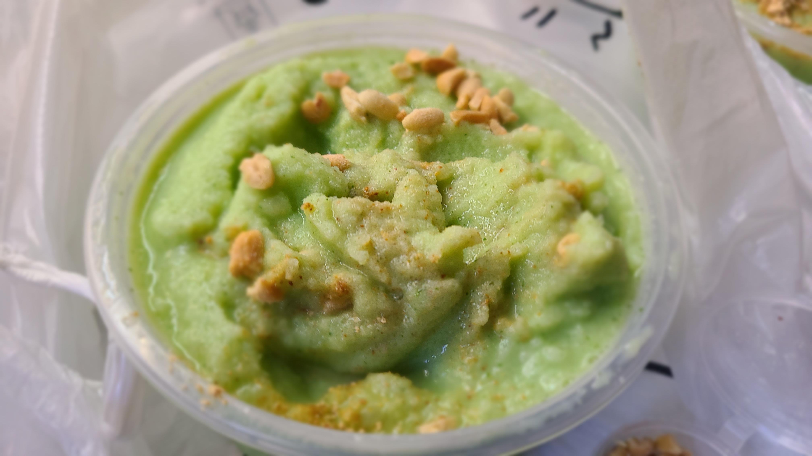

吃到兴起，君君还点了一份双拼炒饭，和一份什么来着（忘记了），当做了今晚的夜宵。这个美食城的人气很旺，我们甚至找不到多余的空的椅子，每张桌子上都坐满了人，据说贵阳的夜生活是一种文化，餐饮店普遍会开到凌晨2,3点，酒吧更是直接通宵。。很难想象这里的人都不用上班的吗

吃完夜宵，离开了青云市集，步行回酒店休息。这个点路上的人开始变少一些，吹吹夜风还挺舒服~

## Day6——10.04
### 贵阳的早市
今天白天的计划是逛，这是贵阳的三大博物馆之一，因为另外的两个博物馆，省博和地质博物馆距离我们都太远了，而且人比较多，所以选了相对小众且在市区的民族博物馆。早晨君君和欣怡在酒店睡懒觉，我和老婆两个人按惯例先出门溜达了一圈。酒店门口的巷子里有卖鲜榨刺梨汁的，刺梨是贵州这里的特色水果，富含VC，有很高的保健与药用价值，昨晚逛街的时候也看到满大街都在卖刺梨汁，不过据说很多游客都喝不惯，不过价格挺贵的，要15块一杯，就先没点。。早晨的贵阳还是挺冷的，9点左右气温还没有升上来，于是我们去了附近不远的去茶山，点了两杯热饮暖暖身子。路上途径一个广场，大爷大妈们已经开始健身锻炼了，不过是一种我看不懂的运动，两只手甩一根长长的玩意？



虽然刚才在路边没买刺梨汁，但是我还是在去茶山点了一杯，还更贵，不过味道确实蛮好喝的，梨味比较浓郁，带一点酸酸的。去茶山的人气真的很火爆，我们下单时前面只有3单，但是却等了快半个小时！！取茶的时候，在前台发现可以免费集章盖章，贵阳的每一家去茶山都有不同的印章，有点后悔来之前没有仔细做攻略了，没有带印章的本子！！（以后要加到旅游CheckList里去）

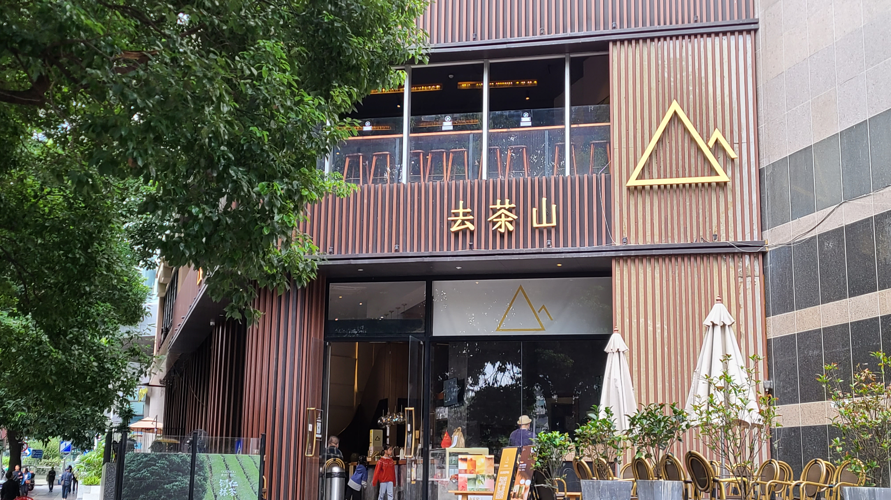

到了该吃早饭的时候了，那怎么少的了菜市场呢~自从去了一趟昆明之后，现在每次旅游都会想去当地的菜市场逛一逛，吃一点本地特色的早餐。老婆选了一家距离我们比较近的菜市场，叫做，打车过去10分钟。整个菜市场占地面积不大，10分钟就能逛完。我们买了洋芋粑粑，糖炒栗子，玉米粑，还有现炒土豆片！贵州真不愧是土豆星人的圣地，路边随便找一家炸土豆片都超级好吃，有番茄味/黄瓜味/香辣味的，比乐事的性价比高！

出了菜市场，面前突然豁然开朗，来到了一条叫“交通街”的马路。这条路的两边也开着各式各样的小吃店，我们又买了一个破酥包，不过感觉面皮一般，里面的豆沙还挺好吃的；还尝了一碗贵阳老素粉，特意要的是贵阳特色的酸粉，老素粉吃起来感觉是综合了碱水面 + 螺蛳粉的口味，特别香，而且一碗粉只要6块钱！当我们坐在店里吃粉的时候，门口还不停的有操着本地口音的本地人来买素粉吃，看来这是被我们找到了一家本地宝藏美食店呢~~ 这种烟火气息真的很令人陶醉



### 万物皆可烙锅
吃完早饭，我们点了四人份的去茶山外卖，准备等会中午吃饭的时候喝，然后打车回了酒店，和大部队一起汇合。今天的午饭吃的是昨晚君君看到的那家必吃榜上的烙锅——，只能说人气是真的火爆，在车上的时候看了下等位还是无需等位的状态，10分钟后到了酒店就变成了中桌30+，小桌200+了？？幸好君君提前取了一个号，我们赶过去之后等了10分钟就轮上了。

所谓烙锅有点像铁板烧，就是在一个大圆锅上面倒油，然后放上一些半生半熟的肉和蔬菜开始烤。圆锅的中间有一口小锅，里面放的是烙锅的特色蘸水，这种烙锅也叫做活油烙锅。蘸水比较辣，也比较油，我不太吃得惯，所以我和老婆只拿了些五香粉当做干碟调味用。锅面是中间高两边低的上凸形状，因此烤完后油会顺着锅面下沉到锅的边沿底部，如果有菜放在那边烤的话，就会吸饱了油水，需要避免。吃完之后才知道为什么这家烙锅人气这么火了，味道尚可的情况下，价格竟然只有人均¥30！！当然了，吃饭必不可少的一环就是冰浆啦，今天中午吃的是芒果味的，一如既往的好吃！直冲灵魂的味道！我愿意为贵阳冰浆献出心脏！

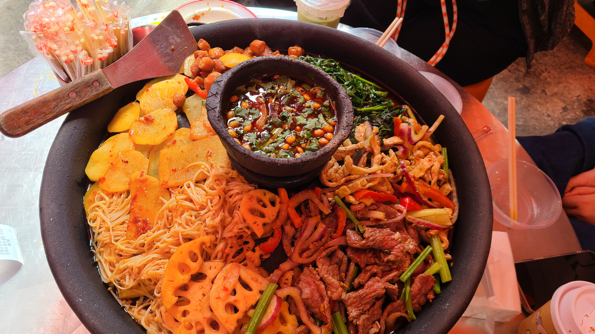

### 民族博物馆
吃完饭，我们打车去了下午的目的地——民族博物馆。这个博物馆占地面积挺大的，楼高11层，我们要逛的是里面的3层楼，其中2楼是限时展馆，3~4楼则是常规展馆。进门前的广场上竖立着一个超级大的雕塑，看着像是日晷的模样。1楼大厅放眼望去是一排排的行李箱，不是刚到的贵阳就是要离开的吧。临时做了一下攻略，结果发现民族博物馆居然也有免费集章的活动，于是赶紧跑去附近的超市买本子，可惜时间仓促，没有那种空白的适合盖章的集章本，只能买到带条纹的笔记本了。。。

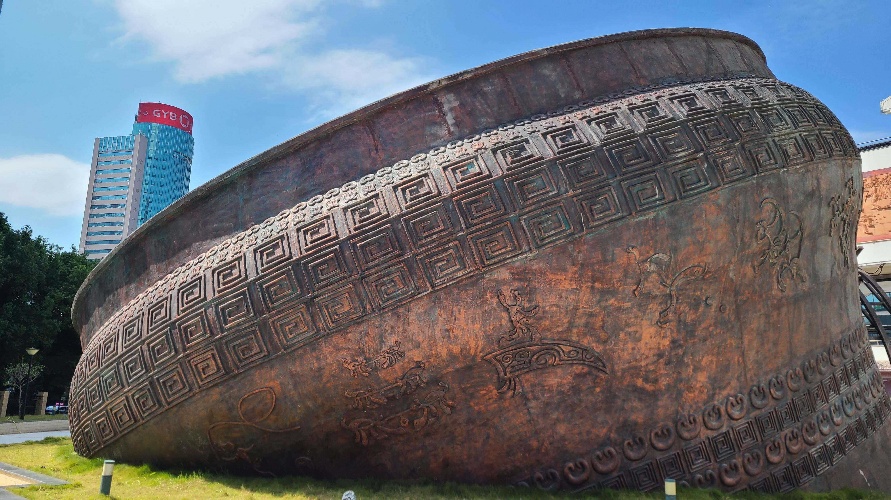

民族博物馆主要介绍的就是贵州的各个少数民族，包括民族概况、服饰、起源、语言文字、秩序规约、本族名人等等。还有民族的一些传统文化，像是耕种作物、建筑、布艺纺织、银器铸造、礼俗民风、歌舞曲等等。在这里我们了解了我们的圣女殿下的母族——水族，其源远流长的历史文化，还了解了水书的发展等等。虽然每到一个新的城市旅游都会去逛一下博物馆，但每次又都前脚逛完后脚忘记。。尽管如此，逛博物馆还是能多多少少地帮助我们了解当地的历史、文化、风俗。老婆空闲时和我说，旅游不仅仅只有特种兵打卡旅游，我们也可以增加旅游的深度，对我们旅游的目的地多作一些深入的了解，这些都是无形的知识与财富，比起无脑的拍照打卡，更有旅游的意义。



2楼的前台有免费的印章，一共16个的样子，分成红色、蓝色和紫色三种颜色，主要对应了15个不同的少数民族 + 汉族。老婆一个人手忙脚乱的，有好几个印章都不小心重复盖了几次。以后我们要专门准备一个旅游的盖章本，记录我们的旅行足迹！

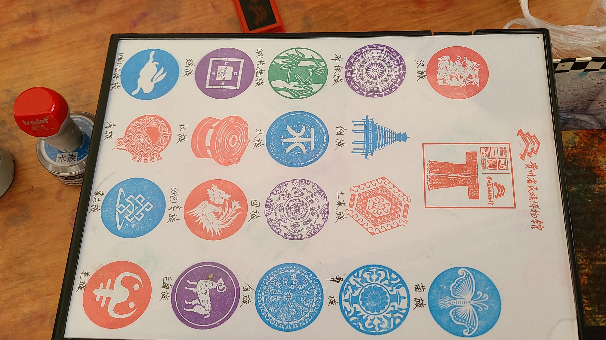

### 南横街闲逛
从博物馆出来已经是下午4点了，君君打算提前去晚上吃饭的火锅店等位，我们仨就打算去附近逛逛。附近有一个商圈叫南横街，是商业化程度比较高的步行街道，路不算长，两边开了很多家网红零食/奶茶/小吃店。欣怡在一家奶茶店坐着休息，我和老婆则出去轧马路~在南横街遇到了另一家专卖冰浆的店，xhs上也很火，叫，可惜排队的人太多了，没敢上去买。南横街的对面是一栋古色古香的酒楼，名叫，状元楼的旁边是一个非遗集市，里面有很多摆摊，不过时间尚早，听摊主老板说要到傍晚5点以后这边会禁止机动车通行，晚上人才会多起来热闹起来。可惜我们今晚就要离开贵阳了，只能遗憾地错过:sob::sob:

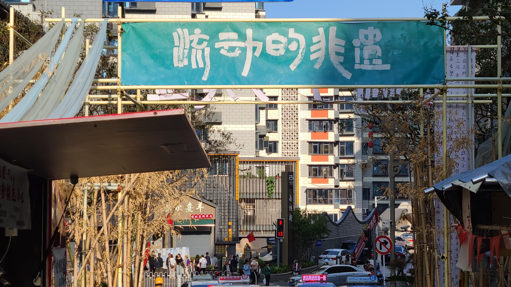

### 地摊火锅
晚饭去的是昨晚在吃铁签烤肉的路上看到的一家街边火锅店，叫做。地摊火锅也是贵州这边的特色，锅底里面会加豆豉、西红柿、辣椒等等，所以闻起臭味还挺重，但是吃起来又是香香的。由于这个火锅有点点重油重辣，所以我又点了一份芒果味冰浆解渴，真是百喝不腻呀~这可能是我们贵州行几天以来吃过的最接近重庆火锅的一顿了，锅里涮着的蔬菜吸满了饱饱的辣油，油光发亮，晶莹剔透。我在自取蘸料的时候，甚至因为倒油碟的关系，还引来了背后异样的眼光:sweat_smile:

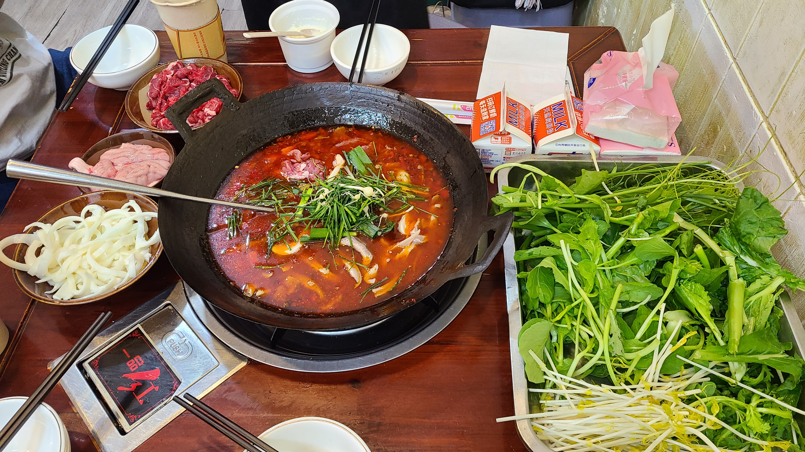

### 打车惊魂
今晚我们会离开贵阳，坐城际火车前往黔西，因此我们掐着点吃完了火锅，步行回酒店拿回行李后，便打车前往贵阳站了。来接我们的是一辆高贵的红旗，里面还是一位女司机，穿着黑色西装，戴着白色手套，满满的都是高贵优雅。一路上君君在刷xhs看一些冷知识，我们就在车里闲聊，比如金庸笔下的高手排名第一居然是扫地僧，再比如什么什么的（忘记了）。



司机姐姐送我们到贵阳站后，我刚准备下车去帮忙搬行李，就听到老婆在后座的一声惊呼：“我们买的是贵阳北站啊”。我的第一反应是“不可能啊”，因为我记得清清楚楚，我的攻略里都是安排的贵阳站出发，我们玩的地方和住的地方都离这里更近。第二反应就是赶紧掏出手机确认了一下，结果“贵阳北站”四个大字赤裸裸地挂在了我的眼前，让我一瞬间失了神。这个时候已经接近晚上20点了，我们的火车是20:45发车，留给我们的时间可能只有20多分钟了。司机姐姐一听，大喊“来得及，没问题！”车头一转就开启了狂飙模式，一路上疯狂提速，踩实线变道，隧道内变道等等各种违规操作都来了一套，而我则默默地坐在了副驾驶位置上，一声不吭，满脑子都是“怎么会是贵阳北呢”，“完了，不会之后的行程全部冲突了吧”，“要滑跪谢罪了”。君君和欣怡倒是很乐观，一直在有说有笑的，嘴上还说“没事，来得及的”。

经过了一番猛烈的厮杀追逐，最终在20:20分左右，我们到达了贵阳北站，真是太感谢这位司机姐姐了~进站后才发现站里空空荡荡的，甚至都没有几个人，倒也不需要这么赶时间。。我们乘坐的是C字头的城际动车组列车，一共就几节车厢，里面还有不少的扶手，看起来像是在坐地铁。车厢里坐了许多的小孩子，都是那种父母带着一两个小孩的组合，让人怀疑他们是不是都是住在黔西，从黔西去贵阳玩，然后玩完了回家的。坐在我前排座位上的似乎是一个女大，戴着耳机手里拿着一张纸片，上面居然写了微积分公式！！今晚住宿在黔西，明天一早出发去溶洞之王——织金洞！

## Day9——10.07
安顺回贵阳的火车需要1h15min，坐的是绿皮火车。不知道是不是回贵阳打工的人太多了，我们的这班次车直接爆满，检票时排队都排到绕了个大弯了。这辆车的终点站甚至是上海南站，不过需要坐整整20多个小时，是君君明天坐高铁回到上海，这班火车都还没到上海的水平。

我们的车厢不出意外的落在了最里面的19车厢，拖着行李箱穿越了一层又一层人群后，终于到了目的地。结果上车的时候居然不开放19车厢的门，只能从18车厢进去，最终结果就是18和19车的人一起挤一道门，真是见了鬼= =。在车上一边看小说，一边把在贵阳菜市场买的土豆片给消灭了个干净，一本满足~~

今天晚上没有什么特定的行程安排，晚饭去吃了君君想吃的野生菌火锅，选了一家叫的店，人均只要88，而在在上海吃一顿要人均好几百。虽然现在也不适逢雨季，吃到的还是冷冻的菌子，但是还是比内陆要强很多了

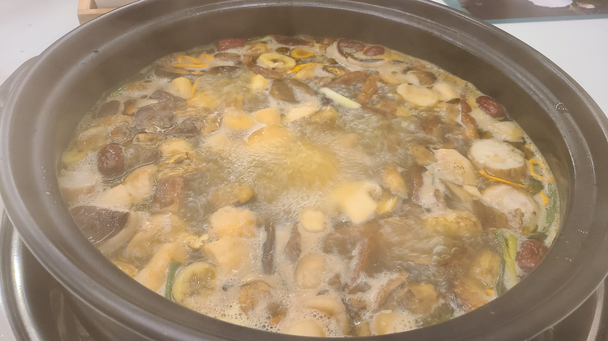

p.s. 今晚的民宿定的是盲盒款，室内设计风格都是随机开箱的，还是挺有创意的~民宿楼下正对面开着贵阳便利店本土三巨头中的两个——凯辉和勇惠，而传统日本三巨头全家、罗森和711在贵阳一家也没有看到过。



## Day10——10.08
### City Walk
今天是整个贵州旅游的最后一天，马上要和这里说bye bye了，还是非常不舍的。早晨我们收拾好行李，把行李放在民宿的仓库寄存。仓库里的每层货架上都存放了很多的日用品，像是一次性毛巾、浴巾、牙刷、梳子等，还有大量的矿泉水存货。不同的货物会贴标签进行区分。墙上还贴了客房卫生标准规范，感觉适合我们为了未来自己搞民宿偷师学艺呢



放好行李，我们就开始出去city walk啦~因为这一天我没怎么安排工作，所以昨晚老婆临时做了很多攻略，真是辛苦我的小老婆了~~今天的第一站是附近的一家必吃榜上榜餐厅——，店面不大，因为今天实际上已经是节后返工的第一天了，店里面客人也不算多，我们很轻松的找到了座位坐下来，点了一份清汤牛肉粉。
味道是绝赞的，感觉灵魂在于他的清汤汤底很鲜，连带着里面的牛肉特别的好吃~由于受前两天吃的老素粉的影响，我选择了粗粉，但是尝过之后发现，对于这种汤粉还得是细粉更入味更好吃，所以又花1块钱多加了一碗细粉。顺便提一句，这家店的前台服务员姐姐感觉也和其他店的不一样很特别，居然坐在那里喝着去茶山呢。

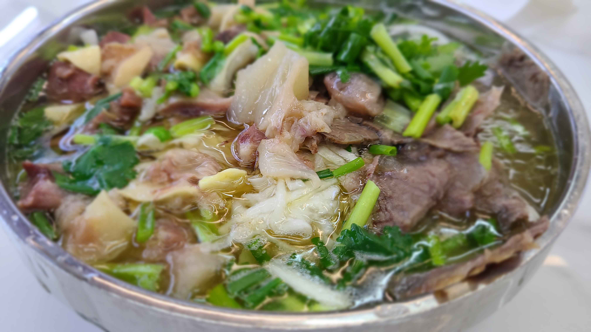

吃饱之后，欣怡说她起床了也收拾好了，准备过来找我们，于是我们强烈推荐她来尝一下这个牛肉粉，我们俩则继续往南走去下一个目的地——当地人好评的。可能是工作日早上的原因，排队的人只有两三个。这家馅饼一共有卖8种口味的，像是黑芝麻、板栗、花生、玫瑰等等。站在我们前面的那个阿姨刚好是贵阳本地人，我们请教了一下哪种口味更好吃，阿姨推荐的是黑芝麻和玫瑰。由于价格便宜，8块钱一盒，一盒里有8个，于是我们一共买了五盒，三盒自己吃，两盒送人。这家店一看就是老店，员工各个都很干练，手脚麻利似生风：负责站在柜台对外打包和收银的小姐姐，夹子夹饼、装袋、打结、算钱，一气呵成；透过柜台往里望去能看到一个方桌，围着桌子边一圈坐了7个员工，戴着统一的白色鸭舌帽，分工及其明确：有负责压面饼的，有负责包馅的，有负责把馅塞到面饼里的等等。材料在一个人手里处理完之后，就会划着一道美丽标准的抛物线，落到下一个人的面前，如此循环，直到一个馅饼的完成。这是一种秩序的美！

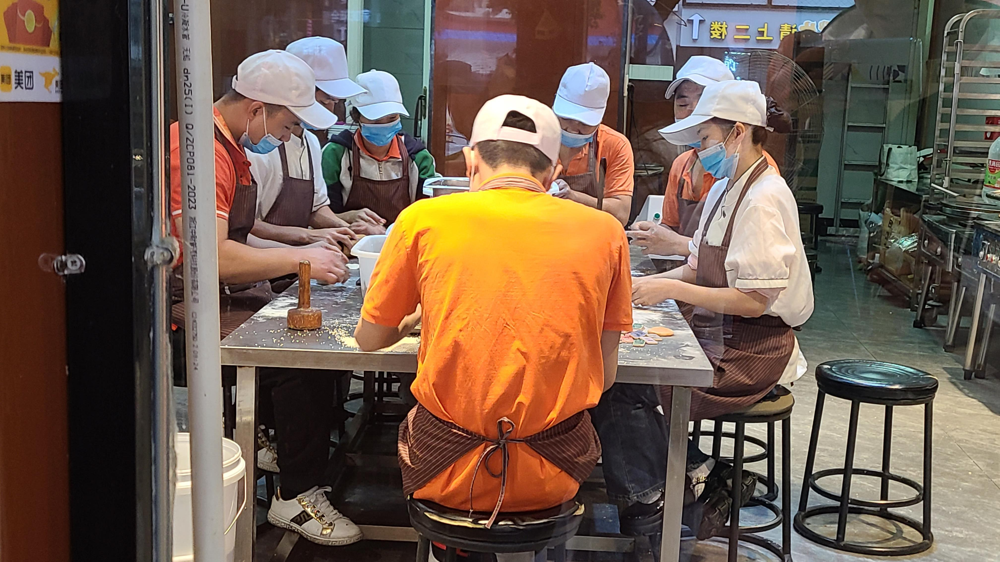

提着一大袋矮子馅饼走回牛肉粉店，欣怡也对这家的粉赞不绝口，而她尝了一口我们刚买的矮子馅饼后，更是好吃的说不出话来，看来今天早上真是大丰收呀！老婆做的攻略真棒！吃饱喝足后，我们俩先行回了民宿，准备上个卫生间。没想到欣怡居然还偷偷地缀在了我们后面，然后仿佛幽灵一般和我们闪进了同一个电梯里，无语！:sweat_smile::sweat_smile:

### 贵州美术馆
因为刚吃了馅饼和牛肉粉，肚子不饿，我们就打算先去逛个景点，选择了老婆最爱逛的美术馆。有两个艺术生在身边，简直是自带免费专业讲解呢~ 高德地图的导航真的很有一手，总是会给你导航一些奇奇怪怪的近路。我们跟着导航走到了一片荒无人烟的像是工地一样的地方，然后步行穿过了一条窄巷，巷子左手边是那种非常老旧的居民楼，窗户的栏杆都布满了锈迹。右手边估计就是那个美术馆了。穿出巷子，眼前瞬间开阔了起来，来到了一片大马路前，而我们的目的地美术馆就巍峨地屹立在我们的右手边。我只能说，高德，牛笔!

可能是因为工作日的关系，偌大的美术馆居然没有一个游客，除了保安外我们是仅有的三个活人:sweat_smile::sweat_smile:贵州美术馆给我的最大印象就是大——展馆面积大，展出的作品也很大。一层展出的是一些著名退休画家的作品，主要以油画、版画和书法为主。老婆和欣怡居然能讲的头头是道，分析出作画的手法，评判出画家的功力高低，真是长见识咯~~二层则是红色专题展览，展出的画作都是描述的革命时代的一些历史事件，整个空间以大红色为主色调，肃穆庄严，令人生畏。三层则展出的是一些民间作品，相比于一层作品的高超画作功力，二层作品的历史意义，这一层的作品更贴近生活更接地气。直到逛到第二层快结束的时候，我才发现用手机相机自带的扫描功能拍出来的照片，要比直接硬拍出来的效果强很多！可惜了之前逛得美术展拍的照片了，以后逛展拍照都要用扫描！



午饭也是老婆挑的，吃的是一家必吃榜餐厅。我们兵分两路，我去巧八角的线下店买冰浆，老婆和欣怡则去线下买奶茶（这次喝的不是去茶山，换了一家新的叫）。线下的巧八角居然一个人也没有!而且居然有之前外卖没有的口味——开心果味，不过价格比较贵，要24一份。抱着尝试的心态，我把Top1~3全点了一遍，黄瓜+芒果+开心果，一本满足！买完冰浆就步行前往黔大叔，没想到这家饭店还有两个门，我从前门进来的，老婆她们是从后门进来的hhh

由于是下午的2点半，一个不尴不尬的时间点，店里也没几个人，我们愉快地随便选了个座位，点了个招牌四人餐，准备开始大快朵颐！套餐里有糟辣鱼、双椒鸡、拌卤肘，蔬菜是炒瓜尖，主食是西红柿拌米皮。这家店的口味特别赞，点名表扬西红柿拌米皮和炒瓜尖，前者的米皮一般，但是西红柿酱特别的好吃，真想知道它的配方，这样家里做来拌面吃绝对是一绝；后者虽然是普通的地瓜尖，但是炝炒之后格外的香，一盘瓜尖起码有半盘多是我炫掉的；双椒鸡的味道也不错，比普通的辣子鸡要好吃，鸡肉很嫩。

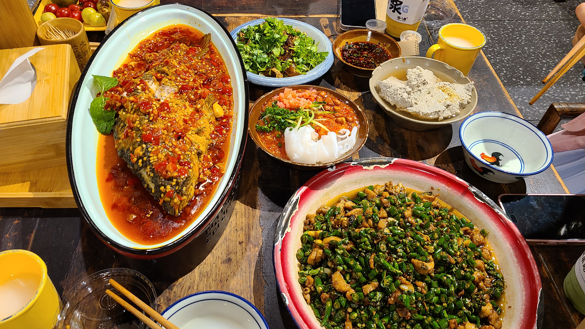

### 仙人洞寻仙
吃完大排档，我们前往下一个目的地——仙人洞。这是贵阳著名的一个道教圣地，坐落于仙人洞路的铜鼓山上，有铜鼓遗爱之称，是明朝的贵阳八景之一（遗憾的是贵阳八景现如今基本已消失殆尽了）。相传这里曾是八仙之一的吕洞宾的修炼之地。仙人洞路比较狭窄，我们只能打车到门口然后步行进去。路口是一个小型集市，两边横七竖八地罗列着卖菜的小摊卖小吃的小摊。进了巷子，两边以民居为主，家家户户都养着大公鸡，一路上”咯咯哒“的鸡鸣声此起彼伏。走进深处后，看到的则是墙边贴着的各种周易卜卦、算命算风水的招牌布告，一种神秘的感觉逐渐在周围萦绕了起来。站在半山腰的平台，已经可以勉勉强强俯瞰到贵阳市区的面貌，而山的对面和我们遥相呼应的，则是贵阳的另一个地标建筑——东山寺。通常游客会选择去东山寺，因为xhs的推广比较多。

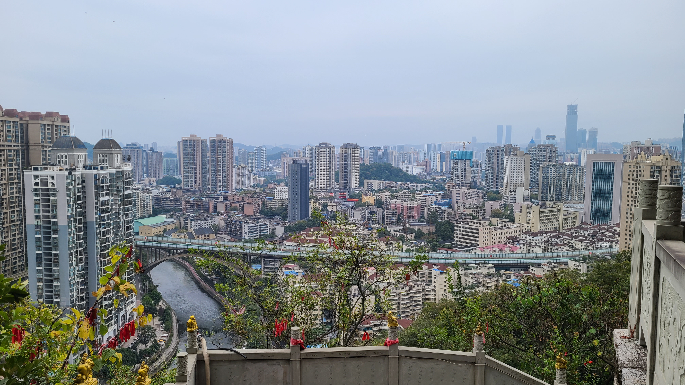

爬到山顶，终于见到了传说中的道观——仙人洞。出于对道教的敬畏之情，在这里我基本没有怎么拍照。首先见到的是一个比较大的广场，广场的四周建着三座殿宇，其中一座是老君殿，另外两座的名字记不太得了。广场正中间摆放着一个很大的鼎，中间插着很多炷香。我们先去了右手边的大殿，买了一包香，开始烧香 + 跪拜。殿外入口处摆放着宣传小纸片，科普了规范的道教跪拜礼——一礼三叩首的流程，还有道教插香的手法：先用拇指+中指捏住插在中间，然后拇指+无名指捏住插在右边，最后拇指+食指捏住插在左边。u1s1
，这个手法真的很难用好不好。。

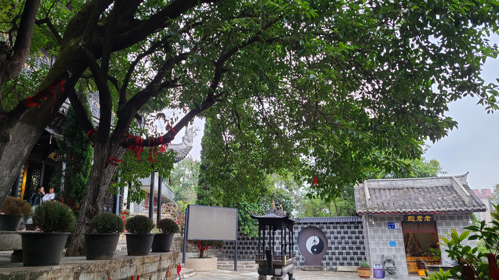

道观里有很多的殿，加起来起码也有一手之数了，我们就每人每个殿三炷香，恭恭敬敬地跪拜了各方各路道教神仙。第一个进去的殿里还可以抽签算命，10块钱一次。这还是我第一次自己竹筒摇签，不知道怎么个摇法，还让师傅见笑了。我求的是最近几年的身体健康状况，抽到的是上上签！不过老婆好像同样的问题，求到的却是中下签捏emmm。。道观里还养着三只小猫咪，一只棕黑间条纹，一只橘白，还有一只黑白奶牛花纹。小猫一点也不怕陌生人，整个道观山上山下都是它们的家，生活的那叫一个逍遥自在~~ 它们的粮盆也超级的大，怪不得吃的都圆咕隆咚的呢。



### 太平路 & 民生路
在仙人洞呆了一个小时，我们原路返回，准备打车去吃晚饭。吃饭前先去一次上午的矮子馅饼那里，因为太好吃了还想再买两盒，结果到了之后发现排队超级长，正好赶上了5点多的下班晚高峰，只能悻然作罢！

晚饭我们吃的是烤鸡，叫，位于太平路上，这也是贵阳一个有名的网红小吃商圈。不得不说贵阳真的很会吃，各种小马路小巷子都是一大排吃的，吃货生活在这里真是一种享受~由于导航路况复杂，找这家店花了不少时间。时值晚上6点左右，由于我们这次回程还没有确定下来是买今天晚上回还是明天早上回的机票，老婆说临期的时候机票通常会降价，所以前两天就一直在蹲机票，结果没想到一周前的价格750竟然已经是最低点了，之后的价格便一路水涨船高，到了今天已经涨到了1500，直接翻了两倍！最后只能妥协了明天上午返回的机票，赌狗赌到最后真是一无所有！因为赌博而受伤的心灵，只能靠冰浆来慰藉了，这也是在贵州的最后一顿冰浆，每一口下去都是无声的告别。等我回家一定要学会复刻，这样就可以冰浆自由了！

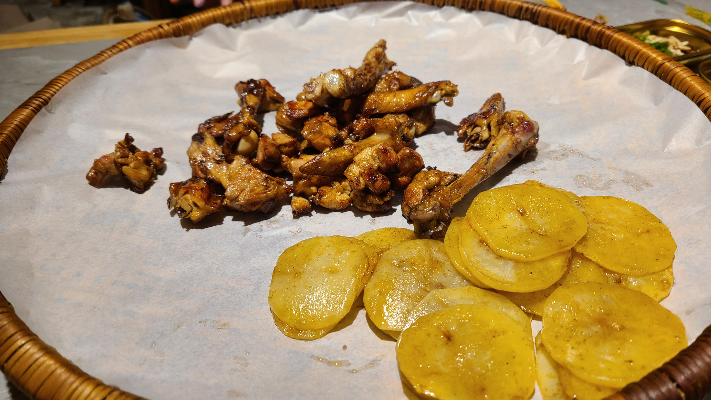

吃完烤鸡后我们就开始夜游散步，从太平路出发，沿着太平路 → 省府北街 → 忠烈街 → 文明路 → 民生路的顺时针方向city walk。省府北街是一条小弄，往里走是一个居民区，虽然略显昏暗，但是从里朝外望去却又能见到各式小吃摊和料理店招牌的霓虹灯光，形成一种异样的繁华景象



忠烈街和文明路就是连接两条大马路之间的小马路，当然也都是小吃街，看得我们眼花缭乱，目不暇接~ 没走多久就来到了大名鼎鼎的了！来之前在xhs上看说不推荐来这里，因为很多店都是新开的，并不是老字号，而且路面环境脏乱差，游客数量暴多。但是我们今晚错峰来逛的时候，人流量就在可以接受的范围内，不过也能看出贵阳的夜生活确实很丰富，整条街灯火通明，熙熙攘攘，很有烟火气！我们在这里就买了一个贵阳举糕糕，当明天的早饭吃。民生路的尽头是一个大型美食综合体，有点像我们在青云集市那次看到的美食城，里面入驻了很多的商家，非常热闹。



从民生路离开后，发现我们正好绕了一圈，又绕回了那条矮子馅饼所在的马路——富水北路。可惜这个点矮子馅饼已经临近打烊，只剩下两种不受欢迎的口味了，我们喜欢的黑芝麻和花生馅的都卖光咯，哭唧唧:sob::sob:

到此我们在贵阳乃至整个贵州的旅途就结束啦，打车回民宿拿了行李后就直奔在机场附近定好的酒店，准备明天返回上海开始~~搬砖~~休息！最后的最后，让我用冰浆三连来向贵州致以最崇高的敬意！




