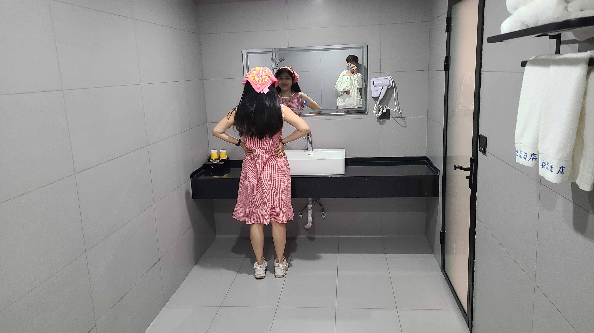
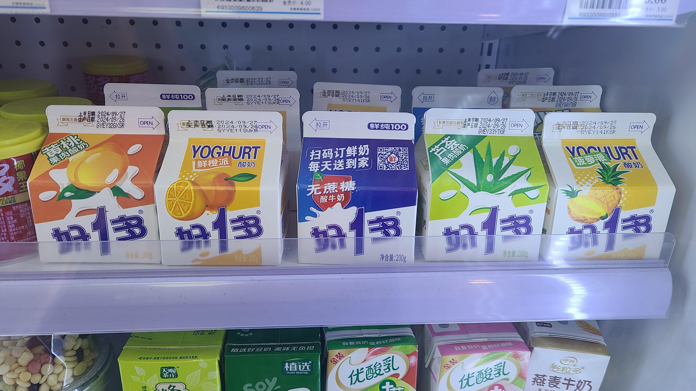
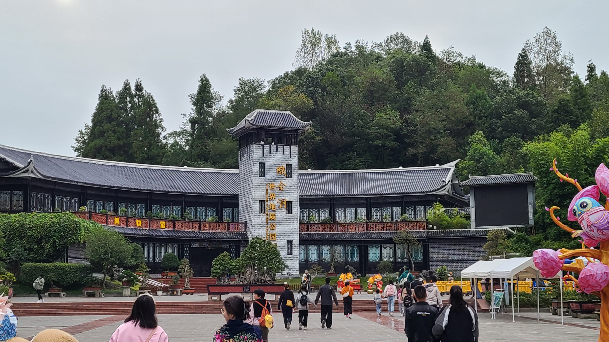
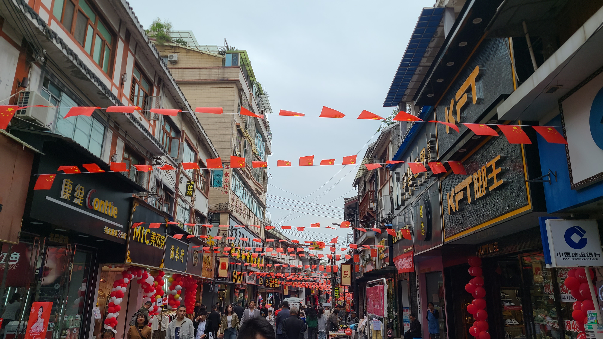

# 贵州旅游(6)——织金

## Day6——10.04
### 超豪华巨型卫生间
织金的主要行程安排就是去看溶洞之王——织金洞。今晚的住宿安排在了距离织金洞北边40多公里的黔西市，这是一个县级市，属于毕节市下属，我们只会在这里停留一宿，第二天早晨就会赶早打车去织金洞。黔西的酒店定在了水西公园附近，那是黔西市里面的一个公园，地位估计和昆明的翠湖公园相当。火车到达黔西时已经快晚上9点半了，我们在火车站门口很容易就打到了车去酒店。这辆车的轮胎似乎有点问题的亚子，在低速行驶的时候车身会左右晃动，高速行驶时才能恢复正常。出于善意，我们将这个情况提醒了司机，没想到司机早就知道，只是没时间去修xs。酒店附近正在修一个地下商场，所以路被封了起来，我们需要到一个远处的路口掉头才能停车。途中经过了一个闹市叫文峰路，司机说这是他们当地的步行街，晚上有夜市很热闹，推荐我们等会来逛逛。

到了酒店，按常规手续办理了入住之后，我们放下行李准备休息片刻就去刚才路过的文峰路溜达。但是当我推开卫生间门的一瞬间，我呆住了，我发誓这是我有史以来见过的最大的卫生间，大到我在里面说话都能有回音的程度，堪比我的大学公共浴室，思聪的卫生间也不过如此吧？为此我们还特意邀请了君君和欣怡来我们这里参观卫生间xs，这家酒店定的真是超值~

### 文峰路夜市
休息片刻后，我和老婆出门前往文峰路溜达。黔西是一座比较小的城市，特别是我们刚离开贵阳，感受更加明显。不过小城市也有小城市的好处，比如生活的烟火气更重。比如我们在快走到文峰路前的时候，路过了一家烧烤店，老板在店门外的路边支了两个桌子，上面摆了烧烤用的铁丝网和炭火，有两桌人刚好坐在那里吃路边烧烤。烤韭菜和土豆的香味随着微风飘进了我们的鼻子里，成功地激发起了我们俩肚子里的蛔虫。

文峰路的布局是这样的：街道两边是有店面的正规商铺，路中间背对背开着的是两排移动摊位。因此我们可以从随便一头逛进去，逛完一圈后再从另一头逛出来。最靠外的一些小摊已经打烊了，往里走则可以逐渐看到许多亮着的灯光。路边卖的最多的是销魂鸡腿，一根铁签上并排串着好几个大鸡腿，然后一起在炭火上慢慢地转圈烤着。这种烤法不知道是不是贵州的特色，因为后来在织金县还有安顺市看到的都是这样的销魂鸡腿呢。

途中路过的一家游戏厅给我留下了极其深刻的印象。游戏厅内里面积不大，但是麻雀虽小五脏俱全，进门左右手两排立着的是抓娃娃机，再往里则是一排借机游戏机。我看到的第一个游戏机前面就排排坐了四个人，俩大人俩小孩，屏幕上玩的游戏叫疯狂赛车（Crazy Racer），是一种类似于赌赛马的赌赛车，一共大概8辆赛车，开跑前玩家投币下注赌哪一辆车会先冲线，然后最后会按照结算结果分钱。离我近的一大一小不知道是不是爸爸带儿子，反正玩的特别起劲，一个劲的狂按按键，面前的一个筐里则盛满了游戏币，让人不禁疑问到底买了多少钱的代币。。



因为肚子不算饿，所以在这里我们没有买什么吃的，就买了一碗莲子粥。这家莲子粥的做法很奇特，是加完料之后，用一个巨大的铜制茶壶倒在碗里搅拌而成，有那么一点点工夫茶的意思在里面hhh，老婆喝完觉得味道还不错呢。摆摊除了常规的卖小吃以外，还有卖宠物的、还有一种卖的像是陶偶，白色的做好的各种各样的卡通形象模具，然后人工后期涂色上色。不知道为什么有好多小孩子和大孩子蹲在这种摊位里玩这个，可能当地比较流行？大半夜不在家里呆着，却在夜市里乱晃，大人们似乎也是默许的状态呢。。



穿过一条马路后，来到了文峰路的后半段，这里比前半段还要热闹，小摊基本都还处于营业状态。快走到尽头的时候遇到一家投飞镖的，20发飞镖全中可以奖励一个大公仔，中19发奖励一个中等公仔。对于那个大公仔我还是比较心动的，就自告奋勇来了一局。可惜的是飞镖没有练手的机会，我的前两发居然全miss了！！！！最后20发中了17发，只能拿一个安慰奖，是很小很小的一串手链，上面缀着一个木刻标记。老板同意我们拿两个，我拿了一个猪和一个牛哈哈哈。可惜了要是能有两发练手的机会，我应该能至少带走一个中等公仔吧！！

回去的路上，在便利店买了三盒好一多酸奶和一盒鲜奶，两盒带给君君欣怡，两盒老婆留着自己喝。这个牌子的奶最开始是在贵阳吃烤肉那晚买的，似乎是贵州这里的本土酸奶，老婆还挺爱喝的，每天都买来喝喝。

原本的计划里还有一环是明天早上早起去逛一逛水西公园，但是因为约好的接送司机和我们说最好7点就能出发去织金洞，不然有概率高速堵车，于是这个计划只能破产啦~~水西公园，byebye！

## Day7——10.05
### 历史文化课时间
因为约好了7点出发，所以早晨6点我们就起床，抓紧收拾好之后，去楼下的早餐店吃一碗热乎的牛肉粉。结果昨晚老板说好今天早上会开门的店大门紧锁着，反而是隔壁的小早餐店开门营业了。一碗热牛肉粉下肚，瞬间就有了活力。这位司机师傅还挺健谈的，一路上一直和我们唠嗑，比如聊了黔西这边的特产黄粑（因为在某一段路上看到的全是卖黄粑的店家），聊了我们要去的织金洞的发掘历史，还聊了织金县城的一些历史和名胜。你别说经过师傅一阵科普，感觉对织金洞和织金县的了解要加深了不少呢~以后我们在做旅游攻略的时候，也不能光顾着打卡，也要尽可能兼顾一下这些景点的历史文化。

司机师傅给我们科普了很多，说织金洞最开始是一个农民发现的，但是因为刚发现的时候只是一个洞口，下面是乌漆嘛黑的啥也看不见，就没有下去探洞，后来好像是因为有一个人不小心失足掉进去了，才开始勘探的，最后发现了这么一个溶洞之王；介绍了织金县的著名历史名人——丁宝桢，他是洋务运动的重要成员之一，曾经做到四川总督的地位，因不动声色地帮慈禧太后料理了一个她手下违法了的宦官而成名，还据说是宫保鸡丁的发明者，织金也有着“宝桢故里”的美誉；除此以外，还有包括现任全国妇联主席谌贻琴也是织金县生人，亲手一路打上去的呢。他还说他希望他的儿子不要整天宅在家里，要多出去见见祖国的大好河山。这番发言的风格太像像我的老丈人，老婆的爸爸了，听着实在是熟悉hh

### 织金洞外无洞天
驱车45min左右来到了织金洞游客中心，我们来的比较早，票务中心都还没开始售票。老婆因为有教师资格证，可以减免100元的门票，属实很赚。我们在票务中心隔壁把行李寄存好，等老婆买完票之后，就一路直奔织金洞了。

织金洞号称“溶洞之王”，“喀斯特地貌百科全书”等，也是国家5A级景区。由于我们卡着入园时间到的，游客数量还不是很多，我们进洞之后可以慢悠悠的闲逛，甚至可以从容的拍照打卡！织金洞里面真的非常非常大，又大又高又深，和这个比起来，之前公司桂林旅游时去的银子岩溶洞就相形见绌了。织金洞里有“三宝九奇”，“三宝”分别是：霸王盔、灵芝树和银玉树，“九奇”则是：倒挂琵琶、雪压青松、婆媳情深、中流砥柱、擎天一线、江山多娇、普渡众生、姊妹玉树和掌上明珠。溶洞内有超多品类且高品位的堆积物，各种各样的钟乳石、石笋、石柱，让人目不暇接。洞内的阶梯高高低低，攀登到高处时望向远处，能看到白雾缭绕袅袅升起，一股超凡脱俗的仙味油然而生，这里是古代大能们夺天地之造化的修炼洞府也说不定呢！

洞的中途有一段特色的阶梯，上面刻着百家姓的姓。我小的时候还特意背过百家姓，背诵到了我的姓所在的地方，一共80个姓，如今回忆起来，竟然仍能脱口而出，即使一时卡壳，看着地上的提示也能想起来。没想到小时候的记忆是如此的牢固，更没想到的是同行的三人的姓居然都排在了我的后面！（写这篇文章的时候才发现，原来君君的姓“褚”排在了第11个，但是当时不知道为什么完全没注意:sweat_smile::sweat_smile:）

在织金洞里走了近1小时20分钟，我们终于来到了洞的出口，这是一个拍照打卡点，洞内的昏暗光线，与从洞外投射进来的阳光，形成了鲜明的对比。本来其实也没指望能够排上照，没想到我们这次属于先头部队，来到这里的时候还没有多少游客，我们甚至可以不急不缓地轮流摆拍，而不至于堵塞后面的游客出洞，真是太幸运啦！！



### 大峡谷
出了织金洞，我们准备坐摆渡车前往下一个景点——织金大峡谷，这是一个新开发的景区，虽然没织金洞那么出名，但是来都来了，就顺便一起玩了得了，毕竟之前我也没见过其他的大峡谷。大峡谷的入口是一个乘船码头，我们四个人坐在一艘船上，然后师傅划船送我们进去。配套的救生衣很舒服，甚至还有一个头枕，方便我们坐在船上抬头欣赏峡谷顶部的风景，这是不选择坐船从旁边走过去的人无法体验到的呢~下了船之后，我们就沿着道路向前步行，路不是很长，走一会会看到一个瀑布，在这里进行了惯例的拍照打卡！出了峡谷山洞后，来到了室外，这里有很长一段的台阶要爬，爬了好久好久，终于来到了传说中坐电梯的地方。这个电梯还是绑定在门票里的，收费40块呢，高度100多米，速度倒不是很快，甚至没有让我产生耳鸣，完全比不上金茂大厦的电梯上升加速度。。



### 织金步行街
离开大峡谷，坐摆渡车回票务中心拿回我们的行李后，就打车去织金县城了。上午的行程总体上是在计划内的，并没有花很多时间排队和人挤人，整体体验十分良好。在摆渡车上的时候，我们听到隔壁有人在嘀咕，说xhs上有人说织金洞里有人打架了，规模还不小，甚至有个人把衣服一脱一甩光着膀子就开干了，也不知道是发生了什么争执，幸好我们来得早，没有被卷进去。织金县城不大，我们的民宿定在了织金古城步行街附近1km左右的地方，小区名字很好玩，叫什么”煤田地质局一七四队小区“，旁边居然还有一个幼儿园。这家民宿整体的装修还比较精致，房间面积也有60平，唯一的缺点是没有电梯，需要拎着行李箱上4楼。。



稍作休整后，我们就准备去吃饭了，竹荪是织金这里的特色，织金竹荪是唯一的清香型竹荪，有着很大的名头，欣怡看中了一家竹荪乌骨鸡火锅，大众点评居然还排名Top1。但是她好像距离古城步行街有点距离，于是我们决定晚上再去吃，中午就去步行街上吃。不知道是不是所有的人都只去织金洞玩，导致滴滴司机也都去织金洞蹲游客，我们从民宿打车去步行街居然还等了好一会才有车。。:sweat_smile::sweat_smile:

步行街非常的热闹，里面可以说是人山人海，感觉整个织金县城的人都在这里了，这是一条典型的充满小县城特色的步行街：两边的店铺匾额之间用了一道道的小五星红旗串在绳子上连接在一起，满满的国庆气息。路边的店铺不局限于卖吃卖喝的、卖衣服的等等，甚至还会有那种五金店、手艺活店，这种在大城市步行街上是绝对看不到的。我们的午饭选的是一家叫的餐馆，老婆她们三个人先去占座点菜，我在路边买了一袋现烤的爆米花，县城的物价真感人，一大袋子的爆米花居然只要5块钱，放到上海电影院里配上饮料起码得卖50块起步。而且不仅价廉，物也很美，爆米花炸的非常脆，焦糖味很浓郁，一口下去香脆香脆的，完全忍不住不停往里探的右手！

这家餐馆似乎也是织金当地比较有牌面的店了，因为我们又赶上了一场婚宴，男方还是一名警察，要知道在小城市里警察的地位是很高的，毕竟办啥事都需要门路，而警察就代表着有很多的门路，所以这家店肯定既能满足逼格，又能保障口味和卫生等。水八碗是织金的特色，每逢红白大事都少不了他，八道菜式用八仙的名字来命名，主材料是本地黑猪肉、土鸡、鸡蛋、薏仁米、竹荪、野味山珍等等。因为单价其实不便宜，我们就点了一份曹国舅烹蹄筋、张果老八宝饭、还有何仙姑酿鸡茸，再加了一份来织金必不可少的宫保鸡丁~织金的竹笋真的很好吃，嫩嫩的竹笋裹着鸡肉，一口下去双重口感，汤也十分的浓郁，君君和欣怡两个喝汤星人狂喜。吃饭的时候我还当了一回跑腿，去打了四杯蜜雪冰城，小县城没有什么奶茶店，最多的就是蜜雪了！



### 中国第一财神庙
吃完饭我们去逛了隔壁的财神庙。这个财神庙号称“中国第一财神庙”，于清朝康熙年间建立，又于乾隆年间重新修缮，负责设计和施工的是一对彝族父女，庙里只供奉了赵公明一尊财神。我们在入口处领了祈福的牌牌，每个人许下自己的愿望后，挂在了后庭的树上。那里的几棵树上都早已挂满了红色的祈福牌，我踩着凳子也够不了更高的地方，只能勉强找了根树枝挂。在财神庙里我了解到了”五路财神“的概念，还分大小五路财神，其中”大五路财神“指的是：东路比干，西路关公，南路柴王爷，北路赵公明，中路王亥；而”小五路财神“指的是中路武财神赵公明和他的四个手下：东路招宝天尊萧升，西路纳珍天尊曹宝，南路招财使者陈九公，北路利市仙官姚少司。除了五路财神，庙里还有关于科举的一些科普，包括乡试-会试-殿试，以及各个阶段考试的通过者和头魁者的称号举人（解元）、贡士（会元）、进士（状元）。这些我倒是之前就有过了解，不过还是学习到了新鲜的知识呢~~



逛完财神庙，君君和欣怡累了就打车回民宿休息了，我和老婆继续逛步行街~ 小县城的步行街逛着还挺有意思的，我们在路边买了个糖蛋糕，才1块钱1个，吃完回头的时候又买了一个；老婆在路边买了一个红糖糍粑，可惜还是不如当初在成都买的好吃。糍粑的旁边是一个卖核桃的，我第一次知道原来核桃最开始不是我们看到的那样褐色的，而是黑不溜秋的沾满了泥，把外面的黑泥刮掉之后才是核桃壳？？前面的路边还有卖大烟的，好像是他们织金本地人抽的烟草，还会用特制的工具来抽，像在吹萨克斯一样= =

途中经过了一个大型广场，广场的对面居然好像就是县政府，在广场上有很多家长带着小孩子玩耍嬉闹，这好像也是县城的一种特色，有种商政一体的感觉。往前一直走到步行街的南门后，我们便原路返回，换了一条小巷子，去吃xhs推荐的织金特色小吃——滚米团和发粑。滚米团是将包好陷料的面团子放在糯米上滚一圈，然后蒸熟；发粑则是用当地独特工艺加上粘米加工而成。我们去的是xhs很火的马记发粑，没想到才下午3点多就已经卖完打烊了:sob::sob:，于是只能随便找了一家店，买了俩滚米团和俩发粑。实际吃起来滚米团的口感就和糯米团子差不多吧，发粑的话也就和米糕差不多？



穿出小巷子后，回到步行街中心又去买了一袋爆米花，没想到刚才买的摊位老板说原料用完了卖不了了55555，没办法只能去隔壁的摊位买。这个摊主一边炸爆米花，一边还和我宣扬说他是这里第一家卖爆米花的，其他摊位都是学他的xs，实际口感的话也大差不差吧，都挺好吃的~~

逛完步行街我们就回民宿休息，君君在卧室里睡觉，我们仨就躺在客厅的沙发上玩手机。这好像是这几天以来我们第一次有时间在民宿躺着休息。一直玩到了晚上快7点，我们才打车去吃了那家。店开在马路边边，店面不大，我们坐在了路边的一个小桌上。，这顿饭其实没啥印象了，因为我全程都在忙着记账，这次出行的账单数目还是很多很杂的，等一顿饭吃完，我的账也记完了xs。吃完饭之后三个人一起散步回了民宿，顺便消消食。

明天就是Next Station——安顺！


