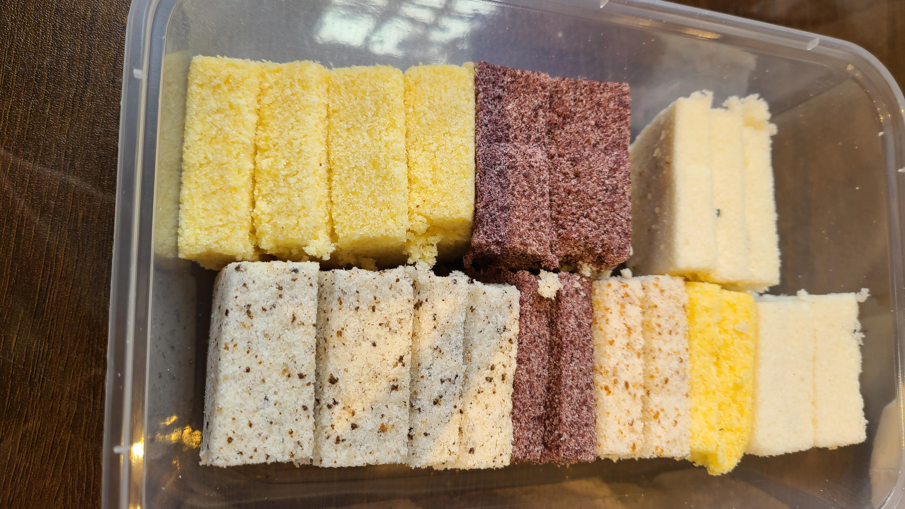
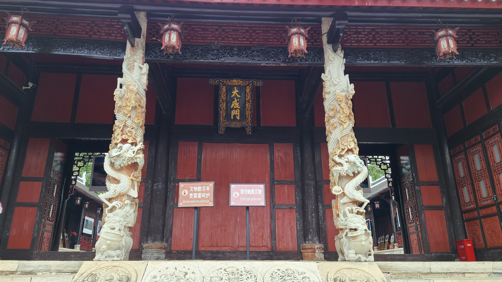
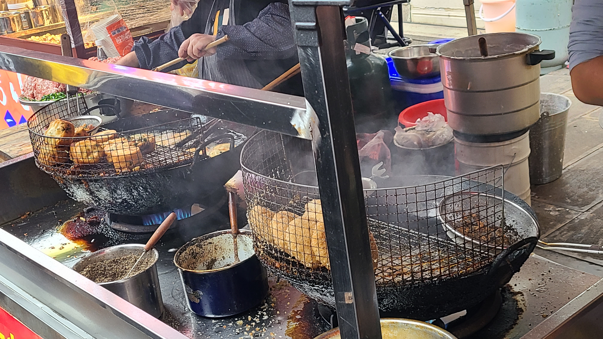
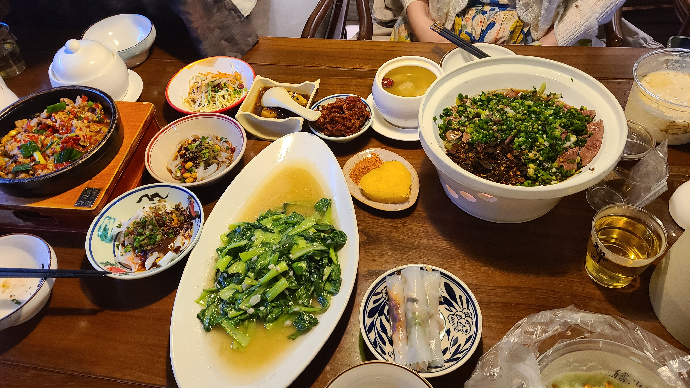
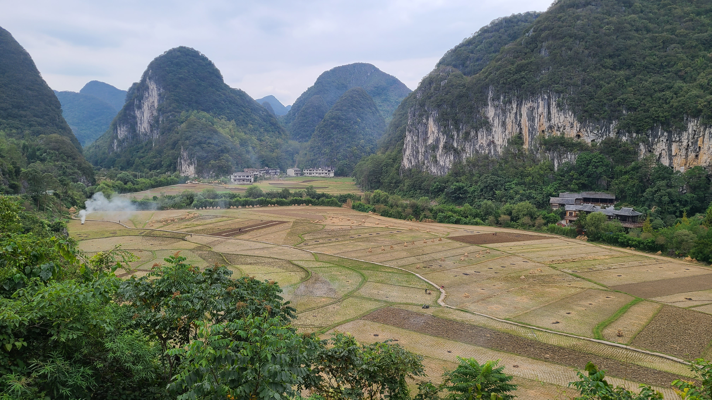

# 贵州旅游(7)——安顺

## Day8——10.06
### 顾府街
上午10点11分，我们的火车到达了安顺站。这是一个老的火车站，而不是高铁站，整个站内面积不大，出站口特别地小。我们将行李箱和书包都寄存在了出站口外的一个小杂货店里，然后打车前往安顺的市中心——顾府街，准备开始今天的城市旅行！顾府街是安顺的市中心，以一条马路为分隔线，马路的一头是安顺古城步行街，另一头则是遍布各式各样小吃摊贩的商业街。安顺的特色美食之一是夺夺粉，这个在来之前就在xhs上做过攻略了，打车的路上我们询问了司机安顺哪里的夺夺粉比较好吃，他给我们推荐了一家叫的店，就在顾府街拐进去的一条巷子里。11点刚好是它开始营业的时间，出于担心等会到了饭点人会很多需要排队，我们就打算直接先去吃午饭了。



商业街这头全都是卖各式各样小吃的手推车，其中最多的一种就是烤小肠。烤小肠是安顺的本地特色美食，每个手推车上都会配一个扩音喇叭，里面循环播放着”烤小肠，烤小肠，安顺特色烤小肠，欢迎品尝。“，一路听下来太魔性了，直接被洗脑了。。君君和欣怡观察了一路，准备挑选一家手法最好的烤小肠摊子尝尝。安顺还有一种特色美食叫裹卷，用米皮刷上辣椒底料，然后再裹上各种各样配菜，像是海带丝、萝卜丝、折耳根等等，之前我们在铜仁的时候其实尝过一次，不过安顺的裹卷更地道也更出名。在这里我们经过了一家叫的裹卷店，人气那叫一个旺盛，排队的队尾都快延伸到了马路中央，乍一看我还以为是隔壁的在排队呢。宫鼎茶也是安顺本地的特色奶茶，有着”安顺茶颜悦色“的美称，等会准备吃完火锅再来点它。



### 夺夺粉火锅
到了店里后，发现还没有人来吃，我们随便选了一个四人桌就坐下了。君君和欣怡出去买烤小肠，她们挑中的摊子卖的烤小肠外皮烤的酥脆，但是内里的肉又保留了嚼劲，没有烂掉，吃的满嘴抹油，太香了！来了安顺怎么能不来份冰浆呢，安顺的冰浆也是很有名的，比较出名的店有之前在xhs上看到过的，还有。不过这两家店都要11点半才能开始买，因为糯米需要一段时间制作，所以老婆就先在火锅店旁边的店里买了一份冰浆，这家店叫，我点的是香蕉牛奶口味的，没想到口味还不错，和贵阳的口感略有不同，冰渣稍微多了一些，但是总体上还是挺好吃的！

夺夺粉是夺夺粉火锅的灵魂，在安顺方言里，”夺“是”叉“的意思，一是谐音叉子“夺”凉粉蘸汤吃；二是亲朋好友围桌“争夺”小锅内的美食。锅底选择的是酸辣锅，这个味道搭配简直妙到毫巅，既不会辣到需要蘸油碟，又有贵州的酸汤口味在里面，回去之后一定要看看能不能在淘宝上搞到类似的锅底调料，实在是太好吃了！招牌的夺夺粉呈黄色块状，下锅煮熟之后用竹签”夺“出来吃，口感感觉和在铜仁吃的米豆腐有点类似，说实话我觉得一般般，反而惊艳到我们的是另一种白色米粉，呈片状，煮熟之后会接近糊状，吸饱了酸辣汤汁，十分地入味。到后面我们甚至还叫来了服务员，想要再加一份这个米粉，结果服务员竟然说这个粉不在菜单里面，而是作为锅底的配菜上的，叫做”切粉“。如果我们想要的话，她可以去后厨给我们加一份xs



吃完火锅，我们准备散步去安顺古城，目的地是安顺文庙和武庙。君君因为脚不舒服，就直接在古城门口的星巴克坐下来休息了，剩下我们仨快乐出发！

### 安顺古城
安顺古城的入口处，贴了很多花里胡哨的招牌，有点像贵阳青云集市看到的那种的低配版本。入口处竖着一块大屏幕，里面正在放一个旅游宣传纪录片，讲述的是徐霞客游安顺的故事，还有不少游客驻足观看呢。



走进古城，我们买了不少吃的喝的，这里也有一家卖冲冲糕的，不过虽然名字一样，这个冲冲糕和我之前在都匀买到的却完全不一样。都匀的冲冲糕确实就是实实在在的糕团，而安顺的冲冲糕更有点像是一种甜品，盛在碗里，有点像是藕粉还是米粉的感觉，里面加了红糖，还是热的。。个人觉得还是都匀的更好吃；在冲冲糕的对面，还买了一份安顺绵绵糕，糕是片状的，口感软糯扎实，没有云片糕那么脆，一盒里面有20多片，一共5种口味，非常好吃！除了糕外，我们还喝了宫鼎茶，没想到古城步行街的店居然没有多少订单在制作中，等了一小会就顺利的拿到了~~宫鼎茶的包装袋很好看，外表是蓝色渐变色，很像我们在云南扎染的样子，上面龙飞凤舞地写了四个大字：”顺水行茶“，英文则叫"Make Tea With Shun Water."

按照我们之前的旅游计划，每去一个城市，都应该留下属于自己的印迹，要在当地寄一封明信片回家。安顺古城里正好就有一个邮局，和丽江古城里的那种差不多，是可以寄当地特色明信片的，不足之处就是款式没有很多种。我们挑选了一份刺绣的明信片，还有一份组合套印的明信片，写上我们想说的话，然后寄回在上海的家家；欣怡也选了一份寄给了她的妈妈。邮局里的布置还挺出景的，很适合拍照打卡。当然，最后将明信片投进邮筒这个环节，还是必不可少地录了一段视频作为以后的素材呢~



### 21℃的城市，360°的人生
不像大理古城和丽江古城那样高度商业化且高度同质化，在安顺古城里走着令人很放松。这里的店面风格也是各式各样，并不统一，保留了很多安顺本地的气息。安顺还是一个充满书卷气息的城市，在去文庙的路上，我们经过了一家很文艺范的书店，叫做「一个人的安顺书吧」，书吧的名字源于著名作家戴明贤先生的《一个人的安顺》.书吧内陈列着许多的图书，装修风格也很现代化，既可以闹中取静，在这里享受静静地阅读时光，也可以满足游客拍照打卡的需求。安顺这座城市有一个标语，叫做「21℃的城市，360°的人生」，这句话到处都可以看到，21℃，是人体最舒适的温度感知范围，也是安顺的舒适宜人；360度，是一个圆，也是安顺全方位的旅游美好体验。



行走片刻后便来到了我们最初的目的地——。这座文庙始建于鸣潮洪武初年，后于清朝康熙、道光年间几经增建修复，是西南地区规模比较大的文庙之一，也被称为”中国最精致的文庙之一“，其最出彩的是它的石雕艺术，例如大成门口的两根龙柱，雕工精湛，活灵活现，堪称绝妙！

原本按计划还打算去玩一玩的，这是安顺市区内的一座4A级景区，但是因为欣怡走累了，我们就原路返回了星巴克，留她们俩在店里坐着休息，我和老婆往回去顾府街那排队买喜欢的小吃去了。重新路过那家何记裹卷，发现他的队伍真的是一点也没变短啊。。老婆去路边排队买了一份舒芙蕾，用现烤的动物奶油做的，味道非常的不错，除了舒芙蕾以外还买了一份栗子饼；我则是去排队买了上午吃火锅的时候在门口的一个卖油炸粑的小摊，老婆馋这个好久好久了。这个摊位的人也非常的多，而且由于油炸鸡蛋糕炸起来比较费时间，前面的顾客又经常一下子买好多个蛋糕，导致队伍排队很长，且推进缓慢，起码排了得有20分钟才轮到我，但是说实话味道一般，这个油炸粑又是那种咸甜口味的，真的很吃不习惯。。。

买完吃的后我们继续向前散步逛街，经过了上午的夺夺粉火锅店后，进入了巷子的深处。这里人迹罕至，但是两边的商店却非常的有文艺范儿，我们经过了一家卖石头的店，名字叫”向阳“，老板养了一只大橘，非常安详地躺在地上，一动不动像一尊雕像；还路过了一家花店 & 杂货店，名字叫”BoomBoomBloom“，也挺小清新的。最后经过了甜院，买了四份冰浆带回星巴克一起吃。甜院的冰浆是贵州之行里吃过的最拉胯的冰浆了，我点的柠檬味的冰浆纯纯踩雷，一点味也没有，老婆点了一个Top3推荐的咖啡味，也踩雷了。。。而且这家的冰浆冰渣很多，吃不太出糯米的口感，差评！开始怀念在贵阳吃过的巧八角了:sob::sob:



到了晚上，古城步行街这边开始亮灯了，五光十色的十分酷炫，有一种mini版青云集市的味道了。晚饭就在安顺古城门口的一家创意餐厅随便吃了点，这家创意餐厅的地理位置很一般，得七拐八拐才能进去，主路门口也没有什么标识，里面的环境还算挺幽静的。菜品的质量比较普通，印象最深刻的反而是长的帅帅的服务员小哥，被我们按铃调戏呼唤了好几次，君君甚至一度想要冲上去要vx（虽然最后还是冷静了下来）。吃完晚饭我们打算去马路对面买点面包当明天在黄果树瀑布和龙宫景区里的干粮，结果发现安顺这里烘焙类的价格直逼上海？？一包吐司也要10块钱，一块大的枫糖吐司要卖38？最后只能买了一些栗子饼，连带下午买的绵绵糕，当做明天的干粮。



今晚住宿在黄果树瀑布景区旁边，为的就是明天一早能直冲大瀑布的上帝视角点拍照打卡。今天也特意没有安排什么行程，就只在安顺古城周围晃悠了一下，一切准备就绪，静待明天的特种兵之旅！

## Day9——10.07
### 黄果树大瀑布
早晨6点左右起床，收拾好要随身带的东西后，让酒店老板送我们去了黄果树景区大门口乘坐摆渡车。下车前老板还嘱咐了我们很多景区的细节，比如一定要看到这个”大黄球“才算出了景区可以打车了；比如景区内的水果不要买很贵，吃的东西想吃的话一定要砍价；比如不需要带雨衣，因为现在是枯水期，水不会那么大的。老板还是个怪好的人呢。

黄果树景区一共有三个区域：大瀑布、天星桥和陡坡塘。我们乘坐的摆渡车第一站来到的是陡坡塘，这是三个区域里最小的一个区域，主要看点就是西游记片尾曲师徒四人在一片瀑布顶行走那个场景的取景地。在这里我们跟着xhs上的攻略，一路步行，七弯八拐之后来到了传说中的”上帝视角“，这里可以无遮挡地俯瞰到整个大瀑布的外貌，并且可以以整个大瀑布为背景拍照打卡。我们到达这里的时候一个人也没有，可以有充足的时间慢悠悠地摆姿势拍照！此时专业助理小Q上线，负责提衣服提包。上帝视角往前走1分钟，则是一个叫做”发呆亭“的亭子，这里也能看到一部分的大瀑布，也可以马马虎虎作为一个拍照点。

拍完照我们就准备回陡坡塘坐车去下一站天星桥了。在走的路上我不小心踢到了一根树枝，无意间低头一看时，两眼的目光却被这根树枝牢牢地吸引住了：这是一根笔直的树枝，没有一丝弯曲；枝干坚硬有力，表皮光滑，颜色呈黄绿色；枝干顶部则是一个月牙型的凹槽，尾部平整。 看到这根树枝外形的一瞬间，我的心口仿佛中了一箭，鬼使神差般地，我弯下了腰将其捡了起来。在握住树枝的那一瞬间，一股暖暖的电流涌入我的手臂后直贯四肢百骸，冥冥之中我感觉到了，这就是我命中注定的那根魔法杖。我举起了树枝，哦不，举起了魔法杖，在空中挥舞了两下，然后念了一个咒语，~~一团火球凭空出现了~~。从这一刻起，又一位魔法师在这个世界上觉醒了。

手握魔法杖，我的战斗力直线飙升！因为天星桥的路又长又比较难走，所以回到陡坡塘后，君君就直接朝出口处走，准备去那里的游客中心商业街找个地方坐下来休息。我和老婆欣怡三个人坐车去了天星桥。天星桥是水上石林变化而成的天然景区，可以看作是森林徒步路线，分为上下两个半程，最值得一看的景点是位于下半程的银链坠潭瀑布。进入景区后的第一个景点叫做”数生步“，这里的石头散落在水中，形成了365块跳蹬，正好暗合了一年的周期，蕴含了每一个人的生日，每一个跳蹬上都刻了日期，游客可以数到自己的生日。但是才数到5月初的时候，就遇到了岔路，而我们如果要去下半程
的话，就要离开这个数生步了。。考虑到6月3号距离5月初只有一个月还挺近的，为了拍照打卡，老婆同意走完我的石头，但是她自己的8月份就太远了，为了避免迷路，只能放弃咯:sob::sob:

路上遇到了几个阿姨在那卖花环，10块钱一个，加钱贵不说，花花的颜色搭配还不好看，大黄色配大紫色。。没想到居然还真有人买了顶在了头上。（一看更丑了，坚定了不买的决心）接下来步行了1个小时，终于走到了下半程的银链坠潭瀑布。你别说，近距离看似乎比上帝视角的大瀑布还壮观的，好几个方向的瀑布在同一个地方汇聚然后落下，水流特别大！

再往前走，还有一些小景点，像天星桥上桥、飞瀑桥等等。天星桥上桥位于暗河和铁索桥之上，飞瀑桥其实就是一个正经的小型瀑布。没走多久我们就出了景区，坐车前往最后一站陡坡塘。陡坡塘进去是一个长长的上坡路，爬完之后，会看到一个西游记师徒四人外加白龙马的泥塑。陡坡塘其实主要就是看一个瀑布，对着瀑布拍照打了卡之后，黄果树之行就算结束了，准备出去和君君汇合。不得不说这次的攻略安排的很棒，今天是10月7号是长假的最后一天，来黄果树景区的人比前两天少了很多很多，游玩体验直线上升，错峰打卡才是王道！



中饭我们在景区门口的麦当劳解决，顺便在门口买了一份黄瓜牛奶冰浆，味道非常的一般，很稀都是水，也吃不太到糯米，还要15块钱，差评！

### 龙宫景区
在麦当劳休整了一个小时，准备打车去龙宫景区。龙宫也是5A级景区，招牌特色有全国最长最美丽的水溶洞、全国最大的洞内瀑布——龙门飞瀑、全国最大的洞中佛堂——观音洞等等。龙宫的行程是老婆一手制定的，参考了xhs上一篇剑走偏锋的攻略，准备逆着传统路线反向行走，沿着——龙字田 → 观音洞 →  地藏洞 → 二进龙宫 → 一进龙宫的顺序游玩。龙字田景区是一片稻田，如果俯瞰的话，可以看出一个繁体字的龍，可惜今天我们来的时候稻子刚好被收割走了，整个稻田光秃秃的，啥也看不到了。。。

走过龙字田，来到了一个撑船码头，坐船后来到了下一个景点——观音洞。观音洞号称是全国最大的洞中佛堂，因为洞中墙壁上有一块巨大的形似观音的石刻而得名，也供奉着一尊长达十几米的白色观音像。我们在这里按惯例买了香，一人上一炷香。到了观音洞主殿，大殿中央坐了一个算命的老师傅，给三个女生都算了一卦，按她们的说法算的非常的准，还说明年老婆一家都会犯太岁，最好还是花钱点灯消灾，老婆还是很信这些的，最后花了几百块钱点了大概半年的灯吧~



由于在观音洞这里耽搁了比较多的时间，担心最后来不及取寄存在景区入口的行李（因为行李寄存点5点半下班关门。。），接下来我们开始猛猛赶路。地藏洞是一个旱溶洞，里面打了五颜六色的灯光，路比较难走，很多地方需要弯腰前行。在这里还发生了一个事故，走在我们后面的一位女性游客好像抬头的时候不小心头撞到了石钟乳上，发出了一声巨响，伴随着的是一声惨叫，听说好像流血了，得回去紧急治疗来着。。。。出了地藏洞，是一段很长很长的户外步行路段，然后就是二进龙宫，这里就到了水溶洞的地盘了，相比于旱溶洞，龙宫的水溶洞才是精华所在，八个字形容就是：五光十色，醉眼迷离。



一进龙宫和二进龙宫整体感觉相差不大，其实我不是很能分得清楚两个水溶洞的差别。。从一进龙宫出来后能看到著名的龙门飞瀑，这还是最大的洞内瀑布呢。在向出口走的过程中，看到一块电子显示屏，上面展示着空气质量相关的指标，负氧离子的浓度达到了4930，AQI是16。特意查了一下，世界卫生组织的清新空气标准是负氧离子浓度1000~1500，浓度大于4000的环境具备养生保健功效，而城市中的负氧离子浓度通常只有80~160左右。。而AQI一级优秀的标准是0-50，所以16是非常优秀的水准了，怪不得龙宫也被称为天然氧吧，黄果树景区其实也差不多，今天在安顺的一整天，都是在天然氧吧里度过的，呼吸了一整天的新鲜空气，神清气爽！



到此龙宫之行就结束了，我们在安顺的旅途也告一段落了，准备打车回安顺站，坐火车回贵阳，开启最后一天的旅程！


