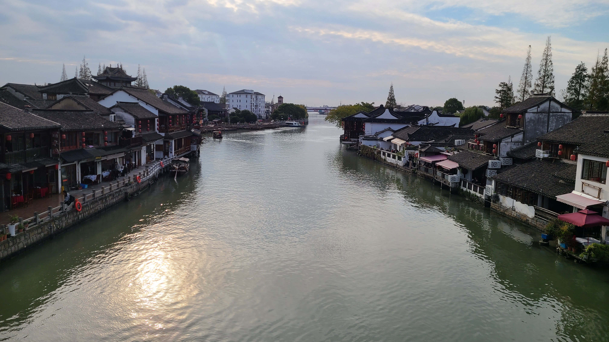

# 朱家角游记

上周末和老婆约好了一起去君君在青浦的大别野玩，顺便把她的克洛伊也带过去，然后在那里住上一晚上。由于周六白天事先约了一场剧本杀要打，所以我们是星期六晚上10点左右才到的目的地。青浦的夜晚是有点冷的，虽然穿了一件冲锋衣，但是感觉不太顶用。君君租的“别野”距离朱家角地铁站4公里，淀山湖大道地铁站3公里。整个小区的占地面积很大，我们打车打到了另一边的大门，结果进去后在小区里走了好几分钟才走到她家。

## 青浦大别野 
新家已经被君君重新装饰了不少，充满了生活气息。进门是一个大客厅，一个懒人沙发，和一个长沙发组成了一个直角。左手边是很大的一面窗户，窗台上摆了几盆绿植。客厅的尽头是一个宜家买的九宫格储物柜，颜值很高。正中间的那格里面有好多的鸭鸭！有银白色的闪亮的鸭鸭！还有一个超大的鸭鸭！一楼的主卧面积不算大，但是麻雀虽小五脏俱全，左手边靠窗摆了一台华为大电视，甚至自带低音炮音响；正前方的一张书桌配上了一个大的夸张的电脑椅，右手边靠墙是睡觉的床，后边则是一个衣柜。

上二楼的楼梯扶手被刷了一层奶油白漆，不过还没有完全刷完，二楼的客房地面上铺了一床厚厚的被子，这就是我们俩今晚的床了。而在一楼上二楼的楼梯下面的空间，则被当做了克洛伊的猫窝，里面放了猫砂盆，猫厕所，还有就是猫活动睡觉的区域。真是一只幸福的小猫咪呢。

晚上我们就躺在客厅沙发上，看了会喜人奇妙夜（经典的西游记、故宫导游，最喜欢的是那个银行抢劫），点了烧烤外卖，然后老婆帮君君一起安装了一个宜家买的抽屉，没想到居然没有附送锤子和螺丝刀，真的很离谱，还得临时外卖（不过这里外卖居然送的还挺快的？）。时间过的非常快，转眼间就到了12点半了，我就先上楼洗漱睡觉了。老婆忙到了2点才睡觉。

## 大战宝石商人
前一天睡的比较晚，今天一觉睡到了8点45才醒，翻开手机发现昨晚3点君君发了消息说给我们点了早饭，预计9点多送到门口。起床洗漱的时候发现青浦这里居然一点也不冷，而且阳光特别好，不知道是不是升温天气好的原因。。下楼后我们一边吃早饭，一边在电视上看Bigbang合体的视频，君君好像特别喜欢Bigbang，我虽然印象里应该是听过这个组合的歌的，但是网易云听了一遍热门的又似乎都没啥印象:sweat::sweat:早饭点的是小杨生煎，外加三碗红豆莲子粥。没想到老婆吃生煎居然还要蘸醋吃，真是奇怪的吃法呢。

吃完生煎包，我们打算掏出带来的switch玩游戏，结果发现switch居然没电了:sweat:sweat:之前元祖把switch放在手柄上玩，结果估计是忘记给手柄充电了，于是我们改成玩桌游。君君家里有很多桌游，我们这次玩的是宝石商人，她买的还是豪华版的，宝石代币是一颗颗以假乱真的“宝石”，而不是普通版的圆卡。这个桌游规则不难，但是竞技性和策略性还挺强的。我们一共玩了两局，第一局本来可以轻松获胜，但是没想到一张关键牌被君君用黄金预购了，结果憾负；第二局卷土重来，没有一味的冲低费卡和宝藏，还是选择了积累低分卡的策略，最后顺利的赢了！听君君说她买的盗版的桌游，一套也才100多，感觉还是挺划算的~

打完两局桌游后，我们的switch也充了一些电，刚准备打开玩游戏，结果发现之前有的胡闹搬家和胡闹装修不知道为什么又需要重新下载了，而且下载速度还很慢，要下载接近20分钟，于是我们又只能一边玩手机一边等待。等了快20分钟，终于抓紧时间玩了一局搬家，又玩了一局装修。由于很久没玩了，操作都不记得了，还花了一段时间适应呢。之前胡闹装修的标准版通关了，所以今天玩的是DLC资料片，加入了一些新的元素，由于时间关系，我们只玩了一局，准备晚上回家继续再战！

## 朱家角古镇
君君下午2点半要进城去玩RPG剧场，所以我们就只约了中午在附近吃饭。吃饭的地方正好就在朱家角古镇的入口，叫，在大众点评上还是青浦区本帮菜好评榜第一呢。饭店面积不大，我们就点了一个2-3人套餐，有盐水虾、白水鱼、白切鸡、蚌肉豆腐煲、水芹干丝，然后加了一份咸肉菜饭。盐水虾的味道一般，虾肉太软了，感觉是时间煮久了；白水鱼的刺儿有点多，鱼肉太偏绵密，不是我喜欢吃的那种鱼肉口感；白切鸡和豆腐煲都中规中矩吧；水芹味道还不错，也可能是我自己的个人滤镜；咸肉菜饭给好评，有那种大铁锅炒出来的香味，特别特别好吃，一炫一大碗！菜饭里还铺了一层的锅巴，咸香脆口，老好吃了~~

吃完我们结账的时候，老板问君君要了个手机号，然后问了句“还满意吗?”，君君回了一句“非常满意！”结果没想到老板直接从抽屉里掏了一张百元钞票就塞了过来？？说让我们直接拿了，瞬间三个人都是愣住.jpg，长这么大还是第一次遇到这种好事，一时间甚至怀疑这是假币，不过后来想了想肯定不能是假币的，不然这店的声望不就毁了么。。那可能就是老板不知道为啥那个时候正好在兴头上，就给我们塞钱了吧。。。君君说这是一张代表好运的钞票，要塞进手机壳里好好保存，xs

吃完刚好是下午2点半，君君准备去玩剧场了，我和老婆就两个人开始逛朱家角古镇。这个古镇还是个4A级景区，人流特别多，我都惊呆了，这么一个犄角旮旯的地方居然会有这么多游客？而且听口音有很多居然还是上海本地人，路上甚至还能看到不少的外国旅客？说实话在今天之前我甚至都不知道上海有一个叫朱家角的旅游景区，难道是我孤陋寡闻了？整个景区风景还是不错的，就是人真的太多了，里面的店面种类也是五花八门，说也说不过来。



我们是从西井街开始逛的，途中穿插进了一个小巷子，里面经过了一家“船拳传承”的店，似乎老板是船拳的传承人，店门口摆了一个练武的木桩，我们忍不住上去摆拍了两下哈哈哈



整个景区面积很大，自西向东有一条很长很长的河将景区分成了南北两个区域，叫做“淀浦河”，寓意应该是连接淀山湖和青浦的河？我们从船拳离开后就来到了这条淀浦河的北河岸边，这里在地图上叫做“西境界漕港滩”，这里的河边有一排排的茶馆店，摆了几张桌子几张椅子，摆上一壶茶，嗑着瓜子吹着河风，十分的惬意。从这里望向河对岸，可以看到对面有一个寺庙，左手边则有一座横跨淀浦河的大桥，叫做“放生桥”，等会就打算从这个放生桥上过河去寺庙里看看。



想要去到放生桥，就要穿过一条东井街。这条街真可以说是熙熙攘攘，摩肩接踵，带有那种浓厚的传统旅游古镇气息，街道两边都是各种卖小吃的，像臭豆腐、奶茶、蹄髈等等。好不容易逆着人流穿过街道，来到了放生桥。中午吃饭有点口渴，在这里小卖部买了一瓶小瓶的矿泉水，居然也要4块钱，真不愧是景区。站在桥上，向下俯瞰整条淀浦河，波光粼粼的水面，反射着点点阳光，风景真的不错~桥下的码头甚至还有直达地铁站的游船呢。

下了放生桥则是一片比较商业化的路段，很多我们熟知的品牌在这里都有开店，像星巴克、奈雪、瑞幸、麦当劳等等。这里也应该是另一个景区的入口吧。这儿的风景因为临河是真的很不错，坐在河边露天的躺椅上，点一杯奶茶或者咖啡，一边喝茶一边吹风欣赏风景，好不惬意~！老婆在这里买了一杯茉酸奶，还在大众点评上买了一个冰淇淋的券，是一家叫做“五个雪人”的店。然后我们就跟着导航的指示，沿着北大街朝西南方向一路逛下去~

北大街这边的人流就没有刚进来的西井街和东井街这么多了，路也变的比较狭窄，路两旁的店面也更带有一丝文艺气息，像是卖陶艺品的，品茶的等等。接连走过了两座桥，泰安桥和廊桥后（此廊桥非大理的彼廊桥），就来到了城隍庙码头，这里有一座城隍庙，还像是一座道观的样子，里面的游客稀稀拉拉很少，我们也就简单的逛了一圈，见到一个殿就进去拜两下，拜的姿势还是上次去贵州玩的时候，在仙人洞学到的道教一礼三叩的方式，怪正经的！我们拜过了太上老君，还拜过了各路财神爷。离开城隍庙后，我们终于来到了圆津禅院，禅院就在淀浦河边，河对岸就是我们来的时候的方向。禅院里面居然还有不少人在烧香呢，不过我们也没买香，就浅浅的拜了一下就走了，然后到这里我们的朱家角之旅就准备告一段落，准备回家咯~从圆津禅院出发步行去朱家角地铁站，将近2km的路程，步行了大概20分钟后，我们就坐上了17号线准备返程回家！



最后这里附一下整个朱家角古镇的地图，和我们这次的游玩路线：

## 微信两周年纪念日
中途很困所以在17号线上睡了一路，转10号线坐到宋园路下车，整个地铁坐了大概一个小时。在宋园路我们骑共享单车回家，我也是开了眼了，居然骑的是一辆没有撑脚的车！虽然它除了没有撑脚外都挺好的。骑到家大概是6点半多，晚饭就简单的把冰箱里剩下的水饺和馄饨煮了，吃完之后，两个人坐在沙发上一边泡脚一边玩switch！生活的幸福其实也不过如此~今天是我加上老婆微信的两周年纪念日，虽然没有什么大的庆祝仪式，但是也算是玩了一趟朱家角了哈哈哈哈~期待明年的三周年！


