# 长沙三日游

去年底老婆公司经历了裁员风波，又成为了无业游民。于是趁着这段时间疯狂出去旅游，感受周中旅游的快乐。先是元旦后和zyx去了几天福建泉州，再是年后又去厦门玩了4天，好不自在。
因为我周中请假不方便，于是就打算复刻2年前的做法，周一请一天假，带上周末凑个三天假期出去浅浅旅游一次。这一次我们选择的目的地是——长沙。因为这个时间段这里的机票很便宜，往返人均才900，对比之前出去玩人均至少要1500+，省了不少开支。

## Day1——02.22

### 紧张刺激的值机
飞机是早晨6点55分虹桥起飞，昨天算了下大概的时间，就打算今早5点半左右打车去机场。由于这次想要去现场值机打印纸质登机牌回来收藏，就没有提前在线上值机，结果上了车后发现值机通道在6点10分就会关闭，形势瞬间变的非常严峻，有可能会值不上机！！！还好司机师傅非常熟练，说我们定的高德导航路线跑起来会比较慢，带我们直接走沪闵高架，最后到机场的时候才5点55分左右，留给我们15分钟的值机时间。

于是乎我们兵分两路，老婆带着所有的包和行李去过安检，我孤身一人快速跑去值机柜台。结果柜台排队值机的人很多，只能在门口的自助机器上完成值机。可恶的是不知道为什么，自助机器打印出来的纸质登机牌是那种最普通的纸，而不是硬纸，我明明记得两年前去成都和广州玩的时候，打印出来的是硬纸登机牌呀；而且由于值机时间太晚了，整架飞机只剩下最后两个不是连座的空座位了，我们俩得被迫分开。。要么以后还是老老实实线上值机得了。:cold_sweat::cold_sweat:

### 天公不作美
去长沙前看天气预报，发现长沙已经连续一两周都在下雨了，每天降水概率百分之七八十那种，气温也只有五六度，又湿又冷。因此在出行前我非常的担心这次的行程，虽然安排了很多的室内活动，但还是会有很多需要在室外进行的。如果雨下的比较大的话就很影响行程和体验了。。回想起之前所有的旅游经历，基本上都没有遇到过下雨（感觉只有丽江和巍山的两个下午下过小雨？），难道这次我的不下雨神话就将迎来终结？？飞机一落地，我就迫不及待的看向窗外。机场地面是湿漉漉的，小水塘上能看到雨点落下后泛起的涟漪。“外面果然在下雨”，我的内心一阵抽搐，只能祈祷这雨别再继续下大了。长沙的机场叫做黄花机场，面积不算很大，我们拖着行李箱一小会就走到了地铁入口。按照民宿管家给的交通路线，我们要先坐地铁6号线，坐一个小时到文昌阁站后转1号线，再坐1站到培元桥站下车。（吐槽一下，怎么长沙也有一个站叫「龙华」啊）

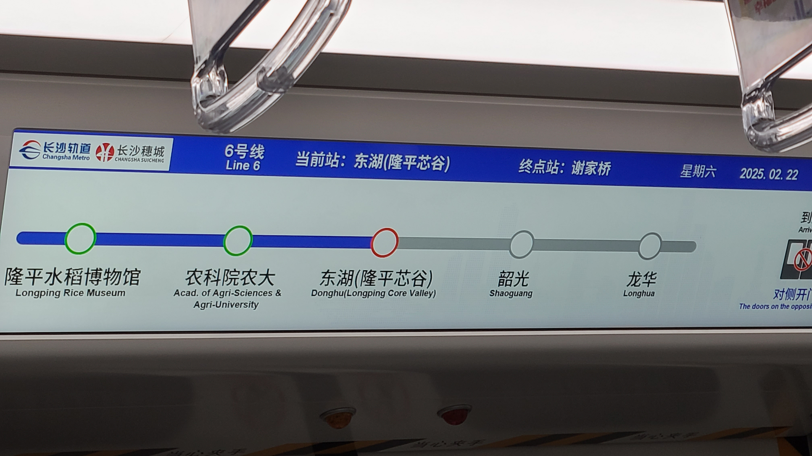

出地铁站后发现外面的雨虽然不算大，但是也没法淋着走，老婆提前在pdd买的双人大伞派上了很大的用场！因为上午没怎么吃早饭，所以在路过民宿楼下的时，我们就打算先进去吃个午饭。湖南两大美食代表应该就是湘菜和粉了，粉分扁粉和圆粉，圆粉的代表是常德米粉，而我们这次吃的长沙米粉则基本是扁粉，粉的浇头在这里被叫做“码子”，最经典的码子是肉丝粉，甚至有很多的粉店专门只做肉丝这一种码子。我们俩点了一碗肉丝粉，一碗牛肉粉。来长沙前我基本吃的都是圆粉，没怎么吃过扁粉，第一次吃扁粉的感觉还挺好的，米粉很嫩，很入味，汤底很有味道，唯独这个肉丝和我想象中的肉丝不太一样，与其说是肉丝，更像是刀工不太好的厨师切出来的肉条？然后肉丝稍微有点老，有的嚼起来柴柴的。



吃完粉我们去寄存行李。我们的民宿没有前台，房间的前一个住客要到12点才退房，所以管家给我们推荐了民宿楼下的一家水果超市，寄存行李10块钱一天。本来还担心超市会不会关门很早，结果老板的回复是：会开门到凌晨3点。。。好吧，长沙人的夜生活果然不容小觑呢。寄存好行李我们直接打车去附近的一家商场，打算在这里给老婆点一杯茶颜悦色的鸳鸯咖啡，提提神。

虽然是周末但是商场的人不是很多，比较冷清，找了一圈没有找到鸳鸯咖啡，但是一楼有一家优衣库，还有一家叫果呀呀的饮品店，来之前做攻略的时候就听人安利这家店很好喝，唯一的缺点就是贵，基本没有25块钱以下的，原因是用料实在，都是真材实料的水果。给老婆点了Top1的牛油果大战椰子，我点了一杯超级肉芒芒，一口下去真的有被惊艳到，满满的全都是芒果肉，吸管甚至都被果肉给堵住了:fearful::fearful:这里柜台上还可以自选可爱的贴纸~扫码还可以添加表情包！后来我们浅浅逛了下优衣库，老婆买了一条很舒适的蓝色裤子，既可以在家里当睡裤也可以穿出门的那种，滑溜溜的。

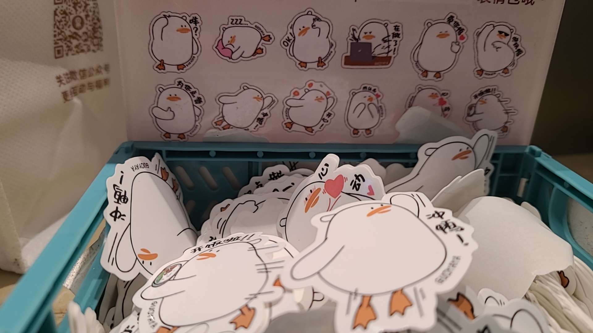

### 湖南省博

下午唯一的行程安排就是逛博物馆：湖南省博物院 + 湖南湘绣博物馆。其中省博就在富兴的旁边，可以步行过去。这个时间点只飘着一些小毛毛雨，就懒得打伞了，直接冲锋衣戴帽子硬抗。在这里我发现了长沙十字路口的两大特色(如下图)：
- 有专门的行人等待区，位置更靠近马路中间，而靠近马路内侧的转弯路线会留给机动车
- 红绿灯少则一个，多则四个，四个红绿灯上下排成一列，同时警示行人和非机动车

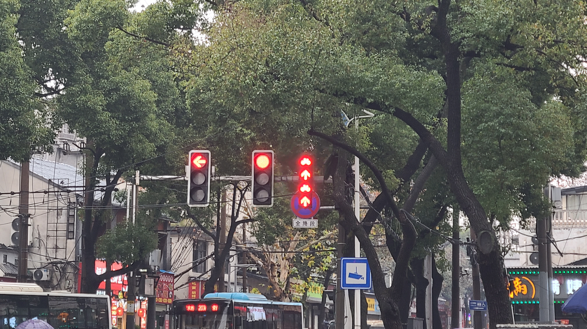

省博这个十字路口人流量超级大，路上感觉遇到了好几拨不知道是公司团建还是旅游团的团体组织。我们在刷身份证过闸机的时候被看门阿姨拦住了，说袋装饮料不能进去，但是我们的果呀呀才刚喝了一小半，丢掉又觉得很可惜，于是打算去马路对面找个店坐下来歇会，结果发现这条马路被好多围栏分割开，根本没办法过马路。。这个时候雨又开始逐渐下大了，我萌生了把饮料丢掉的想法，结果老婆说：“直接过去，我们的饮料在袋子里，她看不见的，万一看见了那再说”，于是我们就假装没事人的过去刷身份证，没想到还真骗过了她hhh。

进去之后是寄存行李，可能我们来的比较晚，行李柜都满了，扫码显示只有唯一一个可以打开，但是出了一些bug实际上打不开。。在这里折腾了快十分钟，也没能把手里的饮料寄存，于是又萌生了把饮料丢掉的想法，老婆也似乎是没招了就同意了我的做法。我走到了垃圾桶旁准备，把袋子丢进去，结果垃圾桶的口太小，我们的袋子太大，在入口卡住了:hushed::hushed:这个时候老婆又突然喊我说：“别丢了，快过来”原来是正好又有人出来拿行李了，空出了一个柜子，终于把手上的东西都寄存进去了，无包一身轻。回过头来想想真得感谢这个垃圾桶比较小呢，不然我们的奶茶就早就被丢进去咯。

结果等我们寄存完行李准备去过安检的时候，发现转弯后路边还有好多一大排的寄存柜，我%^&$@%$^!%$#^#^&%$&*@^&*#%&@%#&@^%&$。

省博一共有四层楼，一楼是付费展，二楼是《湖南人》，介绍湖南的历史，三楼是马王堆汉墓展，四楼是茶颜悦色餐厅。我们只逛了二楼和三楼。别看只有两层楼，但是面积超级超级大，原本我以为逛3个小时怎么着也能结束了，结果最后愣是看了4个小时才勉强结看完，老婆直接说：“我逛不动了，下一个博物馆不去了吧。”:joy::joy:几个令我印象深刻的文物展品：

- 绿釉陶厕猪圈：东汉时期的文物，反映了当地小农生活习惯，农民的粪坑和猪圈互通，拉完shi后再运出来当作物的肥料。配上动画的展示惟妙惟肖
- 剌庙牛型铜灯：西汉时期的文物，整体是牛的形状，肚子里装水，点灯后，烟会顺着两边的管子进到牛肚子里，然后被水吸收，可以说是最早的环保灯。同样也有配套的动画展示
- T型帛画：盖于棺内侧，画里上中下三个部分分别体现了天上、人间和地下的场景，体现了西汉初年的神仙方术思想。后来有一块电子屏幕详细的拆解介绍了画中的每一个元素的寓意，看完后对于画面的理解更深了（在这里还遇到了好多的小学生穿着统一校服坐在地上看大屏幕的讲解，估计是周末的什么课外活动吧）
- 四重棺椁：从外到内，象征着古代人类信奉死后的世界与生前别无两样，可以羽化飞升。

除了这些以外，还有一个令我印象深刻的就是一个叫“君幸食”的话，意思是“请您吃好”，博物馆里陈列的很多古代的碗碟餐具中间都会印上这么一句话。



逛完全部展厅已经是下午4点45左右了，我们打算抓紧时间去一楼文创店盖章，分头行动，老婆去还讲解器，我去寄存柜拿行李和盖章本，因为寄存行李是用的她的微信扫码，所以我需要带着她的手机过去，然后约好了在文创店门口的邮筒集合。我找了个工作人员问去负一楼的路，结果人家告诉我说需要出去走楼梯下负一楼，但是出去了就回不来了，因为已经快到闭馆时间了。。我想回文创店门口和老婆说这个事，结果又找不到她的人，两个手机又都在我的身上，急的我团团转。最后我想着先拿行李，出去了再想办法找老婆。结果在楼梯口遇到了老婆，原来因为临近闭馆时间，工作人员就开始催促游客赶紧离开，要准备关门了，老婆就想着干脆去寄存柜那边等我，而没有在邮筒等我，所以才这么巧合地错过了。。。真是吓出了一身冷汗:cold_sweat::cold_sweat:

### 雨中漫步 & 湘菜初体验

出门后我们原本打算直接打车去晚上吃饭的地方，但是门口的车流量有点大，就想着先往远处走一段路，到空一点的地方再打车。途中经过了烈士公园，这里原本还打算从博物馆出来后逛逛的，但是因为时间因素只能放弃啦，如果之后有机会在11月份来长沙玩的话，可以来这里欣赏水杉~再往前走路过了一家小吃店叫，老婆肚子有一点饿，我们就在这里点了臭豆腐、两个糖饺子、一个葱油饼（似乎还是长沙葱油饼的Top1呢）垫垫肚子。臭豆腐是黑皮的，味道挺不错的，比在上海吃的臭豆腐要好吃！据说长沙这里的臭豆腐分黑皮的和黄皮的，口感不一样，等明后天再尝尝其他类型的比比看；糖饺子感觉就是糯米炸了一下，外面撒了绵白糖，很甜；葱油饼的口感和我妈在家里自己做的饼味道有一点相似。

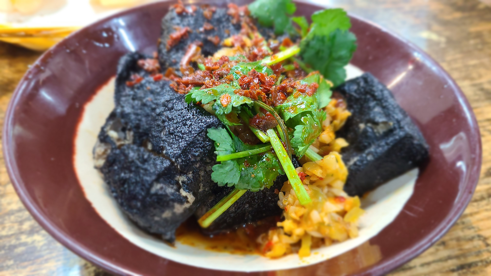

吃完我们就沿着导航一路散步过去，地图显示的距离是2km，但实际上我们走走停停花了得有快1个小时。中途我们遇到了一大批穿着统一高中校服的学生背着书包，好像是刚下课准备回家，有的甚至还拖着行李箱，老婆说这些拖着行李箱的应该是寄宿生，周末带着脏衣服回家。对着他们的校服背后的英文我查了一下，好家伙，似乎是长沙市一中的学生，这可是湖南四大名校之一呢，也有说法是长沙市一中国际部的，查了一下学费一年快60k，好吧，不管是本部还是国际部都很nb就是了。往前走经过了湖南米粉街，原本这也是在计划内的打算去玩一玩的，可惜都给博物馆让路咯咯，还有长沙市一中本部的校门，因为和老婆聊天结果忘记拍照了！！

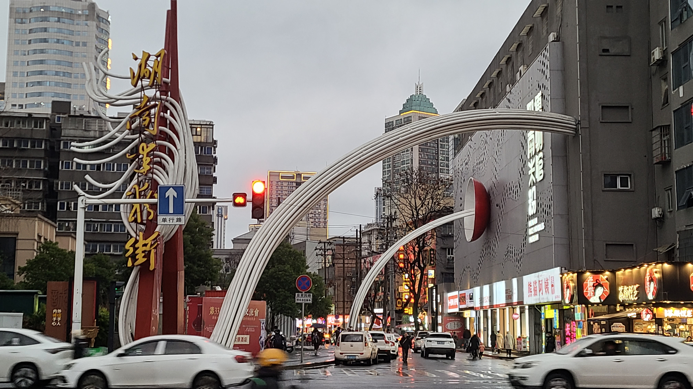

傍晚的长沙略微有点冷，外加天空飘着小毛毛雨，虽然一路在走路，但是身上也不算很热乎，手也是冰冰凉的。快7点的时候我们终于走到了目的地——。这是一家开了四十多年的老店，店面不是很起眼，在一个快捷酒店的二楼，进去之后发现里面还是坐了不少人的，看上去像是本地人约朋友聚餐吃饭的饭馆，都没几个像是游客的。我们坐在了一个比较靠窗的位置，点了一份三人套餐：鱿鱼肉丝、酸萝卜牛百叶、米豆腐烧皮蛋、剁辣椒芽白，还附赠了一大瓶酸梅汤。这家的湘菜每道都是火辣辣的，红色的小米辣充斥着眼球，湘菜确实非常的下饭，我一共吃掉了5碗米饭，同时也喝了5~6杯酸梅汤，得亏有这送的酸梅汤，不然真吃不下去，因为真的太辣太辣了~~~（事后回过头看，这一顿应该是在长沙这三天里吃过的最辣的一顿了，毕竟我们点的是正常辣度）



### 夜游潮宗街

吃完湘菜，浑身都热乎乎的，我们朝着距离最近的游客聚集地——潮宗街区前进。潮宗街因临城门潮宗门而得名，是长沙市仅存的3条麻石大街之一，长511米，宽9米，而这一整片街区的整体风格是旧时民居与潮流并存，充斥着各式各样的创意餐厅、日咖夜酒、网红店铺等等，拍照打卡也很出片。在潮宗街区的门口有一个茶颜家族店，老婆在这里顺手买了一些伴手礼准备带回上海给她的朋友们。

不知道是不是晚上下雨的关系，今晚的潮宗街感觉人挺少的。我们先去了xhs著名的赛博朋克墙这里打了卡，不过拍出来的照片不加滤镜确实没有网上看到的那个feel~，然后在一家服装店里待了好一会（店名给忘记了），老婆在这里给我买了一件衬衫，说这件的款式非常新颖，很难在网上搜到同款，甚至能正反两面穿，不过挺贵的，要349呢。我也看中了一件绿色的灯芯绒外套，他的绿色特别戳我，可惜价格很贵，居然要499一件，还是把这钱省下来给老婆买衣服吧~在这儿浅浅拍照打卡了一圈，感觉雨势逐渐变大，我们就打车回民宿了。第一天的行程也就到此结束了。



### 灯光秀表演
回到民宿，拿行李上楼推开门，房间整体的风格与我在美团上看到的照片基本一致，没有“照骗”，没有过度拉伸角度和美颜。出人意料的是，从窗口向外望去，可以看到对面大楼的霓虹灯光秀，这真的非常令我惊喜，因为我原本还在纠结第二天去哪里看湘江灯光秀，如果去橘子洲青莲站的话会有点绕路，如果去北辰三角洲大悦城的话又有点远。结果没想到直接在民宿窗口给安排了，除了看不到湘江以外，整体的灯光秀场景和我在xhs上看到的基本没啥差别了，确实非常的炫酷~~也不知道为什么民宿老板不拿这个作为卖点来水评论，我之前在预定的时候翻遍了评论区也没看到有人评论这个。。另外不得不感叹我们的运气很好，回家时机选的非常好，到家时间是晚上9点55分，按xhs的说法灯光秀到晚上10点就结束了，好巧不巧刚好赶上了最后的5分钟灯光秀~可能这就是强运吧。洗洗睡睡，准备第二天的行程~



## Day2——02.23

### 上碧湘街菜市场
考虑到老婆最近两个月已经出去旅游两次了，身体消耗不少，所以这次来长沙玩的整体节奏没有安排的很特种兵。今天早上睡到了8点半，9点钟才把老婆喊起床。收拾一下再化个妆，9点半左右出门，准备去南门口先吃早饭！

今天天公作美，出门的时候没有下雨，不打伞也不带行李的感觉真爽！10点钟左右我们到了南门口，这里有长沙两大菜市场之一的，马路对面就是黄兴南路步行街的入口，还有著名的长郡中学小吃街！本来一开始打算是去长郡中学小吃街吃早饭的，结果攻略没做完全，基本所有的店都要早上11点才开门，无奈只能去菜市场里逛逛咯~正好旁边就有一家茶颜悦色（据说长沙的茶颜悦色比厕所还多哦），老规矩给老婆先来一杯奶茶~

上碧湘街菜市场和我们之前去过的几个菜市场都不太一样，昆明的东华农贸市场最气派，面积最大，干净敞亮，吃的东西种类很多，铜仁的小十字农贸市场像是丐版的东华农贸市场，整体结构相似但是面积小一圈，吃的东西一般，灯光也比较昏暗，而上碧湘街菜市场就是一条笔直的街道，路两边开满了各式各样的小吃店，还有卖菜的摊位，还有一些奇奇怪怪的店，比如什么黄金回收、家具维修之类的。令我印象深刻的是有一个老奶奶推着一辆手推车来回地走，手推车上有一个喇叭循环播放着老鼠药广告：“老鼠就死在旁边，老鼠死得快，老鼠死得多，老鼠走过当场死。“，“不怕你老鼠多，就怕你没有老鼠”，真的很莫名戳中我的笑点哈哈哈哈哈哈哈。我们在这里买了糖油粑粑（长沙特产）、绿豆饼、炸薯片（真是每到一个地方都会买的呢）、黄金炸藕圆子，也算是吃了顿早饭了~这里的人流量非常非常大，到处都是人挤人，本地居民居多，也有不少游客，整体环境相对比较一般，老婆在排队买藕圆子的时候突然想大大，结果去了菜场的厕所直接被劝退了:fearful::fearful:。

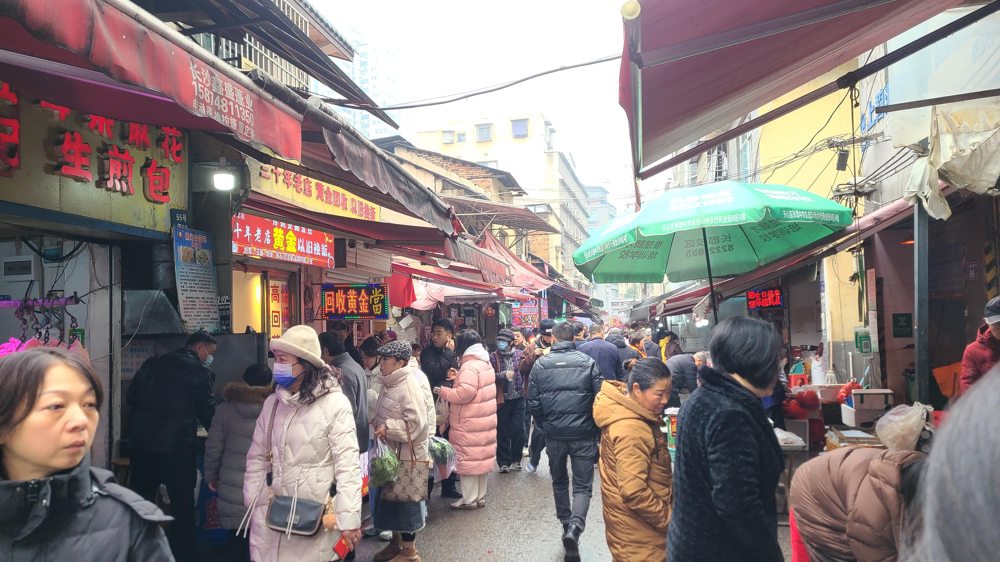

没办法，她就让我买完藕圆子直接回刚才的茶颜坐着等她，她要去附近的商场上厕所。后来老婆和我说，她当时找了两个路边的店主想要问附近商场的厕所在哪里，还没开口，对面就直接“前面，拐弯，楼上”给招呼上了，难道来这里的游客都会想要问厕所的吗？:hushed::hushed:

### 李自建美术馆
吃完早饭后的下一站就是李自建美术馆了，这也是本次长沙旅游去的最远的地方，从南门口出发坐7站地铁到洋湖湿地公园，然后打车前往。来之前简单做了点攻略，李自建是中国著名的旅美油画家，擅长人物肖像和社会现实题材的现实主义油画，这座美术馆是李自建和他老婆丹慧独立出资打造的，还是经过WRCA认证的世界最大的艺术家个人美术馆呢。到了地方下车，门口已经能看到不少的小吃推车了，烤肠臭豆腐啥的香喷喷的，看来来这里的人绝对不会少。一楼有免费的行李寄存，我们租了一个讲解器，这是李自建本人亲自录制的讲解，会讲述每一幅画在诞生时的背景，以及画家自身的心路历程啥的，和之前去过的美术馆都不太一样呢，甚至这个讲解器还能当充电宝，配备了三条数据线，真的是天才设计！



整个美术馆分A馆和B馆，A馆是常设展出，B馆是星云大师的书法展，我们主要参观的是A馆。二层有乡土系列、祖母系列、牛童 系列、红花被系列、汶川娃系列等等，三层有母女系列、美国流浪汉系列、南洋风情系列等等。听老师的讲解确实比起走马观花式的参观，要更有体悟更有感觉一些。二层的祖母系列是我最喜欢的，一共四幅画，每一幅都是一个老人+一双手组合成一个动作，或抚头或远望或祈祷或穿针，近距离看非常的震撼；三层的母女系列也给我留下了很深刻的印象，当时老婆在我一旁解读，说这种一张画上全是白色的东西，比如白色的衣服、墙、裙子、书本、窗帘等等是最难画的，叫做“美术生的白色地狱”，虽然全都是白色的，但是看画的人却能非常轻易的区分开这些东西，需要很高深的绘画功底。另外老师对于人物肖像的拿捏也简直了，老婆说每一张画近距离放大看之后，都能看出门道来，小小的一块脸部区域居然有好多种不同的颜色，但是远看却又一点也不违和；对于衣服的材质画的也非常到位，可以非常轻易的从画中看出衣服的材质是纱，是棉，是丝绸，还是绒类。而且不光男女老少，中国人还是美国人，都画的栩栩如生，连我这个门外汉都觉得牛。三层还有一块区域是讲他疫情被困在摩洛哥时的经历，和一位叫阿卜杜拉的司机结实，租了个房子做简易画室，一边自己做饭，一边画画。老婆还说这段时间他肯定非常的无聊，因为甚至都开始画静物了（水果蔬菜啥的），这对于大画家来说是属于大炮打蚊子，没有任何难度，纯画着玩。

除了画作的技力，老婆还说从这个美术馆的内部构造可以看出是很用心设计的，比如墙上的每一张画都是与墙面呈一定倾角倾斜着挂着的，头顶上方打下来的灯光则是与画面基本保持平行，这样就使得我们在拍照的时候不会遇到反光；除此以外，美术馆内部绝大部分的地面空间都被留了出来供游客站立，只有无法拆除的承重墙的四周才会放一圈软座沙发，一方面极大化馆内可承受的人流量，另一方面软座沙发也可以让游客休息的更充分，甚至可以在这里坐一下午。这些细节之处更是难能可贵，尤其是比起之前去过的一些所谓“画展”。



二楼三楼是油画展，四楼则主要是讲述李自建的生平，他的少年经历十分坎坷，因为出身原因差点无缘美术，又因为一些机缘巧合，得到贵人（星云大师）相助，从此开始了环游世界的美术展，一飞冲天。我们还看到了他早年刚开始学画画时候的素描，老婆说她刚学画画的时候也不过就是这个水平，哈哈哈哈。在文创店里买了两张明信片，还盖了一个免费章。

### 麓山南路小吃街
下一站我们打算去河西大学城，来体验一下“长沙大学生严选”，据说这里有很多好吃的~地铁坐到阜埠河站下车，一出站就看到了满目的餐饮店，各种炸串/奶茶/甜品/小吃，看得人眼花缭乱，这里甚至还没到麓山南路呢。老规矩先给老婆来一杯热乎的茶颜悦色，马路边能看到很多大学生，狠狠感受了一下许久没接触到的青春气息~ 我甚至看到有大学生穿着睡衣睡裤踩着棉拖鞋就出来了！（老婆说她当年好歹还是会注意一下形象套一件外套的xs）

我们在路边吃了个炸炸炸（其实我觉得就是炸串，不过长沙这里就叫炸炸炸），路过一家臭干子店排队很长，老婆就也凑了上去排起了队。店名叫，老板非常的幽默搞笑，一直操着一口带着长沙口音的普通话，反复在和排队的人说着“让你体验长沙最正宗的臭豆腐”，“这个不是臭豆腐，是腐乳。”，非常好笑！排队的时候我们遇到了一个小姐姐也来买臭豆腐，她以前在这里念书，不过已经毕业很久了。我们问她这家店好吃吗，她说味道还不错，并提出和我们拼单一人一半。我们还趁机问起这条街上还有什么好吃的店，她推荐了天马牛肉饼，还有一家鸡蛋灌饼（都是我在xhs上看到过的，看来这次xhs诚不我欺啊）本来还想去吃的，结果她说那家的排队人数起码是这边的三倍长，听完我们立马放弃！

排了那么久的队总算还是值得的，臭豆腐的味道很棒！这家的臭豆腐是黄皮的，口感和黑皮的不一样，但是各有各的香！老板还给老婆试吃了腐乳，结果因为不适应这个味道，彻底地被yue到了，还不小心弄脏了羽绒服的袖口（后面一整天，老婆一直觉得身边有一股臭臭的味道，百思不得其解，最后才发现就是袖子上的这个味道。。。）

吃完臭豆腐，我们往前走去买了鸡蛋灌饼，店名很好笑，叫，但是味道真的是一级棒，很少能吃到味道这么正的鸡蛋灌饼，里面的猪排里脊很嫩，鸡蛋的香味很浓郁，蛋饼也很柔软，谈不上入口即化但是嚼起来非常舒服，一份11块钱，真的好好吃！！！也有很多人排队，肉量很充足，店里还会配套糖水，点了一份冰镇荔枝，嘎嘎甜！途中老婆又手痒买了一份提拉米苏，可惜味道一般般，奶油和蛋糕胚的质量都不太行~~ 路过臭名远扬臭豆腐的时候，果然人排的好长好长，神奇的是隔壁的绿豆饼排队更长，都排的拐了个弯了，老婆上去要了一小份试吃，和上午在菜市场买的味道不太一样，这里的绿豆饼更酥软，味道更香甜，可惜队伍实在是太长了。。。下次有机会的话再来吃吃吧~



往前走着走着，突然路两边的房子开始变成红色砖墙，老婆灵魂发问：我们会不会已经进了湖南大学里面了，不是说是没有围墙的吗？我一开始还反驳说：应该不至于吧，现在不是还有大马路吗？可当我们走着走着，发现马路的对面居然是工商管理学院的时候，我震惊了，原来湖南大学里面居然真的会有大马路？是被马路一分为二了吗？:fearful::fearful:浅浅地在校园里逛了一下，也米有遇到几个学生。可能周末大家都出去吃喝玩乐了吧。中途我们还聊起湖南大学是双一流大学里唯四的B类，老婆就问我东华是不是双一流，我想当然的说：肯定不是吧，双一流应该大部分都是原985的才对，结果上网一查，东华还真的是双一流大学？？材料和纺织两门学科入选。老婆说东华的材料和纺织很强的，宇航服全都是东华做的呢，龟龟，可真了不得~~

### 橘子洲 & 大虾
下午5点左右，我们离开湖南大学，地铁前往碧沙湖地铁站，去恰同学少年广场遥望橘子洲。这里的视线非常的开阔，可以很清楚的看到江对面的毛主席雕像，也有很多摄影师在这里专职拍摄，旁边的游客服务中心甚至还提供了旅拍服务，可以租借服装（比如中山装、旗袍啥的）。本来我打算带一面小红旗来这里做拍照道具的，可惜去年国庆去贵阳的时候的那面小红旗折断了，不然带过来刚刚好呢:pensive::pensive:坐着休息的时候发现这里还有活动，在2分钟内一口气完整的背诵出《沁园春·长沙》，就可以领一个大礼包。于是我们立马现场开始复习，毕竟高中的时候都是背过的，稍微找点感觉就想又背的出来了，可是当我准备好的时候却发现，这个活动在前几天刚好结束了。。。生气！！

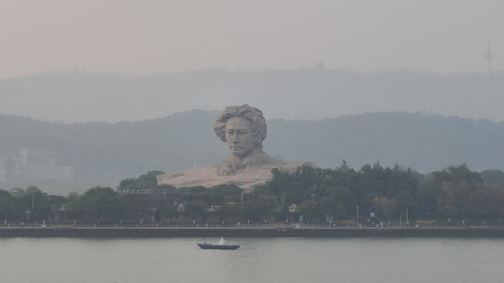

晚饭我们准备去吃虾虾，据说长沙这里的虾非常好吃，唯一缺点就是贵，一盘虾10几个就要动辄200+，不过来都来旅游了，不吃一次也感觉对不起自己。我们选的店是，餐厅位于一个叫汇景城的商场，据说这个商场全靠天宝兄弟这一家店支撑起来，因为他没有别的分店，想吃天宝就得来这里。几年前长沙吃虾的价格还没有那么贵，就是被天宝还有翟记几家店给带高了的，结果其他的店也纷纷向他们看齐，但是最优质的货源又被这几家龙头给垄断了，所以就变成了物也不美价也不廉。。

本来还担心会有很多人要排队的，不过公众号上看了很久也没有提示需要排队的，到店一看才发现店内面积还挺大的，起码也有个几十桌吧，我们就点了一份最招牌的罗氏虾，外加一份麻辣烤鱼。罗氏虾的虾肉非常的新鲜紧实，虾线是提前去过的，虾脑甚至是干净到，可以吃的程度，虾肉能够轻松的被拔出来，蒜蓉的酱汁也十分入味，这个质量和个头的虾，老婆说如果在上海吃的话起码得要三四百？烤鱼的质量也很好，鱼肉是紧实的，不会被筷子一夹就断。两个人一共吃了300块，有点小贵，但是也不算亏。



吃完饭坐电梯到了一楼准备离开，却找不到出去的出口，重新坐电梯回二楼之后发现这个商场很多商铺房间都处于废弃/装修阶段，整体比较荒凉，到了晚上不打灯的情况下很有“氛围感”，超级适合做那种恐怖题材的密室场地！二楼正好就是那家聚味翟记龙虾，里面的客人稀稀拉拉只有三两个，明显比不过天宝（也有能是因为聚味翟记有很多家分店导致的客源分流？）

### 长郡小吃街
晚上预定的行程就是去黄兴路步行街还有坡子街那边逛gai，顺便去一趟早上没去成的长郡小吃街。我们一路向北慢慢散步，大概走了半个小时，来到了黄兴路步行街的南边入口（没错，也就是上午的那个南门口）。比起上午的人烟稀少，夜幕降临后这里热闹了很多，沿街有好多的摆摊夜市小吃，有点像之前我们去的安顺古城门口的夜市。在步行街入口处有一群人穿着统一的红色制服在那里跳广场舞，不知道到底是不是统一组织的活动，第一排中间的那个姐姐跳的还挺有感觉的，看上去像是个领舞的，站在后面的就有好多在摸鱼的了，手脚都没有力气，很蔫吧的那种。。果然哪里都有摸鱼侠呀~

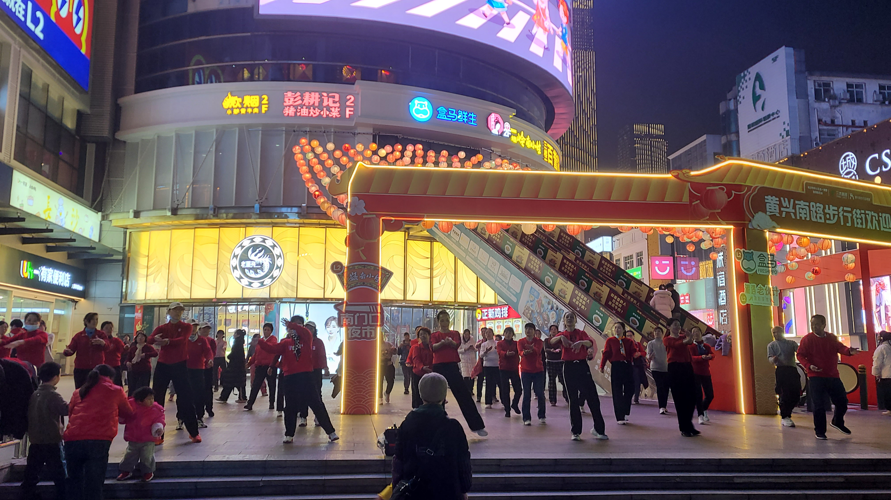

往前走我们来到了大名鼎鼎的长郡中学，它位居长沙四大名校Top2，同时也是湖南四大名校Top2。在有的榜单里甚至能排进全国前五！！都星期天晚上8点了，居然还能看到有学生背着书包从学校里走出来，细思极恐:fearful::fearful:学校门口就是小吃街，里面开满了各种小吃店，对面路边直接摆了好多的小桌板，好多人坐在那里吃着炸串，聊着天，一股苍蝇馆子的味道扑面而来，这才是夜市应该有的样子:heart_eyes::heart_eyes:我们在这里找到了传说中口味最正宗的，没有实体店，只是一辆小推车，娜姐晚上7点半以后才出摊。所谓的紫苏桃子感觉就是水果罐头大杂烩，里面加上了紫苏叶子，口感很清凉，我们选了招牌的桃子、荔枝还有菠萝，配上对面的，那叫一个酸爽~~中途遇到一个路人来问我们这个好不好吃，他说他也是游客，才来长沙第三天，谁曾想我们才来长沙第二天呢xs



### 黄兴步行街 & 坡子街
吃饱喝足我们就开始逛步行街。黄兴南路步行街据说名列《全国十大步行街》，我们是从南往北走的，一开始我还在疑惑，不是说长沙夜生活很丰富吗，怎么步行街晚上都没有人的（后来才发现步行街的北端人比南端多很多，南边的人比较稀少，也不知道原因）。路过一家的小店，里面卖的是各种各样平价的奇怪小玩意，冰箱贴不超过10块钱，还有各种小玩具，饰品等等。我们在这里逛了足足一个小时，买了一些伴手礼回来。

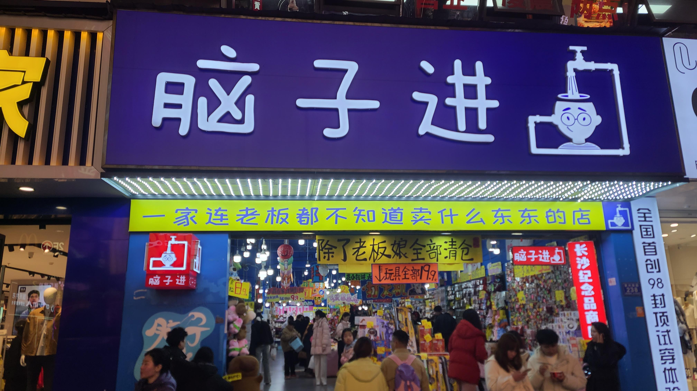

这边的民间街头艺人堪称高手辈出，我们先是看到一个模仿迈克尔杰克逊的，穿着黑衣黑裤黑皮鞋，戴着黑色帽子，在那里跳舞，太空步走的有模有样的，接着一路上看到三组街头卖唱的，第一个选手乏善可陈，第二对组合甚是令我大开眼界，主唱的功底尚可，但是鼓手那位哥们居然用的是水桶来替代架子鼓？？每个水桶还都有不同程度的损坏缺口，配合着鼓点打击居然愣是听不出违和感，鼓手还戴着一副墨镜，一副高人模样，实在是酷毙啦。“水桶哥”的周围里三层外三层的围了好多观众，这里差不多是步行街的中央地带了，没两把刷子也镇不住这里的场子吧，不知道回头在抖音上能不能搜到他们。第三个选手是个男的，有点娘，但是他的声线很牛，可以独自一人在男声和女声之间丝滑切换，唱了一首83射雕的主题曲，惊为天人，可惜选曲风格和水桶哥不太符合，不然两人联手，出道都是指日可待了呢。



越往北走，周围的人流量越大，夜色下的黄兴南路步行街确实好看，拍照非常的出片，还在这里给老婆买了一条裙子，价格出乎我意料的便宜，居然只要79，比起潮宗街那里便宜不知道多少倍了:mask::mask:逛的差不多了之后我们就打算左拐去坡子街看看，怎么说也要去那边“抱头”打个卡吧。晚上11点的坡子街已经没什么人了，比起隔壁还熙熙攘攘的黄兴路，属实是冷清了许多，可能这条街只是在饭点的时候人比较多吧？我们中途路过了火宫殿，不知道为什么，虽然是是供奉火神的庙，但是门口的墙上却打着很赛博朋克的灯光，有股异样的违和感，里面甚至立着一座毛爷爷的雕像，上书：“火宫殿的臭豆腐闻起来臭吃起来香。”看来这火宫殿还是有点东西的呀。坡子街派出所门口则可能是这条街人最多的地方了，我们过去的时候加起来统共大概有10几个人吧，近处三五个在抱头的，远处五六个在远远地拍照。





### 解放西
从坡子街离开，最后打算去解放西转一圈，其实解放西也和黄兴路步行街连在一块，这一片区域的人流量也是挺大的。一路上看到好多的店，比如某个把入口的门做成冰箱模样的，老婆说推开冰箱的门进去就是酒吧，我大受震撼，老婆看来以前没少去这种地方啊，居然这么懂:unamused::unamused: 后来打车回家的时候，听司机说其实解放西这一片的酒吧已经关停了好多，因为现代的年轻人都喜欢玩手机，再加上整体经济形势下行，很多酒吧都开不下去了呢。解放西的尽头就是黄兴南路步行街的北部入口，那里竖着一座雕像，走近一看原来是黄兴的雕像，这整条街都以他的名字命名，看来黄兴对于长沙的影响力很大呀。而步行街的对面就是IFS国金，即使是在夜晚也能看到楼顶的那两个巨大的KWAS玩偶。

从黄兴雕像开始去步行街里面浅浅再逛了一小会，时间已经晚上11点半了，就打算回家了。因为地铁已经停运了，附近打车又有点堵，所以我们从步行街里的一个小巷子里钻了进去，沿着育英街-登隆街的方向散步前行。这里也开了好多的小吃店，途中我们见到了传说中的排队之王——笨罗卜，还在一家糖水铺里点了份糖水当夜宵吃。



回到家里已经是12点半了，好像还从来没有这么晚回民宿过，今天的行程属实拉满，明天就是在长沙的最后一天了，就要和长沙说再见咯。

## Day3——02.24

### 鲁哥饭店
今天是在长沙的最后一天，基本上P0级别需要逛的景点都已经去过了，所以今天的安排比较随意宽松。又因为昨天晚上睡觉都快1点了，所以今天早晨睡到9点才起床，快速洗了个头，吹头发的时候把老婆叫醒，把行李都收拾好之后，大概10点15分才出的门。由于民宿没有前台，没办法寄存行李，而如果寄存在楼下超市的话，去6号线地铁站又需要走路 + 转线，于是就想着看看能不能把行李箱直接寄存在地铁站。可能是老天有眼，没想到在离我们2站路的「湘雅医院」站居然真的有行李寄存柜，还是前不久刚落地的，整个6号线只有3个站点在试运行中，于是我们打算先坐1号线转6号线，把行李箱寄存之后，再开始今天的行程。

走到途中的时候，老婆说要不直接把中午饭解决了吧，正好1号线地铁站的对面有一家，还是必吃榜来着，就进去搓一顿。我们进去的时候才10点半多一些，还没正式开始营业，上菜时间是10点50分，我们就点了一个套餐，把Top几的菜都来了一遍，顺便外卖再叫了一份果呀呀（我真的超爱果呀呀的！吃辣必备！）。

上菜速度还是很快的，这家的湘菜和天下客的不太一样，至少我们桌面上的菜只有两份是辣的：爆炒小肚丝和孜然牛肉，其他几个菜，像招牌Top1的茄子咸蛋黄，还有皮蛋肉泥、蒸南瓜啥的都是一点也不辣的菜，看上去像是适应了游客口味的湘菜？不过重油的口感还是一如既往，得亏点了果呀呀。随套餐还上了一份米浆，应该是用大米打成的像豆浆一样的糊状，超级甜，没想到大米会这么这么甜，喝了一口愣是没喝下去。。。这顿吃了人均70，比天下客贵了10块钱，长沙这里吃饭的价格整体还是比上海要便宜不少的呢。

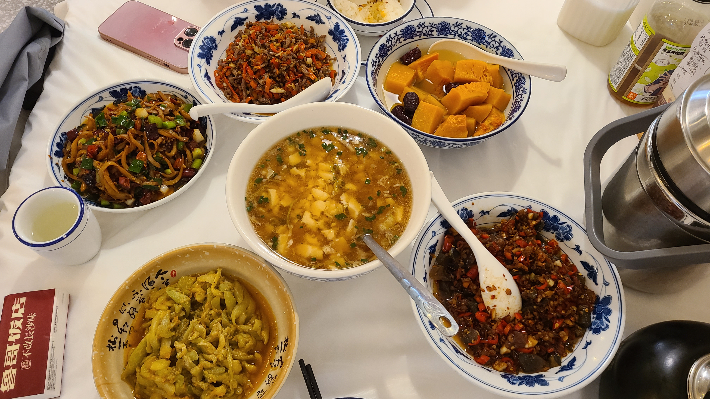

### 古开福寺
吃完饭，坐上地铁去把行李寄存了，接下来的安排就是去古开福寺，这是一座有着千年历史的古寺庙，据说求财比较灵。出了地铁后是一片比较宽阔的广场，这里沿着路边有好多人摆摊算命，还有打着横幅说招收学员，包学包会的呢:joy::joy: 进寺庙的门票费¥10/人，进去之后首先看到的是一座巨大的观音像，上面有石头雕刻成的篮子和龙嘴，外面围着不少的游客在向里面投掷硬币。我们也在门口换了10块钱，老婆一个也没投中，我连续投中了两个哈哈哈哈。过了观音像后有一座桥，桥边的池塘里有一座高高的假山，上面停满了鸽子，水里和岸边还有好多只鸭子、大鹅和鱼。在桥上我们遇到了一个老爷爷，他正在喂鱼，闲聊时他说他每天有空就会来这里喂鱼，怪不得这里的鱼都这么这么大！！！我之前从来没见过这么肥的鱼，像是修炼成精了似的。

过了桥之后就是主殿群，我们领了两炷香，开福寺和之前去过的其他寺庙不太一样，他不允许我们在外界点燃香，而是在不进大殿，不拆包装的前提下，把香丢到焚香炉里即可，还怪环保的呢。不光之前的假山上有鸽子，寺庙里面的草坪上、凳子上、路上也有好多好多的鸽子，这些鸽子一点也不怕生人，你甚至能追在它的屁股后面跑，还可以近距离蹲下来拍照！看来这个寺庙对小动物保护的真的很不错。照例把每一个殿都走过一遍，见佛就拜，主要祈祷的是财源广进，以及保佑老婆可以找到一份稳定的好工作。其中的毗卢殿是可以求签的，它的求签方式也和其他寺庙不一样，居然是数罗汉的方式，按照你自己喜欢的方式数罗汉，数到一定个数后停止，然后记下最后这个罗汉下面的数字，这个数字就是你求的签的号码。求签¥10，解签也要¥10。这次老婆的签再一次延续了之前几次的“中平”签运，解签的结果是：莫强求TAT，而我求的买房子的签的结果居然是放手去做，一切顺利！最后到了菩提阁，我们给梨子求了一个宠物开福卡，狠狠写下了对于梨子的祝福，My梨~，三天不见，你是不是想爸爸了呢QAQ。



### 西园北里 & 通泰街
接下来我们出发前往，这是一个历史文化街区，离我们民宿不远，唐代名相裴休在此所建“西楼”之故，时至清代，望族龙家沿用“西楼”雅意建了西园，由此得名。说是历史文化街区，其实就是一条巷子，里面有很多的历史名人故居，属于不可移动的文物，还有一些依托居民楼而改成的文艺小店，像是咖啡店、花艺店等等，起的名字都非常的文艺小清新，我还记得有一家店的名字叫“不过”。不过很多店都关门歇业了，甚至看到一家店门口挂着“正在放寒假”的牌子，自己开店真的是爽啊，虽然整体偏文艺风格，但是又没有潮宗街那么有冲击力。在巷子里我们还路过了一所学校，可以隔着墙上的镂空花窗望见里面正在
打篮球的学生们。

西园北里的尽头再往南是一条叫通泰街的小街，这条街因长沙老九门之一的通泰门位于境内而得名，整体风格是浓厚的市井气息，曾经是长沙著名的老街棚户区。这里沿街开着很多的小吃店，不过都要晚上才出摊，可惜这次应该是没机会吃上了呢



### 二顾潮宗街
从通泰街出来，下一站的目标是轩辕殿巷，这是老婆在xhs上看到的古着一条街，地理位置位于潮宗街区的南部，于是就顺便把潮宗街区再逛一遍。我们自北向南前行，从营盘路的一个岔路拐进去，老婆说里面似乎很好玩的样子，这里有一家叫的饭馆，门口有一摞的老式旧电视做装饰。还打着一个招牌，上面写着“皮蛋肉丸”创始者，老婆被这个标语吸引了，表示很想吃这一家，我看到这个饭店的名字，总觉得很眼熟，仔细回想了一下，原来是民宿管家今天上午给我发消息的时候，里面推荐的餐馆就是这一家！这可真是巧了，没有不吃的道理了。不过现在时间还早，所以打算等晚饭时间再来吃。往前走是一条小巷子，在高德地图上甚至看不到名字，但是却很有烟火气息，感觉住在这里也会是一种很不错的享受呢。巷子的两边还开着零零散散的一些小店，有烘焙、咖啡、甚至还有个纹身店，老板估计是海贼王铁粉了，店门口的墙壁上涂满了海贼王的壁画。



从小巷子里出来，又来到了熟悉的潮宗街区。只不过和第一天晚上的路线不同，今天是从另一个入口进来的，所以看到的也是新鲜的风景。转角处有一家摄影店，名字叫，是拍那种情侣/闺蜜的大头贴写真的，价格的话148块钱可以无限拍15min，底片全送，彩打6张，附赠一张小卡。那张小卡我还是略微有点心动的。进入店里面，门面不算很大，里面刚好有两个女生坐在那里，估计是刚拍完正在修图。内里有一个小小的影棚，影棚里有一台相机，旁边有一个大的显示器屏幕。拍照的方式也非常简单，对着相机摆好pose，人脸就会显示在旁边的显示器上，可以根据显示器上的样子调整自己的pose，满意后按一下遥控器，旁边的屏幕就能实时显示出这张照片的样子了。影棚里还提供了很多的道具，像是帽子、头饰、一些物品道具等等。我们体验了10分钟，在xhs上搜了一些拍照pose后，就开拍了。拍完后还需要选照片 + p图 + 打印，一共在店里花了有快2个小时呢。虽然时间有点漫长，但是还是值得的，最后成功入手了老婆的小卡，真是好看~~ 出来后老婆说同样的拍照在上海可能得要300~400块钱，所以虽然150块在长沙估计比较贵，但是还是划算的。

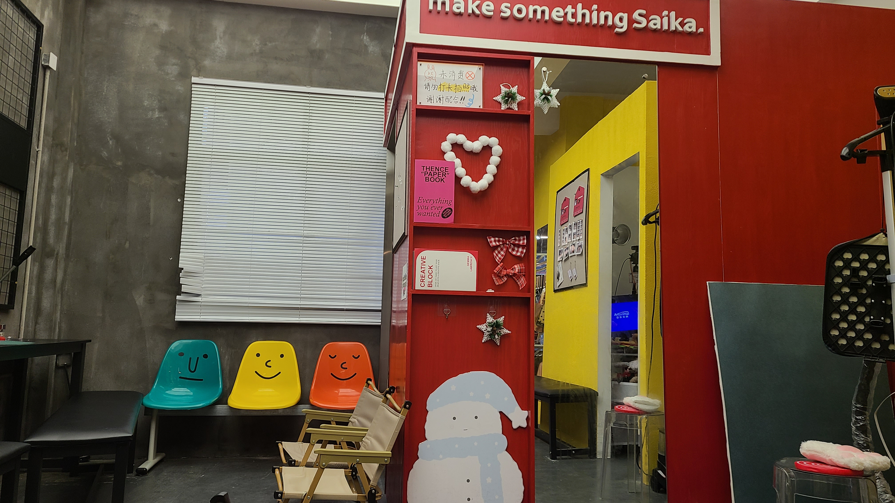

### 轩辕殿巷
由于今天出门时间比较紧张，所以等我们拍完照拿到照片已经是下午4点15分了，留给我们继续闲逛的时间已经不多了。可能是今天不下雨的缘故，今天的潮宗街人明显比第一天晚上多很多。我们浅浅的逛了两圈，拍点照打点卡，就一路向南直奔我们的目的地——轩辕殿巷。这是一条仍然属于潮宗街区内的巷子，号称“古着一条街”，里面的店都是卖古着的。当我还在跟着导航前进的时候，老婆突然向左拐了进去，然后和我说她觉得我们应该已经到了，我仔细一看门牌，还真到了！第一家店的风格偏可爱甜美系，老婆在这里买了一件小吊带，剩下的店都是那种很偏中古的感觉，穿衣风格和老婆不太搭，虽然每家店都进去逛了下，但是都没有挑到合适的衣服~这里的店都是看着不大，但是里面空间巨大的那种。。



晚饭我们打车回乡院子吃，临走前在路边买了份臭豆腐，还在街边拐角的黑色经典连锁店又买了一份臭豆腐，长沙的臭豆腐真的很好吃！百吃不厌！！打车的时候遇到了一点小插曲，因为定位不准的原因，司机师傅没有找到我们的位置，沿着大马路绕了好大一圈才找到我们。。。回到乡院子后，因为赶时间，我们直接点了份套餐开吃！这家店的招牌是Top1的皮蛋肉丸，好像还是首创的做法，老婆吃的赞不绝口，不过我不太喜欢皮蛋，对我来说一般般，反而是有一道白菜炒粉丝，真的超级无敌香，不知道他炒的时候放了什么作料，吃起来居然满嘴生香！！！对比起第一天晚上在天下客吃的辣白菜，这顿白菜好吃到爆！最后的这顿饭真的吃的好饱好饱，连刚才买的臭豆腐都只吃了两块就吃不下了。。。



本来赶时间坐地铁去机场是为了要去值机，因为上午老婆线上值机的时候发现座位选不了。结果等我们打车去地铁站的时候，我随手点开app，发现又可以值机了:sweat:sweat:这下时间真的是绰绰有余，早知如此，刚才吃饭就不用这么赶了。。。到机场的时候才7点半，我们是9:10起飞的飞机。本来以为这次旅游没有登机牌作纪念了，结果在长沙机场居然打印的到硬纸版的登机牌，弥补了我的遗憾！！！真是天无绝人之路呀！这次的长沙之旅也到此结束了，期待下一次和老婆出来玩！！




