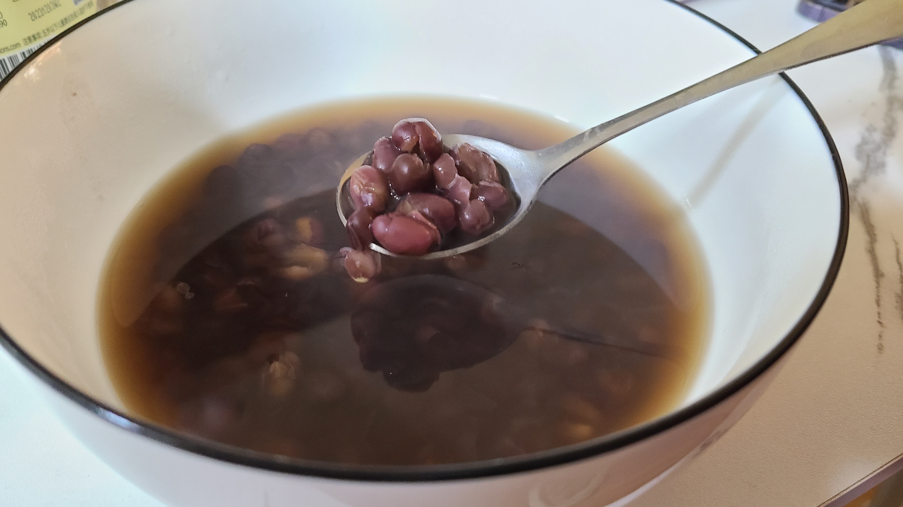

# 红豆糖水

今天早饭给XX煮了她最爱吃的红豆糖水~这次加的红豆好多好多，不小心加多了，结果煮了好久，特此记录一下

<!--more-->

## 原料准备

- 红豆约120ml
- 黄冰糖6~8颗


## 步骤

1. 红豆提前一晚放入冰箱冷冻层冷冻
2. 第二天取出后，清水过一遍后倒入电饭锅内胆
3. 内胆中加水，按 **红豆:水 = 1:7的比例**（即5整杯 + 40ml）
4. 电饭锅按「快煮饭」模式，**煮开两遍**
5. 锅中倒入黄冰糖6~8颗，然后按「柴火饭」模式，煮开一/两遍即可。


## 注意事项

- 通常情况下红豆:水 = 1:7，但是如果红豆加的比较多，水可以稍微少一些，不然的话会煮太久。具体地：
  - 当红豆120ml时，可以按1:6的比例来加水，即4.5杯
  - 当红豆80ml时，可以按1:7的比例来加水，即3.5杯



