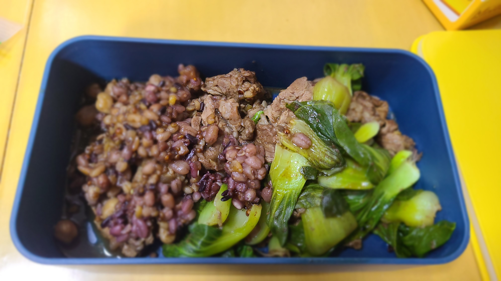

# 懒人焖饭

今天给老婆用电饭锅闷了个懒人焖饭，省时省力，特此记录一下

<!--more-->

## 原料准备

- 杂粮饭70g
- 水100g（正常做饭的米水比例是1:1.2，这次多加了一些，事后证明不用多加。。）
- 小青菜5颗
- 吊龙300g
- 灵魂酱汁：生抽2勺、老抽1勺、蚝油0.5勺



## 步骤

1. 电饭锅里加入杂粮米饭 + 水，洗净后直接按煮饭键。然后定时15min
2. 吊龙用厨房用纸擦干血水（如有），青菜洗净
3. 15min后，开锅往米饭上平铺吊龙，然后平铺青菜；倒入酱汁后，搅拌均匀，合盖
4. 自然煮到结束即可
   


## 注意事项

- 上面的分量是一人一天两顿的量
- 水不要加多！就按1:1.2的比例即可。。不用担心不熟
- 青菜5颗稍微多了点，感觉3.5颗差不多
- 酱汁稍微咸了点，感觉生抽1勺、老抽0.5勺、蚝油0.5勺就差不多了




