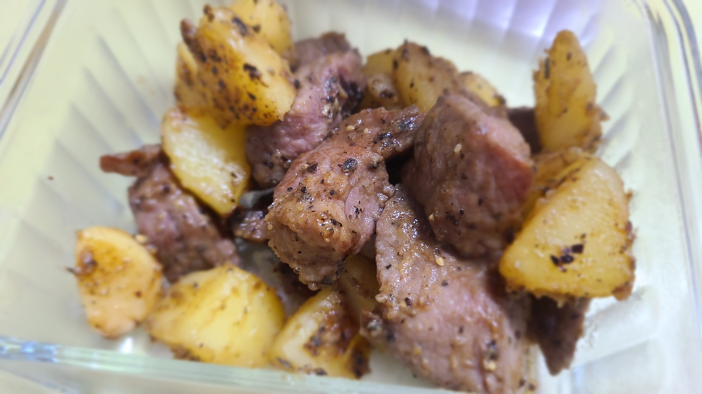

# 黑椒土豆牛肉粒

今天是连续做饭第一周的最后一天，用上了上周末去盒马奥莱存货里的最后一份黑椒牛肉，外加一颗上上周剩下的土豆，做了一顿黑椒土豆牛肉，没想到意外的特别好吃！！老婆吃的赞不绝口，赶紧记录一下~

## 原料准备

- 土豆一颗
- 黑椒牛肉粒一份
- 大蒜半颗


## 步骤

1. 土豆去皮，洗净，切丁（先对半切，然后米字切，最后再对半切，切成原本的1/32大小）
2. 热锅冷油，倒入大蒜炒至爆香后，锅中倒入土豆。
3. 中小火**不断翻炒土豆**，中间间断性地加少量水翻炒（加水的目的是让土豆内部熟的更快）；还可加入适量黑胡椒和盐
4. 土豆炒至金黄微微带焦后，<u>**再加适量的水，翻炒出汁后一起盛出备用**</u>
5. 热锅中倒油，倒入黑椒牛肉粒，中火翻炒至变色后，再倒入土豆，翻炒半分钟后出锅


## 注意事项

- 没有现成的黑椒牛肉粒的话，就自己腌制
- 盛出土豆时，最好带一些汁会更好吃
- 记得不停的翻炒土豆，且用中小火，避免焦掉；大概需要炒10~15min的样子



